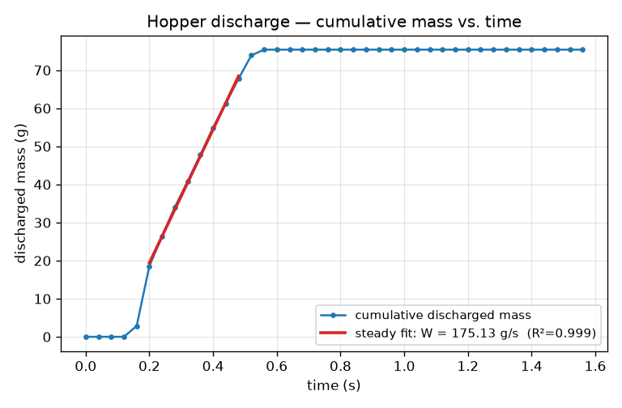

# Worked Study: Hopper Discharge Rate

This is an **end-to-end worked study** — the whole loop a scientist actually
runs: **describe a scenario in a config → run it with the generic driver →
post-process a dump into a named quantitative result → make a figure.** No Rust
is written or recompiled at any step.

The study is a **silo/hopper discharge**: a bed of glass beads drains through a
slot orifice under gravity, and we measure the **steady mass-flow rate `W`** (the
"discharge rate", in g/s). This is the quantity a granular-flow engineer sizes a
silo around, and it is the subject of the classic **Beverloo law**.

> **Prerequisites.** You have a release build of the `run` driver (see
> [Installation & Building](../getting-started/installation.md)) and can run a
> config with it (see [Run a Simulation from a Config](../getting-started/run-from-config.md)).
> Post-processing uses Python with `numpy` (and `matplotlib` for the figure).

## 1. The physics we're measuring

Granular discharge from an orifice is **not** like a draining tank: the flow
rate is set by a free-fall "arch" that forms over the opening, so it does **not**
depend on how full the silo is (there is no `√h` bed-height term). For a long
**slot** orifice of opening width `D`, Beverloo, Leniger & van de Velde (1961)
give the mass-flow rate **per unit slot depth** as

```text
W = C · ρ_b · √g · (D − k·d)^(3/2)     (2D slot)
```

with bulk density `ρ_b`, grain diameter `d`, gravity `g`, an "empty-annulus"
correction `k ≈ 1.4` (grains cannot flow within `k·d/2` of an edge), and an
order-one constant `C`. The exponent is **3/2 for a slot** (a 3D circular orifice
is 5/2). Our study geometry is a quasi-2D slot — the domain is periodic over a
few grain diameters in `y`, so the orifice is effectively a long slot — so the
3/2 form applies and `W` should come out physically sized by this law.

## 2. Describe the study — the config

The whole scenario lives in one declarative config,
[`examples/run/hopper_discharge.toml`](https://github.com/SueHeir/dirt/blob/main/examples/run/hopper_discharge.toml).
The geometry is a rectangular bin whose floor is a **symmetric wedge funnel**
(two finite inclined plane walls) that converges to a central **slot of opening
`D` = 24 mm**. The slot is *open from the start* — there is no blocker and no
scripted "remove the wall now" step — so beads inserted above the funnel simply
fall through and drain. The driver owns the step loop; the config only *describes*
what to simulate.

The pieces that matter for the study:

```toml
[domain]                        # quasi-2D: periodic in y over 12 mm (3 grain-d)
x_low = 0.0 ; x_high = 0.16
y_low = 0.0 ; y_high = 0.012
z_low = 0.0 ; z_high = 0.32
boundary_y = "periodic"         # -> a long SLOT orifice (flow per unit depth)

[gravity]
gz = -9.81

[[dem.materials]]               # softened glass: rigid-grain regime, larger dt
name = "glass"
youngs_mod = 5.0e7
poisson_ratio = 0.3
restitution = 0.5
friction = 0.5                  # friction is required to form a discharge arch

[[particles.insert]]            # the bed that will drain
material = "glass"
count = 900
radius = 0.002                  # d = 4 mm, monodisperse
density = 2500.0
region = { type = "block", min = [0.025, 0.0, 0.19], max = [0.135, 0.012, 0.31] }
seed = 7

# Wedge funnel: two FINITE inclined plane walls leaving a D = 24 mm gap.
# The slot runs x = 0.068 → 0.092 (width 0.024 m), centred at x = 0.08.
[[wall]]
point_x = 0.02 ; point_z = 0.18
normal_x = 0.13 ; normal_z = 0.048
material = "glass"
name = "funnel_left"
bound_z_low = 0.049 ; bound_z_high = 0.181
# ... a mirrored `funnel_right`, plus two vertical bin walls (see the file) ...

[dump]                          # standard per-atom snapshots the analysis reads
interval = 2000
format = "text"

[output]
dir = "examples/run/hopper_discharge"

[[run]]                         # one declarative stage; 80k × 2e-5 s = 1.6 s
name = "discharge"
dt = 2.0e-5
steps = 80000
thermo = 5000
```

Nothing here is a script: there is no control flow and no user-authored sequence
of operations, exactly as described in
[Run a Simulation from a Config](../getting-started/run-from-config.md#declarative-not-scripted).
To study a *different* orifice, material, or bed, you edit these numbers — that
is the whole point of the worked example.

## 3. Run it

```bash
cargo run --release --example run -- examples/run/hopper_discharge.toml
```

This runs in a couple of seconds and writes per-atom snapshots to
`examples/run/hopper_discharge/dump/dump_{step}.csv` (plus `vtp/` frames for
ParaView). Each CSV row is one grain:

```text
tag,type,x,y,z,vx,vy,vz,fx,fy,fz,radius
```

That standard dump is all the analysis needs — the simulation carries **no
special discharge recorder**; measuring `W` is done entirely in post.

## 4. Analyze — extract the discharge rate

The post-processor
[`examples/run/analyze_discharge.py`](https://github.com/SueHeir/dirt/blob/main/examples/run/analyze_discharge.py)
reads the dump frames, counts the **cumulative mass of grains that have dropped
below the orifice plane** vs. time, and fits the straight, steady middle of that
curve — its slope is `W`. (Counting mass *above* the orifice and subtracting from
the initial bed mass makes the measurement robust to grains being removed as they
fall past the floor, and to polydisperse beds.)

```bash
python3 examples/run/analyze_discharge.py examples/run/hopper_discharge.toml
```

```text
frames                : 40  (900 grains initially, total bed mass 75.40 g)
steady-fit window     : 8 frames (0.200-0.480 s)
discharge rate W      : 175.131 g/s   (1.7513e-01 kg/s)
  per unit slot depth : 14594.277 g/(s·m)   (slot depth 12.0 mm)
fit quality R^2       : 0.9990
figure                : examples/run/hopper_discharge/discharge_curve.png
```

**The named result: `W ≈ 175 g/s`** through the 24 mm slot, with an essentially
perfect linear steady region (`R² = 0.999`). The per-unit-depth value
(≈ 14.6 kg/s·m) is what compares to the Beverloo law above: with `ρ_b ≈ 0.6·ρ`,
`(D − k·d) = 0.0184 m`, it implies an order-one `C ≈ 1.2` — right where Beverloo
puts it, confirming the run is physically sized and not an artefact.

## 5. The figure

The script also saves the cumulative-discharge curve with the fitted steady line:



The curve has the three regimes you expect: a brief **start-up transient** as the
arch establishes, a long **constant-slope steady flow** (the slope is `W`), and a
final **plateau** once the bed empties. We fit only the steady 10–90 % window.

## 6. Adapt it to your own problem

This is a template, not a fixed demo. Copy the config and change numbers — still
no Rust:

- **Sweep the orifice.** Change the slot width (move the funnel `point_x`/normals
  so the `x = 0.068 → 0.092` gap widens or narrows) and re-run. `W` should rise as
  `(D − k·d)^{3/2}`. Running several `D` values and regressing `ln W` vs
  `ln(D − k·d)` recovers the Beverloo exponent — the DIRT
  [`bench_hopper_beverloo`](https://github.com/SueHeir/dirt/tree/main/examples/bench_hopper_beverloo)
  benchmark does exactly this sweep and validates the 3/2 slope.
- **Change the material.** Edit `[[dem.materials]]` — stiffer grains, more
  friction, different restitution — and see how `W` responds.
- **Change the bed.** More grains, a polydisperse `radius = { distribution = ... }`,
  or a different fill `region`. The analysis already handles polydispersity.
- **Point the analysis elsewhere.** `analyze_discharge.py` reads the output dir,
  timestep, and slot depth from whatever config you pass it, and takes
  `--orifice-z`, `--density`, and the steady-window fractions as options — so the
  same command works for any hopper config you build.

That is the full workflow: **config → run → analyze → figure**, entirely from a
declarative config plus a standard dump, with the discharge rate as the result.

## References

- W. A. Beverloo, H. A. Leniger, J. van de Velde, "The flow of granular solids
  through orifices", *Chem. Eng. Sci.* **15** (1961) 260–269.
- R. M. Nedderman, *Statics and Kinematics of Granular Materials*, Cambridge
  Univ. Press (1992), ch. 10 (slot vs. circular Beverloo exponents).
