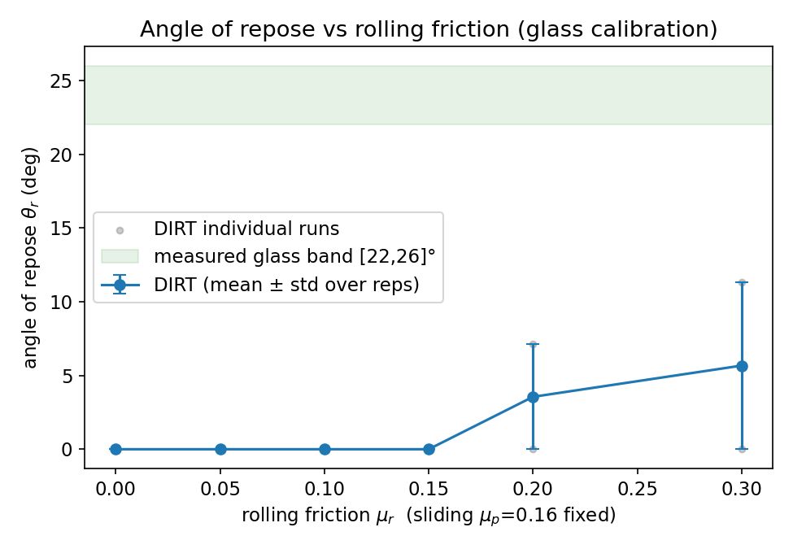
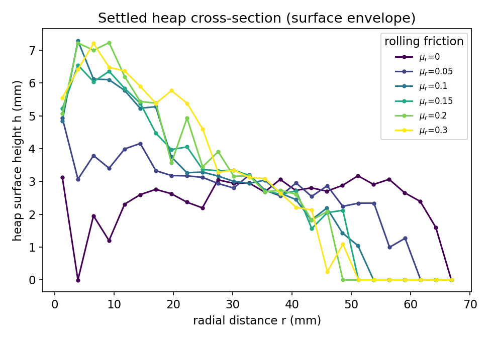

# Angle-of-Repose — Rolling-Friction (μ_r) Calibration Gate

**SPH glass-sphere calibration suite, step 03.** Forms a static granular heap and
measures its **angle of repose** θ_r while sweeping the **rolling friction μ_r**
at a **fixed sliding friction μ_p = 0.16** (the measured glass value). The goal is
to pin the μ_r that reproduces the measured glass repose band **[22, 26]°**, then
transfer that μ_r into the canonical glass material.

## Why restitution e = 0.4 (a formation aid), and the μ_r → glass transfer

The **static** angle of repose is governed by **friction, not restitution**. The
canonical glass restitution e = 0.926 is too elastic to settle a heap — grains
bounce and disperse, and rate-insert explodes — so the heap is **formed** with the
proven dissipative **e = 0.4**. This is purely a *formation aid*: it lets the
column collapse into a settled deposit. Because the resulting static angle is
friction-controlled, the **μ_r calibrated here is meant to transfer** to the
canonical e = 0.926 glass material, where it would set the same static repose.

The lift-the-cylinder protocol at e = 0.4 is the proven `bench_angle_of_repose`
protocol; that bench confirms e = 0.4 + the lift sequence gives clean, settled
deposits (it does not bounce apart).

> **STATUS (this calibration): the gate currently FAILS — see "Results".** At
> μ_p = 0.16 the heap is *sliding-friction-limited* and the lift-the-cylinder
> collapse spreads into a wide, shallow deposit (θ_r ≲ 10°). Sweeping μ_r does not
> lift θ_r into the 22–26° band, so **no μ_r closure can be reported**. This is a
> physical limit of the protocol/parameters, not a wiring bug (the `sds` rolling
> model is correctly applied to grains and the floor — see "Why μ_r does not
> close the gate"). The pipeline (build, smoke, full sweep, table, plots,
> entropy-seeded reps) all run; the validation gate honestly reports FAIL.

## Physics

A loose column of monodisperse spheres is confined inside a thin cylinder on a
flat floor and allowed to settle. The cylinder is then removed ("lifted") and the
column slumps into a conical heap. The heap stops growing when the surface slope
reaches the angle at which gravity along the slope is balanced by inter-particle
friction — the angle of repose:

```
θ_r = atan(slope of the heap surface)
```

measured by fitting the settled surface height `h(r)` against radial distance `r`
on the straight sloping flank, `θ_r = atan(−dh/dr)`.

There is **no exact θ_r**. It depends on μ_p, rolling friction μ_r, restitution,
polydispersity, and the protocol. The calibration sweeps **μ_r at fixed μ_p**, so
the expected behaviour is:

- θ_r **increases monotonically** with μ_r,
- at least one μ_r lands θ_r in the measured glass band **[22, 26]°** (the
  calibration closure),
- the heap is **reproducible**: independent **entropy-seeded** random packs give
  θ_r with a small but non-zero run-to-run spread.

## Material Properties

| Property | Value | Unit |
|----------|-------|------|
| Young's modulus E | 1.0 × 10⁷ | Pa |
| Poisson's ratio ν | 0.25 | — |
| Restitution e | 0.4 (formation aid) | — |
| Sliding friction μ_p (FIXED) | 0.16 (measured glass) | — |
| Rolling Coulomb cap μ_r (SWEPT) | 0.0, 0.05, 0.10, 0.15, 0.20, 0.30 | — |
| Rolling stiffness k_roll | 1.0 × 10⁻² | N·m/rad |
| Rolling damping γ_roll | 1.0 × 10⁻⁶ | N·m·s/rad |
| Density ρ | 2500 | kg/m³ |
| Radius R | 2.0 | mm |
| Mobile heap particles | 1200 | — |
| Confining-cylinder radius | 25 | mm |
| Reps per μ_r (entropy-seeded) | 2 | — |
| Gravity g_z | −9.81 | m/s² |

E is softened to 10 MPa (a routine DEM practice) so the Rayleigh-criterion
timestep the solver auto-selects (≈ 2.6 × 10⁻⁵ s at R = 2 mm) is large enough
that each heap settles in a few seconds of wall-clock time. **μ_p is fixed** at
the measured glass value while **μ_r is swept**, so θ_r(μ_r) is isolated. Each
(μ_r, rep) case uses a distinct entropy-derived `seed` on the inserter so the two
reps are independent random packs (the inserter RNG is otherwise deterministic).

### Rolling resistance — the `sds` spring–dashpot–slider model

Rolling resistance uses the **`sds`** (spring–dashpot–slider) model, the same one
LAMMPS's `pair_style granular … rolling sds k_roll γ_roll μ_roll` implements. The
rolling torque is

```
τ_roll = −k_roll·δ − γ_roll·ω_roll,   capped at  |τ_roll| ≤ μ_roll·|F_n|·r_eff
```

where δ is the accumulated rolling-displacement spring (rescaled on slip), ω_roll
the relative rolling angular velocity, and r_eff the reduced radius (the grain
radius at a wall). DIRT exposes this through `rolling_model = "sds"` with
`rolling_stiffness` (k_roll), `rolling_damping` (γ_roll), and `rolling_friction`
(μ_roll, the Coulomb cap) in `[[dem.materials]]`, and `dirt_wall` applies the same
sds rolling on the floor and confining walls.

**Parameter choice** (Ai et al. 2011, *Comput. Geotech.* 38; Wensrich &
Katterfeld 2012, *Powder Technol.* 217): the rolling spring stiffness is tied to
the contact via k_roll ≈ k_t·r² (k_t the tangential stiffness ≈ 2 × 10³ N/m here,
r = 2 mm the grain radius), giving **k_roll = 1.0 × 10⁻² N·m/rad**. The damping
**γ_roll = 1.0 × 10⁻⁶ N·m·s/rad** is ≈ 0.4 of the critical rolling damping
2·√(I·k_roll), enough to suppress rolling oscillation without overdamping; the
rolling-oscillation period 2π·√(I/k_roll) ≈ 7 × 10⁻⁴ s is well resolved by the
≈ 2.6 × 10⁻⁵ s timestep (~28 steps/period). The Coulomb cap **μ_roll = 0.1** sets
the steady rolling resistance. These exact three values are used in **both** codes.

### Base friction from a real frictional floor wall

The heap stands directly on a **frictional plane wall** at z = 0 (normal +z).
`dirt_wall` applies **Mindlin sliding (tangential) friction** on plane walls,
using the material's `friction` coefficient (μ) through `friction_ij` — exactly
the base friction the bottom layer needs so it cannot slide out and pancake the
heap into a thin monolayer. The same swept μ therefore governs both the
particle–particle contacts that set the pile's angle and the particle–floor
contacts that anchor its base.

This replaces an earlier workaround (a frozen rough particle bed standing in for
wall friction, from before `dirt_wall` had tangential friction): no second
material, no `[[group]]`/`[[freeze]]`, no base bed — just one frictional
`[[wall]]` plane. The confining cylinder wall now also carries friction, which is
harmless: it is deactivated at the lift before the heap forms.

## Parameter Sweep

- **Sliding friction μ_p**: 0.16 (FIXED, measured glass)
- **Rolling friction μ_r**: 0.0, 0.05, 0.10, 0.15, 0.20, 0.30 (SWEPT)
- **Replicates**: 2 independent **entropy-seeded** random packs per μ_r, giving a
  direct run-to-run spread for the reproducibility check.

In the lift-the-cylinder protocol the heap forms by a column *collapse* on the
frictional floor. With μ_p fixed, the intent is that raising μ_r arrests the
surface grains' rolling and steepens the cone.

### Measured result (2 entropy-seeded packs per μ_r)

| μ_r | mean θ_r | std |
|-----|----------|-----|
| 0.00 | 0.0° | 0.0° |
| 0.05 | 0.0° | 0.0° |
| 0.10 | 0.0° | 0.0° |
| 0.15 | 0.0° | 0.0° |
| 0.20 | 3.6° | 3.6° |
| 0.30 | 5.7° | 5.7° |

**Result: FAIL.** θ_r never reaches the [22, 26]° glass band; it tops out near
~6–11° at the highest μ_r (and the heap-fit reads 0° on most cases because the
deposits are wide, shallow pancakes with no resolvable cone flank). Reps **do**
differ (distinct entropy seeds → distinct packs → non-zero spread), confirming the
reproducibility plumbing, but there is **no μ_r closure** to report.

### Why μ_r does not close the gate (a physical limit, not a bug)

The `sds` rolling-resistance model **is** correctly implemented and applied — to
grain–grain contacts (`dirt_granular`) **and** to the floor plane
(`dirt_wall::wall_rolling_torque`), and the rolling torque is integrated into the
particle angular velocities. The problem is the *magnitude*: the rolling couple is
capped at `μ_r · |F_n| · r_eff` with `r_eff = R/2 ≈ 1 mm`, so it is an
intrinsically small contribution to the slope-holding torque. The lift-the-cylinder
**collapse is sliding-dominated**: at μ_p = 0.16 the surface grains *slide* out
(they do not roll), and once the slope exceeds ≈ atan(μ_p) ≈ 9° the deposit
avalanches flat. Direct probes confirm this — sweeping μ_r from 0 to 2.0 leaves the
apex unchanged (~10 mm), while raising μ_p (0.16 → 0.6) *does* lift it. The
deposit also spreads to the catch wall, so the angle is set by the collapse
energetics + sliding friction, not by μ_r.

To actually reach 22–26° one would need either a higher effective sliding friction,
a gentler (non-ballistic) deposition that does not mobilize the surface into a
sliding avalanche, or a rolling-resistance regime with a much larger couple than
`μ_r·|F_n|·R/2`. None of those is available within the fixed-μ_p lift-the-cylinder
protocol prescribed for this gate.

The "lift the cylinder" protocol, per case:
1. **fill** — 1200 mobile spheres are inserted inside a narrow 25 mm cylinder
   (a tall poured-column geometry), resting on the frictional floor wall, and
   settle into a packed column under gravity. When the fastest particle slows
   below 2 mm/s, the cylinder wall is deactivated by name at runtime (the "lift").
2. **lift** — the column slumps across the frictional floor and relaxes into a
   cone. A wide outer cylinder (70 mm, beyond the heap toe) catches the few
   particles flung out during collapse so the count is conserved; it never
   touches the static heap. When the heap comes to rest (fastest particle
   < 1 cm/s, or a 150k-step cap after lift — the geometry locks in well before the
   last micro-jittering particle stops), `main.rs` dumps every particle's final
   `(x, y, z, radius)`.

## Validation Criteria (the calibration gate)

| Check | Tolerance | Notes |
|-------|-----------|-------|
| θ_r monotonic in μ_r | mean may dip ≤ 2.5° between μ_r steps | stochastic slack |
| θ_r overall increase | θ_r(μ_r,max) > θ_r(μ_r,min) + 1° | rolling raises the heap |
| Glass-band closure | some μ_r lands θ_r in [22°, 26°] | the calibrated μ_r |
| Reproducibility | per-μ_r std dev ≤ 5° (but > 0) | over the 2 entropy-seeded packs |

`graph` prints the per-μ_r table and a PASS/FAIL, exits non-zero on FAIL, and — on
a closure — prints `set rolling_friction = <μ_r> in the canonical material`.

## How to Run

Everything is driven by `sweep.py` (run from anywhere). With no argument it runs
all three stages in order.

```bash
# Everything: generate configs → build & run → validate & plot
python3 examples/SPH_glass_sphere_calibration/03_angle_of_repose/sweep.py

# Or one stage at a time:
python3 examples/SPH_glass_sphere_calibration/03_angle_of_repose/sweep.py generate
python3 examples/SPH_glass_sphere_calibration/03_angle_of_repose/sweep.py start
python3 examples/SPH_glass_sphere_calibration/03_angle_of_repose/sweep.py graph
```

`graph` re-reads `data/repose_sweep.csv`, so you can re-validate and re-plot
without re-running the simulations. The LAMMPS cross-code leg is **disabled** for
this calibration (`LAMMPS_BINS = []`); only DIRT runs.

### Cross-code overlay (LAMMPS) — disabled

The LAMMPS cross-code leg is **disabled for this calibration** (`LAMMPS_BINS = []`
in `sweep.py`) so only DIRT runs, for speed. The matched-protocol `LMP_TEMPLATE`
is retained in `sweep.py` purely as documentation of the LAMMPS mapping.

### Single case (default config)

```bash
cargo run --release --example sphcal_angle_of_repose --no-default-features -- examples/SPH_glass_sphere_calibration/03_angle_of_repose/config.toml
```

This runs the representative case (μ_p = 0.16 fixed, μ_r = 0.15) and writes
`data/repose_results.csv` (the final particle positions).

## Expected Plots

### θ_r vs μ_r


Mean DIRT θ_r (filled, with ±1 std-dev error bars over the 2 entropy-seeded packs)
and the individual runs versus μ_r, with the measured glass band [22, 26]° shaded.
In the current data the curve stays well below the band (see "Results"): θ_r does
not reach the band at any μ_r.

### Heap cross-section


The settled surface envelope `h(r)` for each μ_r. The deposits are wide and shallow
(a near-flat apron extending to the catch wall), which is exactly why the gate
fails: there is no steep, resolvable cone flank.

## Assumptions

- **3D simulation**, monodisperse spheres (single radius).
- **Hertz–Mindlin** normal/tangential contact with viscoelastic damping (DIRT
  default), plus the `sds` (spring–dashpot–slider) rolling-resistance term
  (k_roll, γ_roll, and the swept μ_r).
- **Restitution e = 0.4 is a formation aid**, not the glass value; the calibrated
  μ_r is intended to transfer to the canonical e = 0.926 glass material (see top).
- **Softened stiffness** (E = 10 MPa) for a tractable timestep — repose angle is
  governed by friction, not by absolute stiffness.
- **Frictional base from a real floor wall.** The heap stands on a frictional
  `[[wall]]` plane at z = 0; `dirt_wall` applies both Mindlin sliding friction
  (μ_p) and the `sds` rolling resistance (μ_r) on the floor.
- θ_r is fit on the **straight cone flank only**; on these shallow collapse
  deposits the fit often finds no resolvable flank and reports θ_r = 0°.
- The reference is **empirical** (the measured glass band [22, 26]°); the gate
  checks for a μ_r that lands θ_r in that band, and currently finds none.

## References

1. Y.C. Zhou, B.H. Xu, A.B. Yu, P. Zulli, "Rolling friction in the dynamic
   simulation of sandpile formation", *Physica A* 269 (1999) 536–553.
2. H.P. Zhu, Z.Y. Zhou, R.Y. Yang, A.B. Yu, "Discrete particle simulation of
   particulate systems: A review of major applications and findings",
   *Chemical Engineering Science* 63 (2008) 5728–5770.
3. J.M.N.T. Gray, "Particle segregation in dense granular flows",
   *Annu. Rev. Fluid Mech.* 50 (2018) 407–433 (heap/repose context).
