# DIRT Validation Status

This document records what the `bench_*` examples actually validate, and how to
read each figure. Every benchmark couples a small DIRT simulation to a reference
(an analytical result, an empirical correlation, or LAMMPS) and checks measured
quantities against it with explicit tolerances (`sweep.py graph` prints PASS/FAIL).

The intent is to be useful *and* honest: each section states the result, then says
plainly where the test is weak — an idealization, an empirical fit, a check that is
really self-consistent (confirming a model returns its own input), or a regime that
isn't reached.

**Evidence tiers** (decreasing strength): *Analytical* — a closed-form reference;
*Cross-code* — agreement with LAMMPS, which tests implementation consistency under a
**shared** contact model, not correctness against physical reality; *Empirical /
law / qualitative* — only a functional form, scaling exponent, or trend, sometimes
against a correlation with fitted constants.

There is **no direct comparison to experimental data** in this suite; references are
analytical, empirical correlations, the experimentally-established Maw curve (as a
theory curve), or LAMMPS.

**These benchmarks catch real bugs.** The oblique-impact validation alone drove two
contact-model fixes — a tangential damping-sign error that was injecting energy, and
a requirement that a frozen contact partner also have its rotation frozen — and the
rebound benchmark surfaced a mislabeled damping constant (`SQRT_5_3` holds √(5/6)).
So the suite is doing its job, not just decorating passing runs.

**Wall friction (recent core change).** `dirt_wall` now applies a **Mindlin
tangential (sliding) spring with a Coulomb cap** on plane walls (using the
material's `friction`), with per-contact tangential history — not just normal force.
This unblocked `bench_sliding_friction` (now a clean flat-wall test) and
`bench_column_collapse` (now passes), and let `bench_angle_of_repose` stand its
heap on a real frictional floor wall. Two examples still use a **frozen partner**
for legitimate reasons: `rolling_decay` needs a curved surface to define `r_eff`,
and `oblique_impact` uses a sphere–sphere contact to exercise the *particle–particle*
tangential model directly.

---

# Tier 1 — Single-contact and single-particle mechanics

The strongest tests: small, deterministic setups compared to exact results. Some are
nonetheless partly *self-consistent* — noted where so.

## `bench_hertz_rebound` — Hertzian normal rebound

A single glass sphere strikes a rigid wall; the benchmark sweeps impact velocity
(0.1–2 m/s) and input restitution (0.5–1.0) and measures the coefficient of
restitution, contact duration, and peak overlap against Hertz theory. The strongest
evidence is the **elastic anchor** at COR = 1 (zero damping): there the contact is
purely Hertzian and the simulation reproduces the analytical peak overlap to
**≤ 0.1 %** and contact duration to ~1 % at every velocity, with measured COR = 1.000.
This pins the contact stiffness and the integrator.

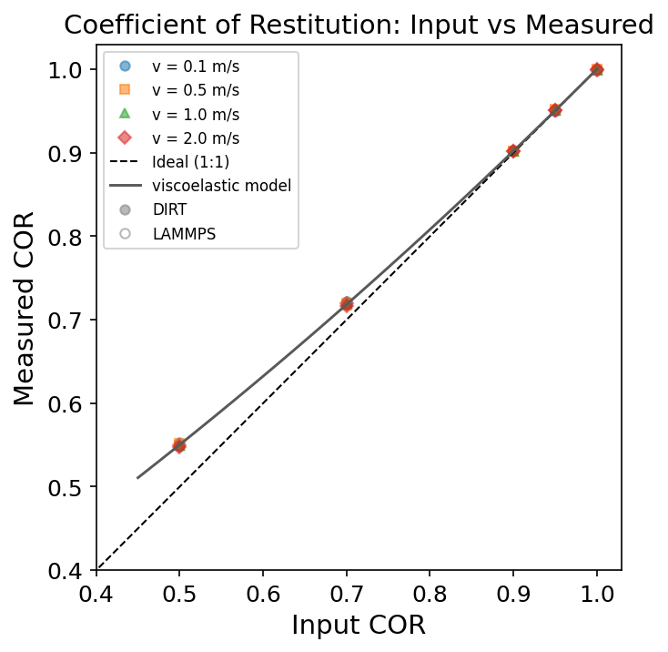

*Measured restitution vs the input value, DIRT (filled) and LAMMPS (open) at four
speeds. Points track the 1:1 line; the slight rise above it at low COR is the known
viscoelastic-on-Hertz bias (gray curve). COR is velocity-independent, as a
constant-`e` contact should be.*

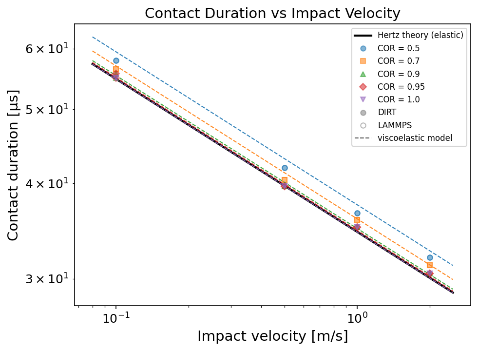

*Contact duration vs impact velocity (log–log) against the elastic-Hertz power law.
Damped cases sit slightly above it (damping lengthens contact, up to ~10 % at the
lowest COR); the COR = 1 points lie on the line.*

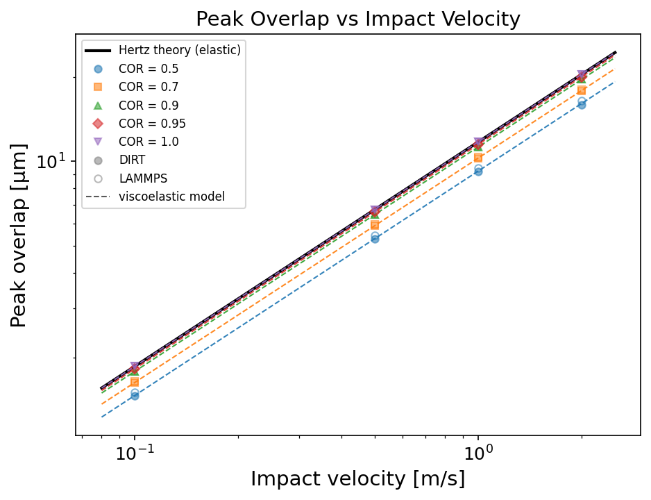

*Peak overlap vs velocity. Dissipative cases fall below the elastic curve (energy
lost on approach reduces penetration), up to ~22 % at low COR; the elastic anchor is
on the line.*

**Honest read:** strong at the elastic limit. Away from it the only reference is the
*elastic* formula (no damped closed form is checked), and the restitution comes from
a viscoelastic damping *mapping* that is calibrated, not derived. Contact-duration
accuracy is floored at ~1–2 % by timestep quantization.

## `bench_oblique_impact` — tangential contact vs Maw (1976)

A spin-free projectile strikes a frozen sphere obliquely; sweeping the incidence
angle traces the tangential restitution β(ψ₁). This validates DIRT's Hertz–Mindlin
tangential spring + Coulomb cap against the **full Maw–Barber–Fawcett (1976)**
solution (the textbook S-curve, experimentally confirmed by Kharaz et al. 2001) and
against LAMMPS's `granular` model.

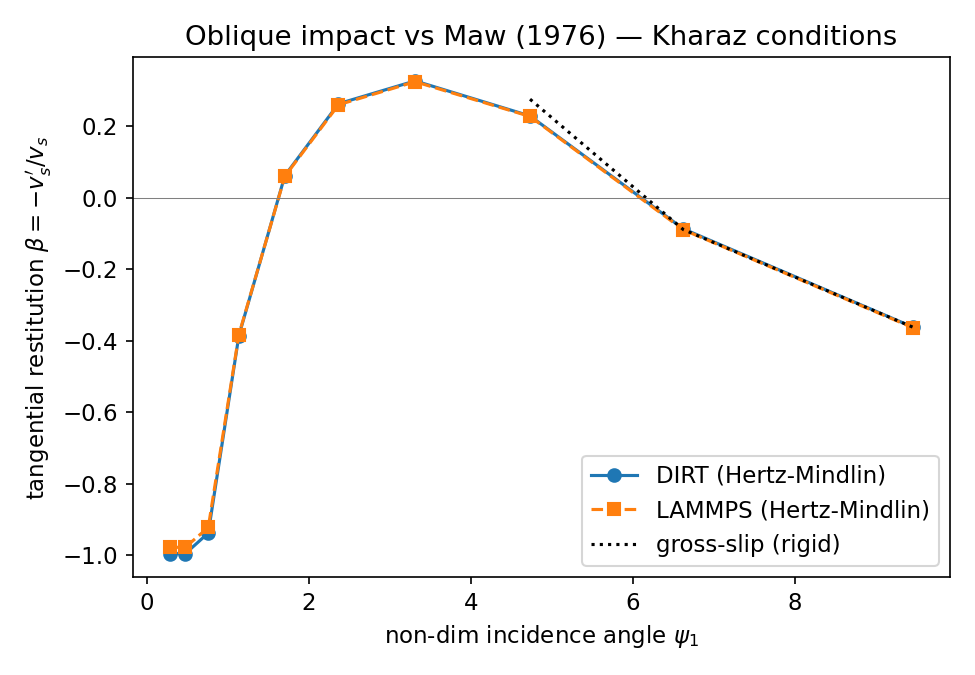

*β = −v_s′/v_s vs non-dimensional incidence angle ψ₁: DIRT, LAMMPS, and the
gross-slip line. DIRT reproduces the whole S-curve — the β ≈ −1 sticking plateau at
low ψ₁, a microslip rise through a +0.32 peak near ψ₁ ≈ 3.3, and convergence onto the
analytical gross-slip branch — and matches LAMMPS to max |Δβ| ≈ 0.007.*

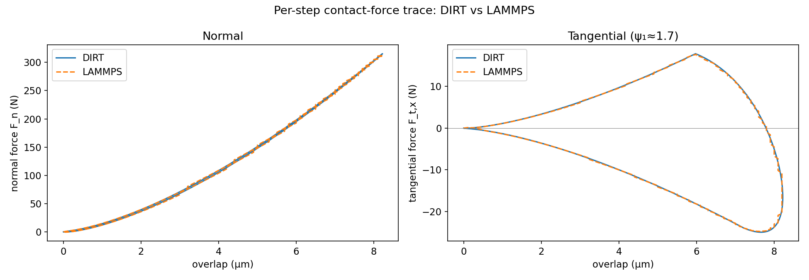

*Per-step normal and tangential force during one collision (ψ₁ ≈ 1.7): DIRT and
LAMMPS trace an identical normal curve and the same tangential loading/unloading
hysteresis loop. Normal restitution stays ≈ 0.985 independent of tangential velocity,
confirming the normal and tangential models are decoupled.*

**Honest read:** this is now a genuine analytical + cross-code validation across the
full regime, not just the gross-sliding limit — the strongest tangential test in the
suite. Still no direct comparison to raw experimental points (it matches the Maw
*theory* curve), and the projectile is aimed dead-centre so the impact normal is
exact.

## `bench_sliding_friction` — slip-to-roll transition

A sphere is launched horizontally with no spin onto a **flat frictional wall** (a real
`dirt_wall` z-plane with Mindlin friction). Kinetic friction decelerates it and spins
it up until the contact stops sliding, after which it rolls without slipping.
Rigid-body mechanics predicts `a = μg`, transition `t* = 2v₀/(7μg)`, and a final
rolling speed `v_f = (5/7)v₀` that is **independent of μ**; all three are checked
across μ ∈ {0.2,0.3,0.5,0.7} and v₀ ∈ {0.5,1,1.5} (tolerances 8 % / 10 % / 3 %).

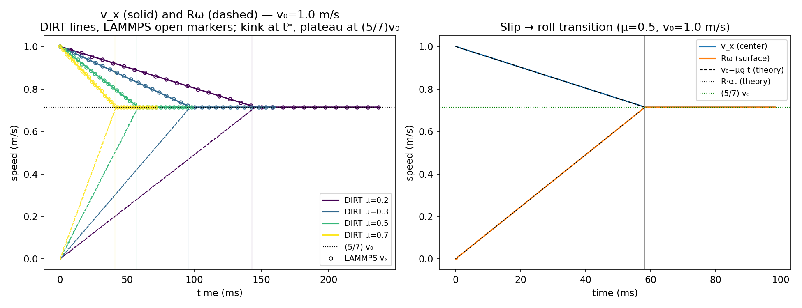

*Centre velocity vₓ (solid) and surface speed Rω (dashed) vs time. vₓ falls and Rω
rises until they meet at the (5/7)v₀ plateau (the slip→roll transition); the predicted
t* lines mark where each case stops sliding.*

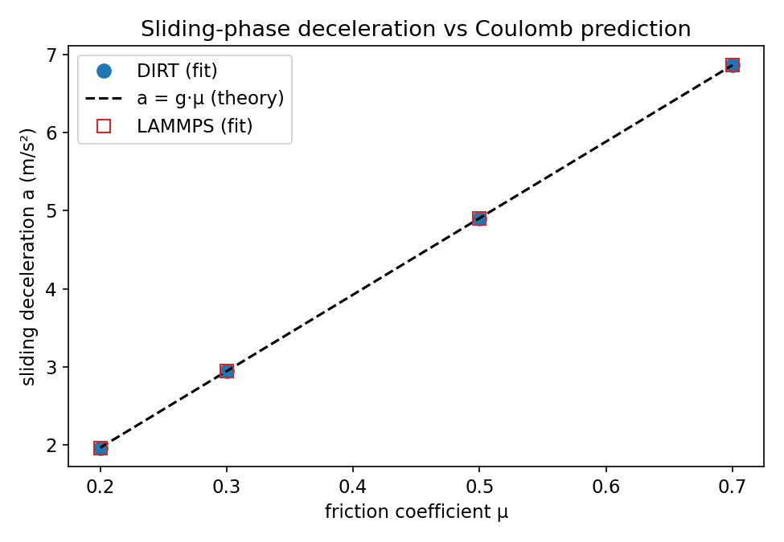

*Fitted sliding deceleration vs μ, on the `a = μg` line.*

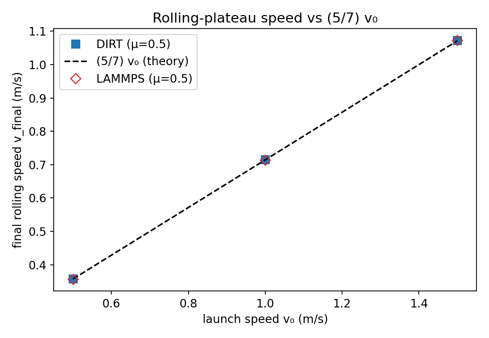

*Final rolling speed vs launch speed, on the `(5/7)v₀` line — and μ-independent, the
non-trivial prediction.*

**Honest read:** now a clean flat-wall test (the earlier giant-frozen-sphere floor
that blew up neighbor binning is gone). The `(5/7)v₀` plateau is model-independent, so
it genuinely tests the Hertz–Mindlin tangential law; `a = μg` is partly
self-consistent (the cap is μ|Fₙ| by construction). Gross sliding only; no LAMMPS.

## `bench_rolling_decay` — rolling-resistance deceleration

A sphere set in pure rolling on a (locally flat) frozen floor sphere is decelerated by
rolling resistance; for DIRT's constant-torque model the deceleration is
`a = (5/7)·μ_r·g·(r_eff/R)`, constant in time.

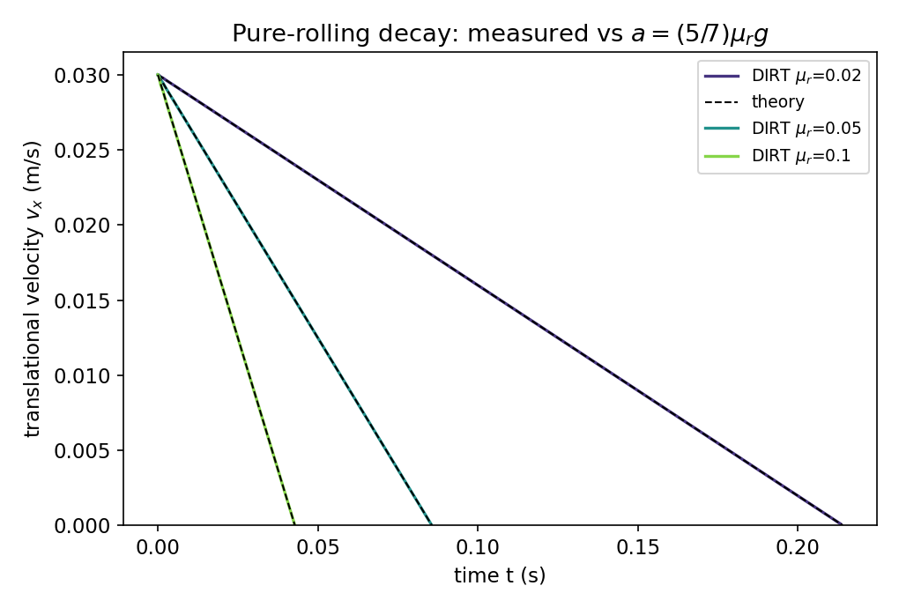

*Speed vs time for three rolling-friction coefficients (solid) on the analytical
constant-deceleration lines (dashed); pure rolling (v = ωR) held to < 1 % slip.*

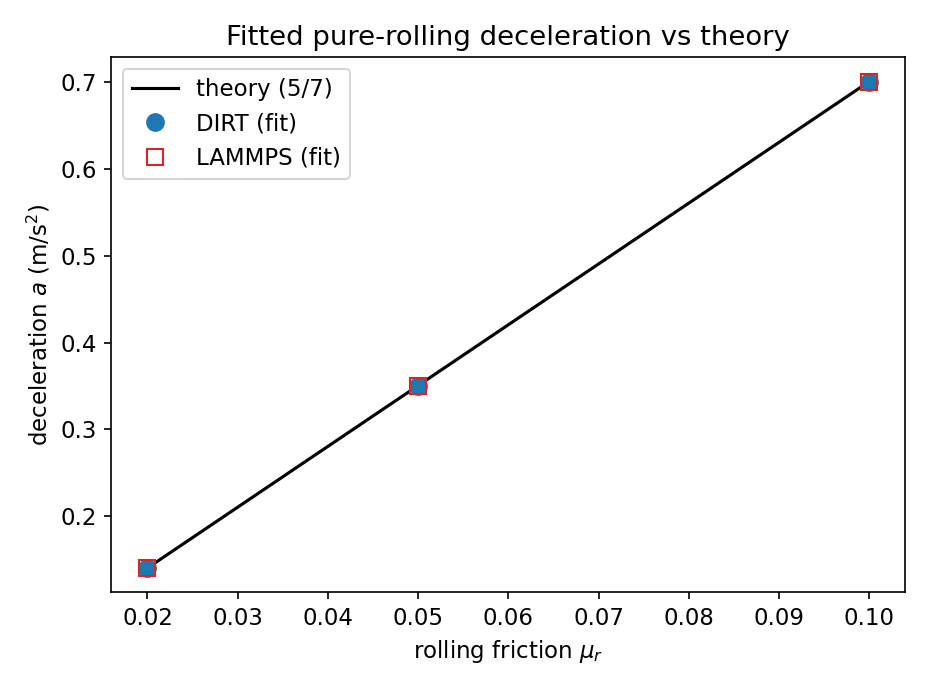

*Fitted deceleration vs μ_r on the `(5/7)μ_r g (r_eff/R)` line; DIRT (filled) and, when
present, LAMMPS `rolling sds` (open). Within 5 %.*

**Honest read:** largely **self-consistent** — the rate is derived from the same couple
the code applies, so it confirms the integrator reproduces the model's own coefficient,
not the rolling model vs experiment. The frozen sphere is legitimate here (it defines
the curvature / `r_eff`). LAMMPS overlay is printed, not asserted.

## `bench_jkr_adhesion` — adhesive pull-off

Two glass spheres approach, adhere, and separate; the peak tensile (pull-off) force is
compared to the JKR value `F = (3/2)πwR*` across work-of-adhesion values.

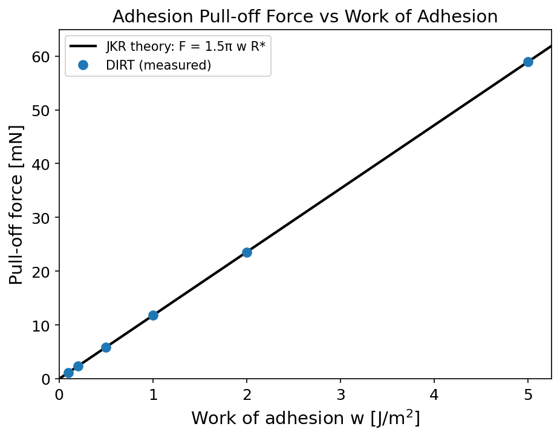

*Pull-off force vs work of adhesion (markers) on the JKR line — exactly linear
(R² = 1, < 0.001 % error).*

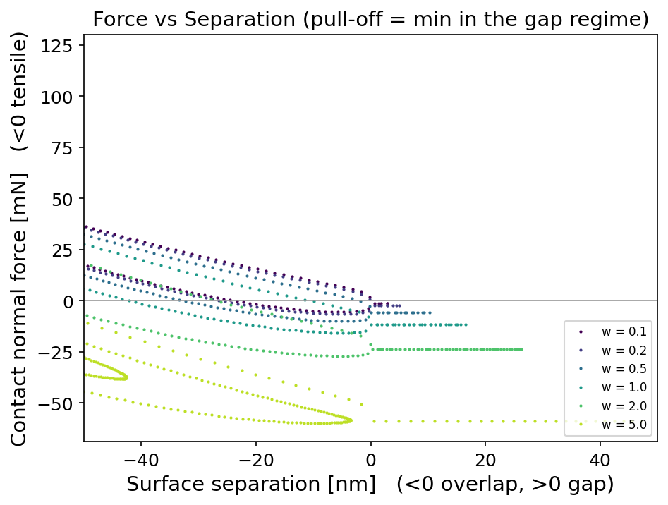

*Normal force vs surface separation: Hertzian repulsion while overlapping, then a flat
tensile −F_adh plateau in the gap until snap-off.*

**Honest read:** the near-perfect agreement is **by construction** — DIRT models
adhesion as a *constant* attractive force set to exactly `(3/2)πwR*`, and the test
measures that constant. It validates the sweep/linearity wiring, not emergent contact
mechanics (no Maugis contact-area law, hysteretic neck, or adhesive stiffness); the
flat plateau is that simplification made visible.

## `bench_fiber_crossover` — friction at a bonded-fiber crossover

Two perpendicular bonded-sphere fibers cross at one contact; the upper is dragged
tangentially under a fixed normal load and the sliding force is compared to the Coulomb
limit `F_slide = μN`.

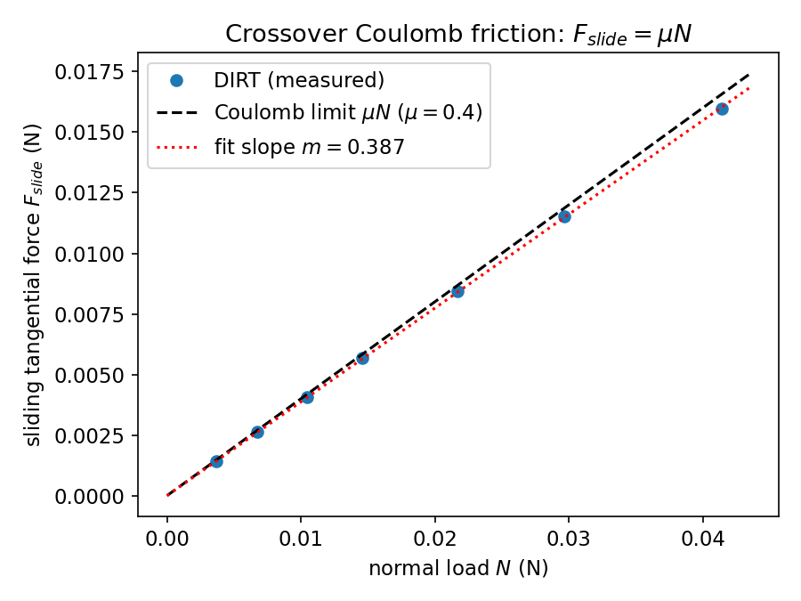

*Sliding force vs normal load on the μN line with the fitted slope (recovers μ = 0.4
to within 0.06).*

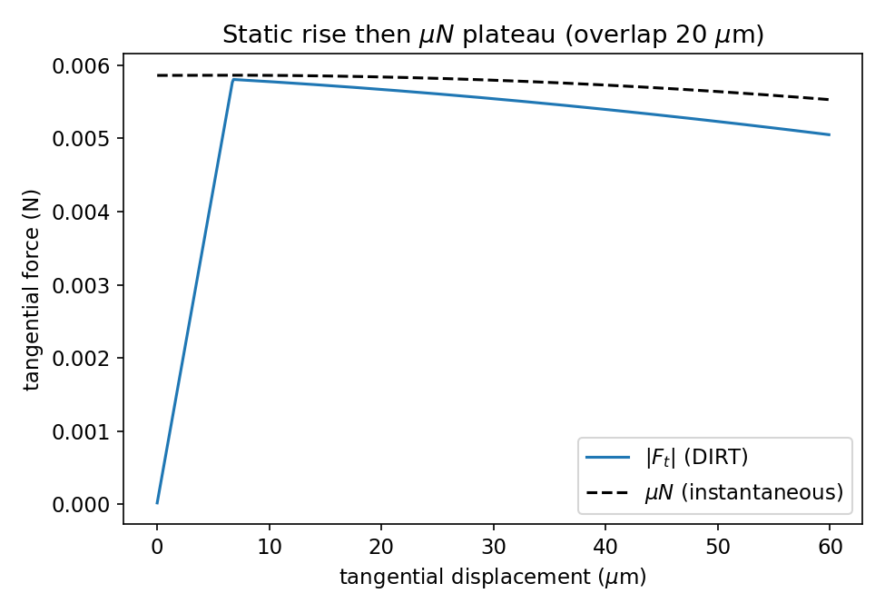

*Tangential force vs displacement for one case: the linear Mindlin static rise, then
the μN sliding plateau.*

**Honest read:** **self-consistent** — it checks the friction cap returns μ, using the
*measured* normal force, so the ratio test is somewhat circular. A useful unit-level
contact-model check, not an independent validation.

---

# Tier 2 — Free cooling (Haff's law)

`bench_sphere_haff_cooling`, `bench_clump_haff_cooling`, `bench_rod_haff_cooling` each
release a periodic box of grains with a random velocity field and let it cool through
inelastic collisions. Because DIRT's restitution is velocity-independent (constant
`e`), the granular temperature must follow Haff, `T(t) = T₀/(1+t/tc)²` — a `t⁻²`
late-time decay, not the `t⁻⁵ᐟ³` viscoelastic law. The strongest statement is that
`1/√T` is linear in `t` (the linearized law), with **R² ≈ 0.9997–0.9999**.

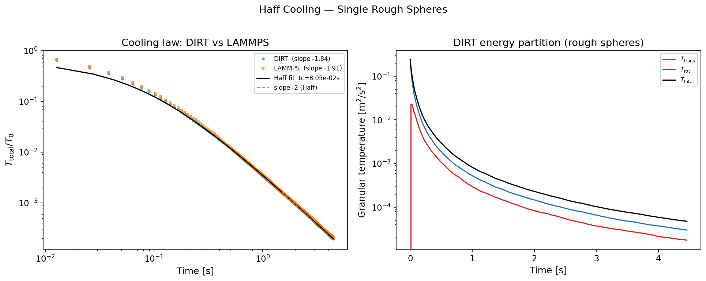

*Spheres. Left: normalized temperature vs time (log–log), DIRT and LAMMPS on the Haff
fit. Right: the energy partition — translational and rotational temperature decaying
together once friction populates the rotational mode.*

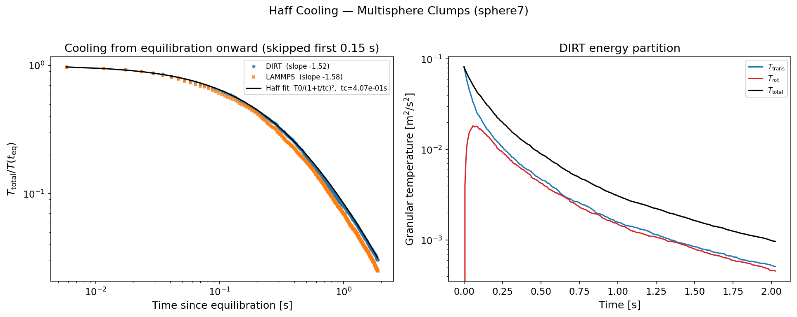

*7-sphere clumps. Left: cooling **re-zeroed at the rotational-equilibration point** (the
start-up transient is skipped); past it DIRT and LAMMPS overlay on the Haff fit. Right:
the full partition, including the skipped transient.*

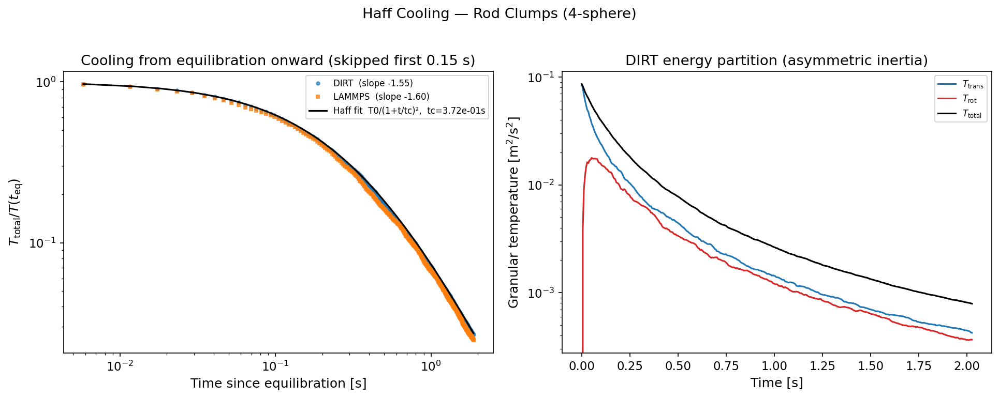

*4-sphere rods (asymmetric inertia). Same construction; DIRT and LAMMPS track the same
cooling law.*

**Honest read:** the cooling *form* is well supported, but the **−2 asymptote is not
directly reached** — these dilute gases cool only to `t/tc ≈ 8–9` (local slope ~−1.6),
so we rely on the fit curve (which embodies −2) lying on the data. `tc` is only an
order-of-magnitude match to kinetic theory (a printed diagnostic). Single realizations;
a many-body gas is chaotic, so only curve-level agreement is meaningful. For clumps/rods
the LAMMPS cross-check is **calibrated** (the rigid velocity projection otherwise starts
LAMMPS ~4× hotter) and compared **past the rotational transient**; different rigid
integrators leave a small residual. The claim is "same cooling law," not identical
dynamics.

---

# Tier 3 — Bulk granular phenomena (empirical / qualitative)

Bulk behaviour against empirical correlations or trends — the weakest tier.

## `bench_angle_of_repose` — heap formation

Spheres confined in a cylinder slump onto a frictional floor wall when the cylinder
is lifted; the repose angle is measured vs sliding friction. There is no exact analytical
angle, so the benchmark checks only that the angle rises with friction, is near-flat at
μ = 0, and is reproducible.

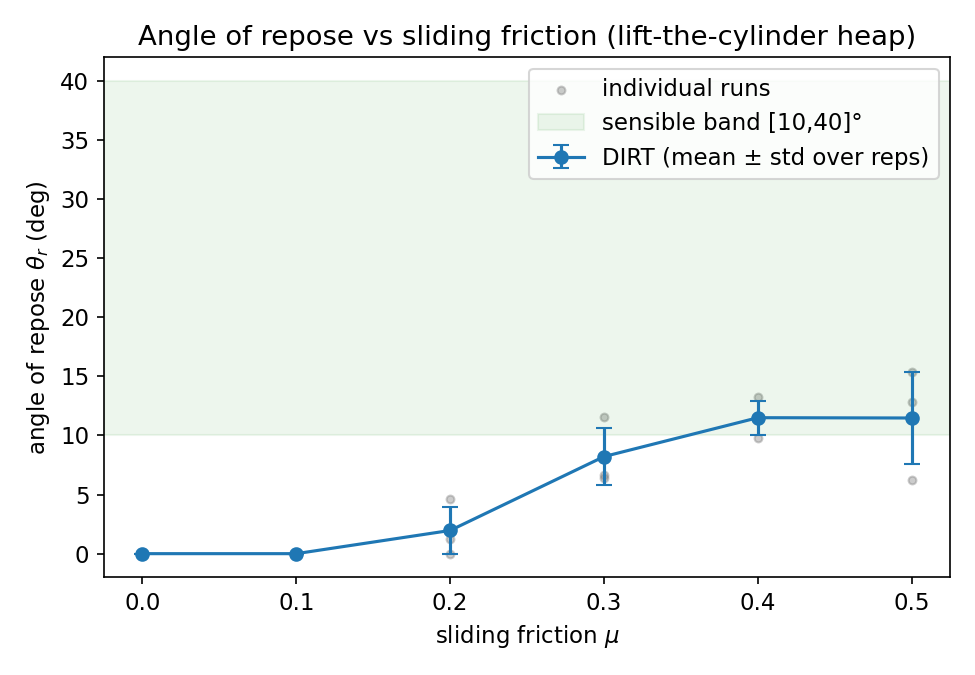

*Mean repose angle vs sliding friction (±1 s.d. over repeats), with the "sensible" band
shaded. The angle increases monotonically with μ — the qualitative law a correct model
must obey — though absolute values run low.*

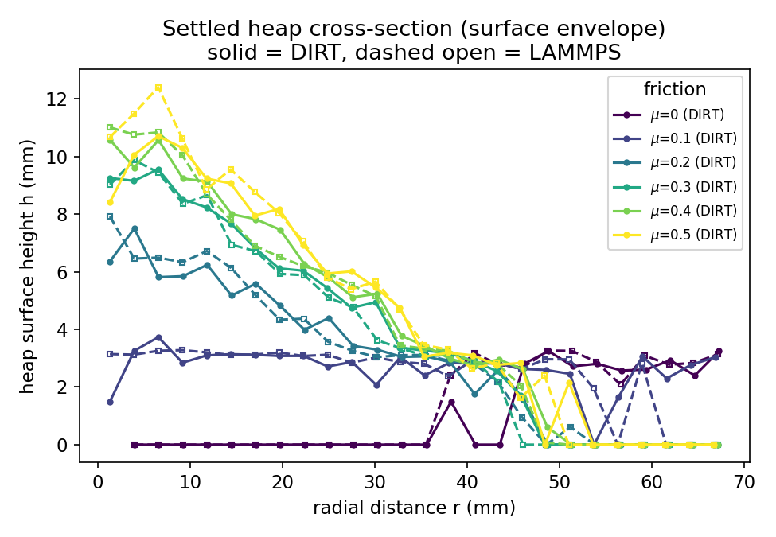

*Settled surface height vs radius for each μ; flanks steepen with friction.*

**Honest read:** qualitative only — trend, sign, reproducibility, never an angle.
Absolute angles read low because the lift-and-collapse protocol mobilizes the surface,
and the sweep stops at μ = 0.3 (the angle saturates above). The heap now stands on a
**real frictional floor wall** (the earlier frozen-bed workaround was removed once
`dirt_wall` gained tangential friction).

## `bench_column_collapse` — granular column runout

A quasi-2D column is released on a flat frictional floor; the runout `L_f` vs aspect
ratio `a = H/L0` is fit against the experimental scalings of Lube (2004) and Lajeunesse
(2004): `(L_f−L0)/L0 ≈ 1.2a` for a ≲ 3, `≈ 1.6a^(2/3)` for a ≳ 3.

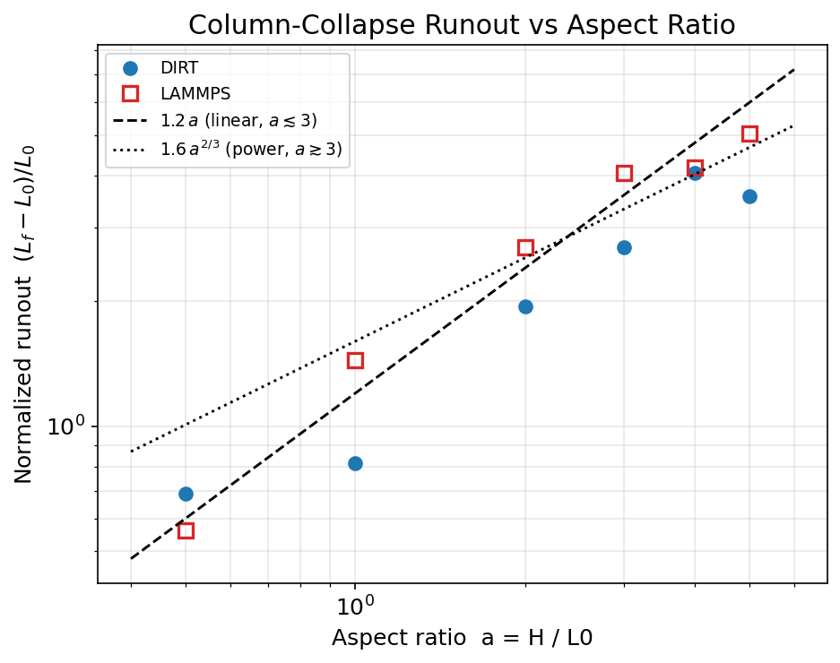

*Normalized runout vs aspect ratio (log–log) with the two experimental regime lines.
Fitted exponents are 0.81 (a ≤ 3, target 1.0) and 0.59 (a ≥ 3, target 2/3) — both within
the ±0.25 band, so the benchmark **passes**.*

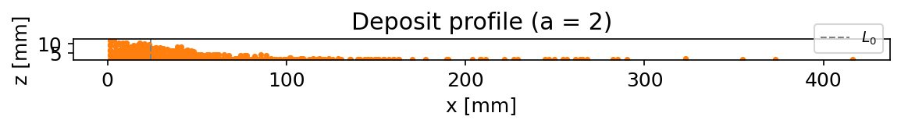

*Side view of the rest-state deposit for the representative case — it now comes to rest
as a finite pile rather than running to the wall.*

**Honest read:** **now passes** thanks to the new wall sliding friction (with a
frictionless floor it previously collapsed to a runaway monolayer). The reference is
still empirical with material-dependent prefactors — only the exponents/regime change
are tested, not the prefactors — and the band (±0.25) is wide.

## `bench_hopper_beverloo` — silo discharge rate

A 2D slot hopper discharges under gravity; the mass flow rate is fit against
**Beverloo's empirical correlation** `W ∝ (D − k·d)^(3/2)` over five orifice widths.

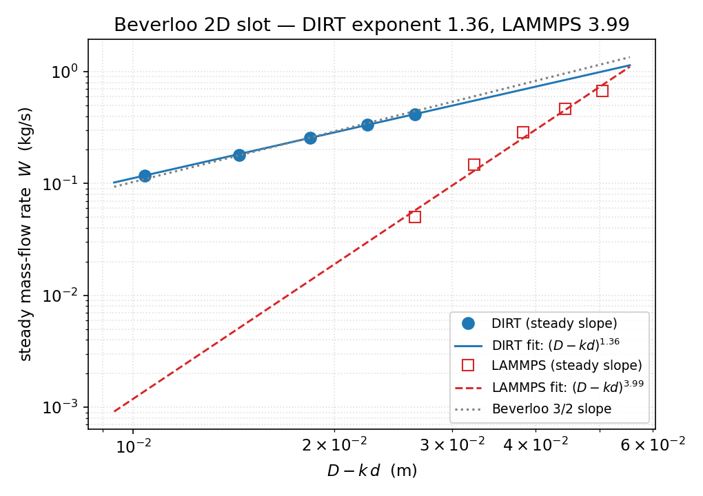

*Discharge rate vs effective orifice width (log–log) with the power-law fit and the 3/2
reference; fitted exponent ≈ 1.36 (R² ≈ 1.00).*

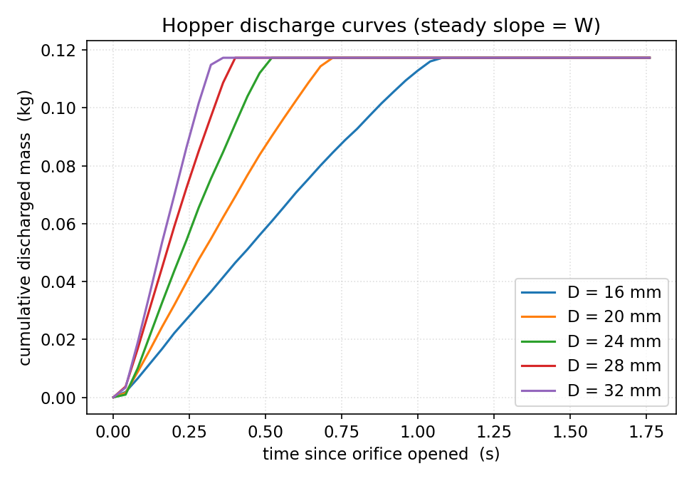

*Cumulative discharged mass vs time per orifice width; the constant-slope region is the
steady rate W.*

**Honest read:** the reference is itself an **empirical** fit (k ≈ 1.4 and the prefactor
are fitted), so this validates a correlation, not first principles — and only its
exponent/form. The measured 1.36 is below the textbook 3/2 (finite hopper, wedge feed,
modest width range); the ±0.25 tolerance is wide. 2D slot only (the 3D `5/2` form is
untested).

## `bench_plate_sinkage` — pressure–sinkage

A plate is pushed into a settled bed; pressure vs sinkage is fit against the **Bekker**
terramechanics relation `p = (k_c/b + k_φ)·zⁿ`.

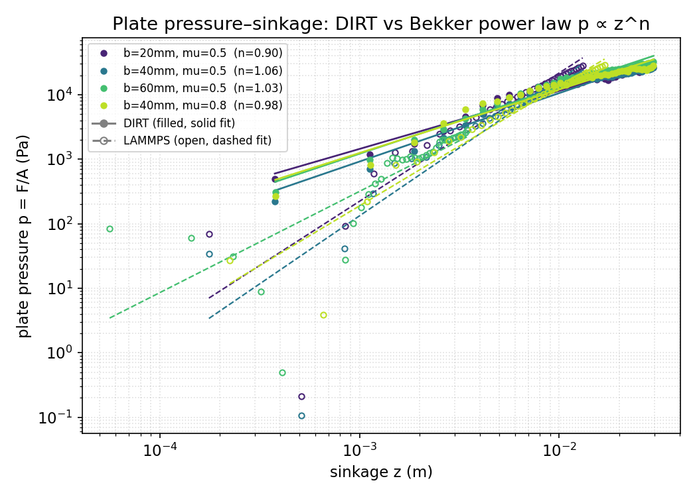

*Pressure vs sinkage (log–log) per case with the fitted power law; exponents land in the
broad 0.4–1.6 band (R² ≈ 0.89–0.93).*

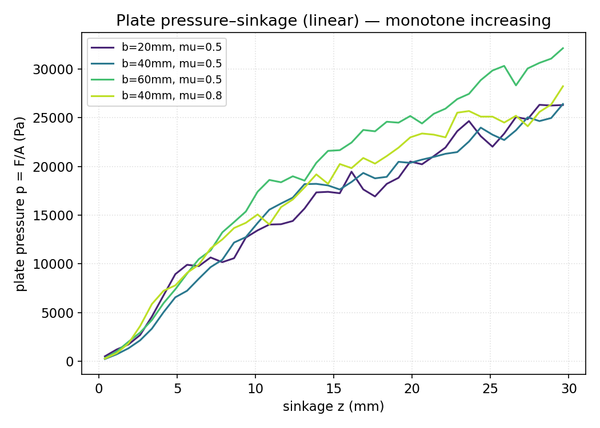

*Same data, linear axes — monotone pressure rise with depth and plate width.*

**Honest read:** empirical/qualitative — Bekker is a soil-fit correlation, not a contact
law; only the power-law *form* and a very wide exponent band are checked (not the
constants, nor any real soil). Grains are softened, gravity enhanced 5×, geometry a thin
periodic slice; absolute pressures are not physical.

---

## What is not validated (scope summary)

- **No direct experimental comparison** — references are analytical, empirical
  correlations, the Maw theory curve, or LAMMPS.
- **The contact model is partly assumed** — Hertz–Mindlin stiffness and the viscoelastic
  damping/restitution mapping; LAMMPS agreement tests shared implementation, not physical
  correctness.
- **Several "analytical" checks are self-consistent** (jkr, fiber_crossover, much of
  rolling_decay; partly sliding_friction).
- **No convergence studies** (timestep, particle count, box size).
- **Empirical references** (Beverloo, Bekker) are correlations with fitted constants;
  only forms/exponents are tested.
- **Other `examples/`** (bonds, fiber_bond, hopper, granular_gas_benchmark,
  granular_basic, lj_argon) are outside this document.

## Capabilities implemented but not benchmarked

Physics DIRT exposes that no `bench_*` currently exercises (bonds excluded — they
have their own non-`bench_` examples). The cleanest open gaps:

- **Hooke (linear-spring) contact** (`contact_model = "hooke"`, `kn`/`kt`) — every
  benchmark uses Hertz.
- **Twisting friction** (`twisting_friction`; both `constant` and `sds`) — no
  benchmark applies a twisting torque.
- **SDS rolling model** (`rolling_model = "sds"`) — `rolling_decay` tests only the
  `constant`-torque model.
- **SJKR cohesion** (`cohesion_energy`) — no cohesive benchmark (distinct from JKR/DMT).
- **DMT adhesion** (`adhesion_model = "dmt"`) — `jkr_adhesion` runs JKR only.
- **Multi-material mixing** — every config uses a single material, so the per-pair
  geometric/harmonic mixing rules (`e_eff_ij`, `friction_ij`, `beta_ij`, …) are never
  exercised between two *different* materials.
- **Polydispersity / unequal-radius contact** — size distributions (`RadiusSpec`) and
  the unequal-radius `R* = R₁R₂/(R₁+R₂)` are barely touched (all two-body tests use
  equal spheres or sphere-on-wall).
- **MPI domain decomposition** — all benchmarks run `1×1×1`; cross-rank correctness
  (ghost exchange, conservation) is untested here.
- **`dirt_fixes` viscous drag / prescribed motion**, and **GPU-vs-CPU equivalence**.

(Contact heat conduction was removed from the codebase, so it is no longer a gap; it
will need a benchmark when re-added.)

## Summary table

| Example | Reference | Tier | Status / main gap |
|---|---|---|---|
| hertz_rebound | Hertz + LAMMPS | analytical (strong) | PASS; damped vs elastic only; damping mapping calibrated |
| oblique_impact | Maw 1976 + LAMMPS | analytical + cross-code (strong) | PASS; full S-curve; vs theory not raw experiment |
| sliding_friction | rigid-body slip-to-roll | analytical | PASS; (5/7)v₀ model-independent; a=μg partly self-consistent |
| rolling_decay | own-model rate + LAMMPS | analytical (self-consistent) | PASS; rate derived from same model |
| jkr_adhesion | JKR pull-off | analytical (self-consistent) | PASS; measures its own constant force |
| fiber_crossover | Coulomb limit μN | analytical (self-consistent) | PASS; ratio circular vs measured N |
| sphere/clump/rod haff | Haff law + LAMMPS | law (cross-code) | PASS; −2 not reached; tc unvalidated; clump cross-check calibrated |
| angle_of_repose | empirical (none exact) | qualitative | PASS; trends only; frozen-bed |
| column_collapse | Lube/Lajeunesse (empirical) | empirical scaling | PASS (after wall friction); exponents only |
| hopper_beverloo | Beverloo (empirical) | empirical correlation | PASS; exponent 1.36 vs 1.5; prefactor untested |
| plate_sinkage | Bekker (empirical) | empirical / qualitative | PASS; form only; loose bands; softened grains |
