# DIRT Validation Status

This document records what the `bench_*` examples actually validate, and how to
read each figure. Every benchmark couples a small DIRT simulation to a reference
(an analytical result, an empirical correlation, or LAMMPS) and checks measured
quantities against it with explicit tolerances (`sweep.py graph` prints PASS/FAIL).

The intent is to be useful *and* honest: each section states the result, then says
plainly where the test is weak — an idealization, an empirical fit, a check that is
really self-consistent (confirming a model returns its own input), or a regime that
isn't reached.

**Evidence tiers** (decreasing strength): *Analytical* — a closed-form reference;
*Cross-code* — agreement with LAMMPS, which tests implementation consistency under a
**shared** contact model, not correctness against physical reality; *Empirical /
law / qualitative* — only a functional form, scaling exponent, or trend, sometimes
against a correlation with fitted constants.

References are mostly analytical, empirical correlations, the experimentally-
established Maw curve (as a theory curve), or LAMMPS. The closest tie to a physical
experiment is `bench_kharaz_oblique`, which replicates Kharaz et al.'s (2001)
elastic-rebound protocol and anchors to their **measured** eₙ = 0.98 and μ = 0.092;
its curve-level check is still against the rigid-body/Maw theory those experimental
points confirmed, because the paper's per-point scatter lives only in paywalled
figures.

## `bench_guo2018_fiber_shear_cell` — source audit; replication blocked

The Guo rubber-cord directory hash-binds the primary paper and its approximate
manual Fig. 6/7 digitization. The paper's numerical setup is periodic and
planar—not the experimental Schulze-ring annulus—and builds walls and blades
from rigidly connected spheres under a gravity-weighted upper body. Its
wall-sphere diameter/layout and upper-body mass are not reported, so this
directory intentionally contains only source and candidate-topology audits,
not a DIRT solver draft. A completed result requires citable recovery of those
inputs, an independently exercised sphere-built gravity-loaded assembly, six
solver-receipted histories, measured normal-load qualification, a post-drive
steady window, and two Fig. 6/7 comparisons at three loads plus a 64/96-mm
sensitivity check. No solver result, figure, or PASS is committed.

## `material_pair_table_validation` — typed Material compatibility

The typed `Material` registration path is compared with a golden mixed-material
pair table recorded from the pre-redesign `origin/main` implementation. It covers
all 21 generated pair properties, including elastic, adhesion, rolling/twisting,
MDR, and liquid-bridge mixing. The `1e-12` relative-error limit is a strict
compatibility check rather than a physics calibration.

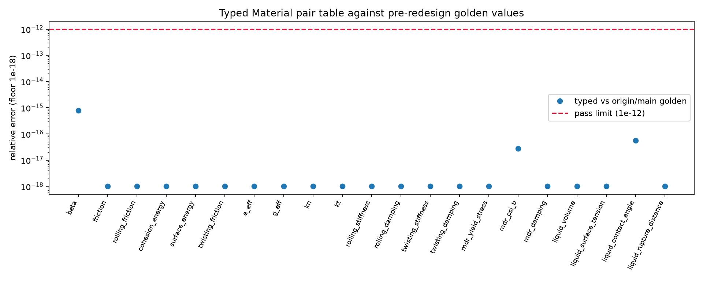

*PASS: 21/21 typed values match the pre-redesign golden table; the dashed line is
the `1e-12` relative-error criterion and exact matches are drawn at the plot floor.*

## `simulation_fixture_validation` — public fixture structural contract

The `dirt_test_utils::SimulationFixture` builder is exercised from a standalone
top-level example, then measured against a committed declaration of a default
contact pair and a three-particle CSR chain. This checks nonzero synchronized
Atom/DEM rows, `nlocal`/`natoms`, material pair-table dimensions, declared CSR
offsets/indices, and the stable default timestep through the public API. It is a
test-fixture integrity check, not an independent DEM physics calibration.

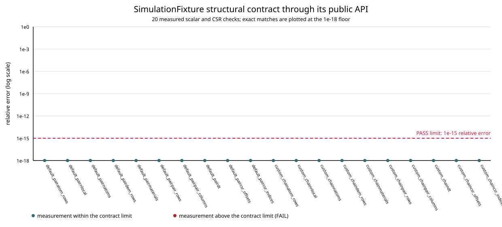

*PASS: 20/20 measured scalar and CSR contract checks match exactly; the dashed
line is the `1e-15` relative-error pass limit.*

**These benchmarks catch real bugs.** The oblique-impact validation alone drove two
contact-model fixes — a tangential damping-sign error that was injecting energy, and
a requirement that a frozen contact partner also have its rotation frozen — and the
rebound benchmark surfaced a mislabeled damping constant (`SQRT_5_3` holds √(5/6)).
So the suite is doing its job, not just decorating passing runs.

**CPU precision baseline.** The archived precision sweep records deterministic
output fingerprints for contact and bulk benchmarks under `precision-double`,
`precision-mixed`, and `precision-single`. The machine-readable status table lives
at `validation/cpu_precision_baseline.csv`; the human summary is
`validation/cpu_precision_baseline.md`. Completed runs are plotted below as
mixed/single relative signature deltas against double; non-OK runs remain explicit
status rows instead of being dropped.

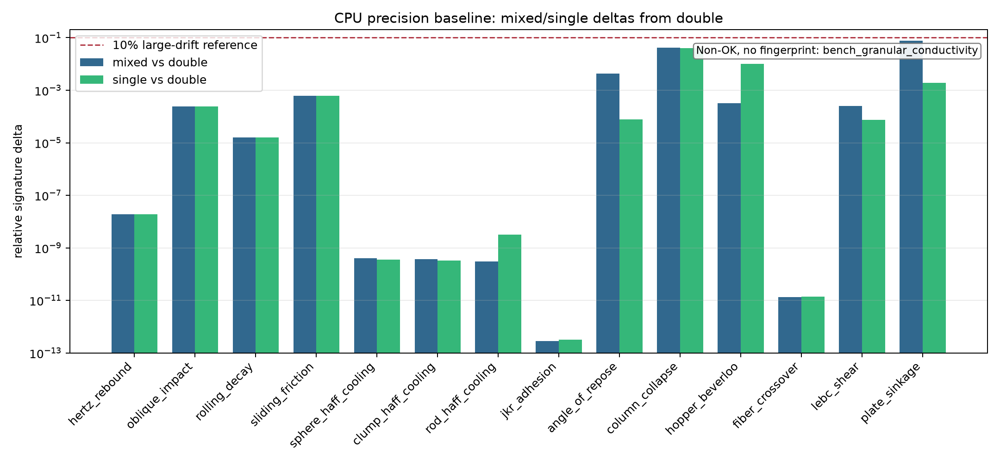

*CPU precision fingerprint deltas for completed benchmarks. The dashed 10% line is
a large-drift reference; `bench_granular_conductivity` is a documented timeout in
all three precision modes, so it has no fingerprint in this baseline.*

**Wall friction (recent core change).** `dirt_wall` now applies a **Mindlin
tangential (sliding) spring with a Coulomb cap** on plane walls (using the
material's `friction`), with per-contact tangential history — not just normal force.
This unblocked `bench_sliding_friction` (now a clean flat-wall test) and let the
`bench_column_collapse` deposit come to rest as a finite pile instead of a runaway
monolayer (though that bench still **FAILs** its exponent gate — a genuine finite-size
limitation confirmed cross-code against LAMMPS, see below), and let
`bench_angle_of_repose` stand its
heap on a real frictional floor wall. Two examples still use a **frozen partner**
for legitimate reasons: `oblique_impact` uses a sphere–sphere contact to exercise
the *particle–particle* tangential model directly, and single-contact spin tests
such as `bench_sds_rolling` and `bench_twisting_friction` use frozen anchors to
isolate the rotational degree of freedom under a known normal load. `rolling_decay`
no longer uses a frozen floor sphere: it now runs on a real flat wall, so
`r_eff = R` exactly.

## `bench_plate_sinkage` — plate pressure-sinkage against Bekker and published parameters

A flat plate is driven into a settled granular bed and the wall reaction force is
fit to the Bekker pressure-sinkage form `p = A z^n`. The sweep keeps its existing
checks that every case is monotone, has a good power-law fit, has a sensible
granular exponent, and carries more total load as plate width increases. It now
adds a cited fitted-parameter gate: the representative narrow plate `b020_mu05`
must fall inside the sandy/loam Bekker exponent range `0.66 <= n <= 1.10` from
NASA/TM-20250006958 Table 1, which includes LETE Sand (`n=0.79`, `kc=102
kN/m^(n+1)`, `k_phi=5301 kN/m^(n+2)`).

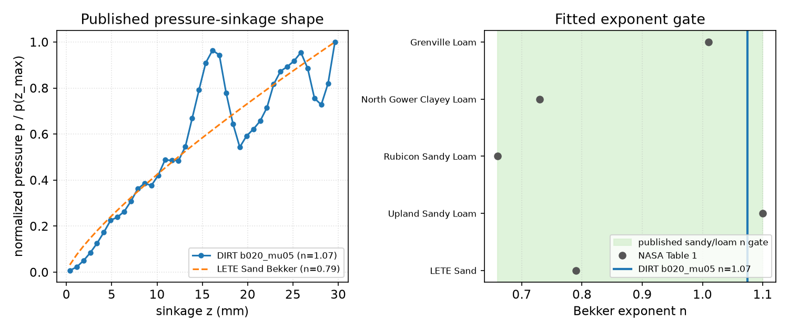

*Normalized DIRT pressure-sinkage overlaid with the published LETE Sand Bekker
curve, and the fitted `n` range gate. Latest run: PASS, the representative DIRT
fit lies inside the published sandy/loam range.*

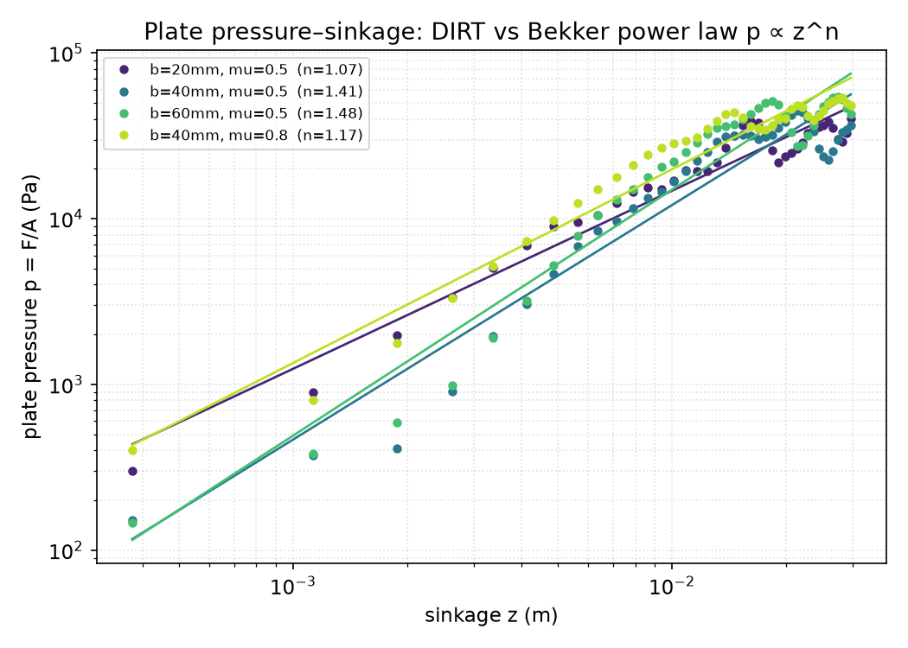

*DIRT pressure-sinkage curves and power-law fits for all plate widths; the broad
Bekker-form checks remain active in addition to the published-parameter gate.*

**SPH glass calibration bounded smoke gates.** The SPH glass-sphere calibration
deliverables 1, 4, and 6 are long-form calibration sweeps, so their harness default
is now a bounded smoke gate rather than the full sweep. The summary figure in
[`SPH_glass_sphere_calibration`](SPH_glass_sphere_calibration/README.md) shows the
actual measured 01 shear-rheology, 04 enduring-contact, and 06 conductivity checks
against their pass bands/criteria.

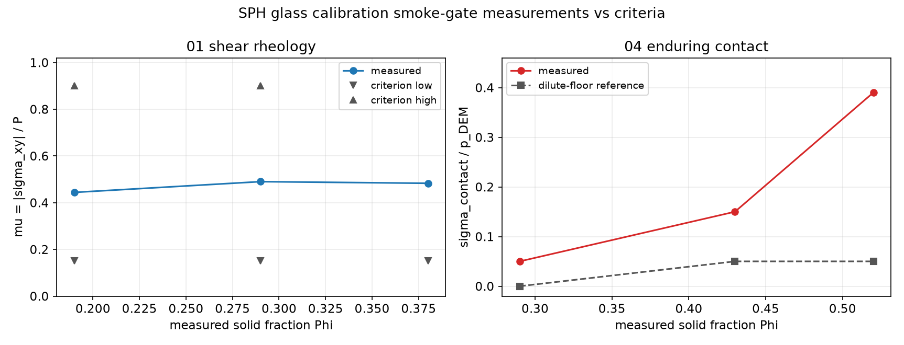

*Latest independent revision run: 01 shear rheology PASS (2/2), 04 enduring contact
PASS (3/3), and 06 conductivity PASS (3/3).*

## `bench_curtis_wet_fiber_breakage` — wet flexible-fiber agglomerate impact

A small wet BPM fiber agglomerate impacts a plane with Willett pendular
liquid-bridge cohesion enabled between fibers and bond breakage enabled inside
the flexible fibers. The recorder counts fiber-fiber contacts from the active
DIRT Willett liquid-bridge force on neighbor pairs, then forms fragments from
those active contacts plus intact intra-fiber BPM bonds. The benchmark follows
Yang et al. (2019): breakage ratio must increase with impact velocity / modified
Weber number, and the minimum largest-fragment mass ratio must decrease. The
gate compares every DIRT point to the digitized Yang/Curtis Fig. 13
modified-Weber master curve committed as
`data/yang_curtis_fig13_digitized.csv`; the tolerance bands shown in the plot
are `0.30` absolute breakage ratio and `0.40` absolute largest-fragment mass
ratio. This is a small regression-scale agglomerate, not the full Table 2
`Np = 664` prepared-agglomerate run.

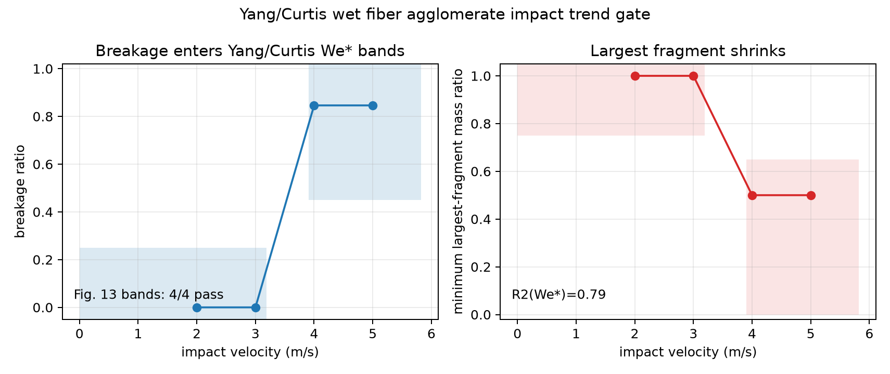

*Breakage ratio and largest-fragment mass ratio across the DIRT velocity sweep.
Latest run: PASS, 4/4 points inside the digitized Yang/Curtis Fig. 13
modified-Weber tolerance bands.*

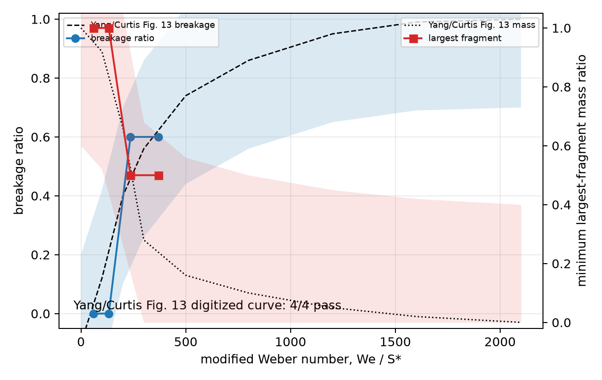

*Same measurements against modified Weber number with the Yang/Curtis reference
curve and tolerance bands shaded. Latest run: PASS.*

---

# Tier 1 — Single-contact and single-particle mechanics

The strongest tests: small, deterministic setups compared to exact results. Some are
nonetheless partly *self-consistent* — noted where so.

## `bench_cundall_damping` — Cundall non-viscous global damping

A single free sphere is launched upward under gravity and spun under a constant
opposing torque while the `[[cundall]]` damping fix applies the documented
component-wise force/torque scaling. The sign of the mechanical power flips at the
apex and at zero spin, so the benchmark exercises both Cundall branches and fits
the exact piecewise-constant rates across γ ∈ {0.2, 0.5, 0.8}. All four DIRT rates
must match the analytical values within 1 %, and the linear acceleration branch is
also cross-checked against LAMMPS `fix damping/cundall`.

*Fitted DIRT linear/angular rates vs exact Cundall analytical rates; the shaded
band is the ±1 % PASS criterion used by the sweep, with LAMMPS overlaid for the
linear branch. Latest run: PASS, all rates within the 1 % gate.*

*Velocity and angular-velocity traces showing the apex and zero-spin sign flips
that separate the piecewise-linear analytical branches.*

**Honest read:** the reference is an exact single-particle analytical solution for
the documented Cundall damping rule, so this is a sharp implementation check for
the fix. It does not test contacts or quasi-static pack relaxation; those are
covered by the broader granular benchmarks.

## `bench_chung_ooi_impact` — Chung & Ooi elastic normal impact

Chung & Ooi (2011) is a widely-used suite of standard test cases for *verifying DEM
codes* against known answers; this benchmark reproduces its elastic normal-impact
Tests 1 and 2 — a head-on sphere–sphere impact and a sphere–wall impact, where one
grain flies into another (or into a rigid plane) and bounces off. Both cases are
undamped (`restitution = 1`), so the collision is purely elastic and the reference is
the independent closed-form Hertz solution. The sweep checks maximum contact force,
contact duration, and peak overlap across relative impact velocities from 0.5 to 10
m/s; all 31 checks pass with force and overlap errors at round-off scale and
contact-duration errors below 0.5%.

*Maximum contact force vs impact velocity for DIRT (points) and the Hertz
analytical reference (lines). The shaded band is the ±2% force PASS criterion;
both Chung & Ooi elastic normal-impact cases pass inside it.*

*Contact duration vs impact velocity for DIRT and Hertz. The shaded band is the
±2% contact-time PASS criterion; the remaining residual is integer timestep
resolution, and all cases pass inside it.*

*Maximum overlap vs impact velocity for DIRT and Hertz. The shaded band is the
±2% overlap PASS criterion; both cases pass inside it.*

## `bench_hertz_rebound` — Hertzian normal rebound

A single glass sphere strikes a rigid wall; the benchmark sweeps impact velocity
(0.1–2 m/s) and input restitution (0.5–1.0) and measures the coefficient of
restitution, contact duration, and peak overlap against Hertz theory. The strongest
evidence is the **elastic anchor** at COR = 1 (zero damping): there the contact is
purely Hertzian and the simulation reproduces the analytical peak overlap to
**≤ 0.1 %** and contact duration to ~1 % at every velocity, with measured COR = 1.000.
This pins the contact stiffness and the integrator.

*Measured restitution vs the input value, DIRT (filled) and LAMMPS (open) at four
speeds. Points track the 1:1 line; the slight rise above it at low COR is the known
viscoelastic-on-Hertz bias (gray curve). COR is velocity-independent, as a
constant-`e` contact should be.*

*Contact duration vs impact velocity (log–log) against the elastic-Hertz power law.
Damped cases sit slightly above it (damping lengthens contact, up to ~10 % at the
lowest COR); the COR = 1 points lie on the line.*

*Peak overlap vs velocity. Dissipative cases fall below the elastic curve (energy
lost on approach reduces penetration), up to ~22 % at low COR; the elastic anchor is
on the line.*

**Honest read:** strong at the elastic limit. Away from it the only reference is the
*elastic* formula (no damped closed form is checked), and the restitution comes from
a viscoelastic damping *mapping* that is calibrated, not derived. Contact-duration
accuracy is floored at ~1–2 % by timestep quantization.

## `bench_wall_twisting_parity` — wall twisting torque parity

A one-sphere contact check compares plane, cylinder, sphere, and spherical-region
walls at the same overlap and local contact normal. The sphere is spun purely
about the normal, so the only wall torque should be the constant twisting couple
`tau = mu_tw |F_n| R*` inherited from the plane-wall implementation. The benchmark
gates each geometry against that plane-law reference to round-off tolerance.

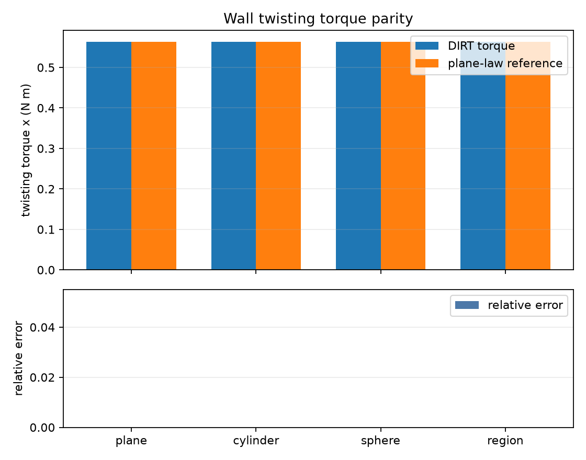

*Measured wall twisting torque for plane, cylinder, sphere, and region contacts
against the local plane-wall reference. Latest run: PASS, max relative error below
1e-12.*

## `fiber_bond_breakage` — coupled axial plasticity and breakage

The `axial_plastic_stress_constant` scenario pulls a bonded-particle fiber
through the axial piecewise plastic envelope while `AxialStress` breakage is
active. The tensile threshold is in the post-yield hardening branch:
`sigma_break = 14 MPa` gives `eps_break = 0.018` from the analytical
elastic-plastic envelope, whereas an elastic-only calculation would break at
`eps = 0.014`. The validator reconstructs the coupled normal force from the
recorded plastic anchor and checks both the pre-break envelope and the
first-break strain.

*Measured axial force after plastic return-map versus the analytical
elastic-plastic envelope, with the active breakage threshold and ±5% first-break
strain gate shown. Latest run: PASS.*

## `bench_hooke_rebound` — linear-spring normal rebound (exact damped closed form)

Exercises the **Hooke** normal contact (`contact_model = "hooke"`, per-material
`kn`/`kt`) — the linear spring-dashpot branch of `contact.rs` that every other
benchmark leaves untouched (they all use Hertz). Two identical spheres collide
head-on; the driver sweeps input restitution (0.3–1.0) and relative impact
velocity (0.5–4 m/s) and gates the measured COR, contact duration, and peak
overlap against the **exact** analytical collision. Unlike Hertz, the linear
contact is a constant-coefficient damped harmonic oscillator, so it *has* a
closed-form solution with no free constants:

- **COR = e** exactly, because DIRT derives the Hooke damping ratio as the exact
  linear inversion `β = −ln e/√(π²+ln²e)`, and `exp(−πβ/√(1−β²)) = e`.
- **Contact duration** `t_c = π/ω_d = √(π²+ln²e)·√(m_eff/kn)` (half the damped
  period), **velocity-independent** — the signature of a linear contact.
- **Peak overlap** `δ_max = (v/ω_d)·e^(−βω₀t*)·sin(ω_d t*)`, scaling linearly with
  the impact speed.

Across all 20 cases the simulation matches every one of these to **≤ 0.05 %**
(COR to within 0.0005, contact time and overlap to a few 0.01 %), and both COR and
`t_c` are flat across impact speed to < 0.05 %.

*Measured COR vs input restitution at four speeds. Points sit on the `COR = e` line
exactly and independently of velocity — the linear contact realizes its input
restitution with no calibration bias (contrast the Hertz/Tsuji rise above the line).*

*Contact duration vs input restitution against `t_c = π/ω_d`. Points lie on the
analytical curve at every velocity (curves for the four speeds coincide), confirming
the velocity-independent half-period of the damped linear oscillator.*

*Peak overlap vs impact velocity for each restitution. The linear `δ_max ∝ v`
scaling and the damping-dependent slope both match the closed form.*

**Honest read:** this is the strongest normal-contact check in the suite — an exact
damped closed form (not just the elastic limit, and not a calibrated mapping), so it
validates the linear stiffness, the restitution→damping derivation, and the
integrator simultaneously. It shares `bench_hertz_rebound`'s ~1–2 % contact-duration
floor from timestep quantization, but here the resolved error is far below it.

## `bench_hooke_wall_rebound` — linear-spring wall rebound

A single sphere strikes a real `dirt_wall` plane with
`contact_model = "hooke"`. This closes the wall-side Hooke normal-force check:
the reduced mass is the particle mass, `kn_ij` is the wall spring stiffness, and
`beta_ij` gives the exact linear spring-dashpot damping ratio. The sweep checks
measured COR, contact duration, peak overlap, and velocity-independence against
the same closed-form damped oscillator used for the particle-particle Hooke
benchmark, but with the rigid-wall effective mass.

*Measured wall rebound COR vs the exact `COR = e` reference; the gray band is the
PASS criterion.*

*Measured wall contact duration vs the exact damped half-period; the gray band is
the PASS criterion.*

*Measured peak overlap vs the closed-form wall collision reference; shaded bands
show the PASS criterion.*

## `bench_oblique_impact` — tangential contact vs Maw (1976)

A spin-free projectile strikes a frozen sphere obliquely; sweeping the incidence
angle traces the tangential restitution β(ψ₁). This validates DIRT's Hertz–Mindlin
tangential spring + Coulomb cap against the **full Maw–Barber–Fawcett (1976)**
solution (the textbook S-curve, experimentally confirmed by Kharaz et al. 2001) and
against LAMMPS's `granular` model.

*β = −v_s′/v_s vs non-dimensional incidence angle ψ₁: DIRT, LAMMPS, and the
gross-slip line. DIRT reproduces the whole S-curve — the β ≈ −1 sticking plateau at
low ψ₁, a microslip rise through a +0.32 peak near ψ₁ ≈ 3.3, and convergence onto the
analytical gross-slip branch — and matches LAMMPS to max |Δβ| ≈ 0.007.*

*Per-step normal and tangential force during one collision (ψ₁ ≈ 1.7): DIRT and
LAMMPS trace an identical normal curve and the same tangential loading/unloading
hysteresis loop. Normal restitution stays ≈ 0.985 independent of tangential velocity,
confirming the normal and tangential models are decoupled.*

**Honest read:** this is now a genuine analytical + cross-code validation across the
full regime, not just the gross-sliding limit — the strongest tangential test in the
suite. Still no direct comparison to raw experimental points (it matches the Maw
*theory* curve), and the projectile is aimed dead-centre so the impact normal is
exact.

## `bench_nohistory_tangential` — history-free tangential law

Two identical glass spheres are held at fixed normal overlap and driven through a
reversing tangential-velocity path. The `linear_nohistory` force is checked against
the documented LAMMPS `pair_granular` velocity-Coulomb law
`F_t = min(μ|F_n|, η_t|v_t|)` with zero stored tangential displacement, while the
default history model is run on the same path as a contrast case.

*DIRT `linear_nohistory` points lie on the LAMMPS documented law, with the Coulomb
cap and the `sweep.py` PASS tolerance shown directly. The history model retains an
elastic force at zero tangential velocity, demonstrating that the new mode is
genuinely history-free rather than a relabeled Mindlin path.*

**Honest read:** this is a deterministic single-contact law check, not an
integrated collision validation. It strongly pins the history-free force expression
and Coulomb cap, but the tangential damping coefficient is identified from the
sub-cap branch before checking the full documented `min()` shape.

## `bench_mindlin_rescale_tangential` — Mindlin unloading rescale

Two identical spheres are held at prescribed overlaps: first tangentially loaded
at fixed peak overlap, then normally unloaded with zero tangential velocity. The
benchmark checks `history`, `mindlin_rescale`, `mindlin_rescale/force`, and
`linear_nohistory` against the documented LAMMPS recurrences for the unloading
gate `history <- history * a/a_prev`.

*DIRT unloading forces against the documented recurrence. The pass gate verifies
that `mindlin_rescale` drops quadratically relative to displacement-history
Mindlin during unload, `mindlin_rescale/force` scales its elastic-force history,
and `linear_nohistory` remains zero when `v_t = 0`.*

**Honest read:** this is an isolated force-law benchmark, not a free collision.
That is intentional: prescribed positions remove integrator noise and expose the
load-unload history update directly.

## `bench_kharaz_oblique` — replicate Kharaz, Gorham & Salman (2001)

Reproduces Kharaz et al.'s (2001) elastic-rebound *experimental protocol* — a 5 mm
alumina sphere on a **flat glass anvil** (a real `dirt_wall` z-plane) at fixed impact
speed Vᵢ = 3.85 m/s, sweeping the incidence angle — and plots the paper's
rebound/spin curves: rebound angle, tangential restitution eₜ = v_t′/v_t, and
non-dimensional rebound spin Rω′/Vᵢ vs incidence angle.

*Normal restitution is flat at eₙ = 0.980 across the whole 5°–80° sweep (matching
Kharaz's measured 0.98). In the sliding regime (Θᵢ ≳ 32.5°) the rebound angle,
tangential restitution and spin match the exact rigid-body impulse kinematics to
three decimals; below it DIRT traces the Maw micro-slip S-curve (eₜ minimum ≈ 0.62
near 20°, spin peak ≈ 0.39 near 30°) — the characteristic Kharaz shape.*

**Honest read:** the flat wall (vs the frozen sphere used by `bench_oblique_impact`)
keeps the contact normal +z at all angles, so eₙ is exactly angle-independent — the
faithful Kharaz geometry. The quantitative check is against the exact rigid-body
sliding kinematics + the Maw theory Kharaz's data confirmed, anchored to Kharaz's
**measured** scalars eₙ = 0.98 and μ = 0.092. The paper's per-point glass-anvil
scatter lives only in its paywalled figures (no open-access copy); if digitised, it
drops into `kharaz_experiment.csv` and is overlaid automatically. So this is the
suite's closest tie to a physical experiment, but still not a raw-point comparison.

## `bench_sliding_friction` — slip-to-roll transition

A sphere is launched horizontally with no spin onto a **flat frictional wall** (a real
`dirt_wall` z-plane with Mindlin friction). Kinetic friction decelerates it and spins
it up until the contact stops sliding, after which it rolls without slipping.
Rigid-body mechanics predicts `a = μg`, transition `t* = 2v₀/(7μg)`, and a final
rolling speed `v_f = (5/7)v₀` that is **independent of μ**; all three are checked
across μ ∈ {0.2,0.3,0.5,0.7} and v₀ ∈ {0.5,1,1.5} (tolerances 8 % / 10 % / 3 %).

*Centre velocity vₓ (solid) and surface speed Rω (dashed) vs time. vₓ falls and Rω
rises until they meet at the (5/7)v₀ plateau (the slip→roll transition); the predicted
t* lines mark where each case stops sliding.*

*Fitted sliding deceleration vs μ, on the `a = μg` line.*

*Final rolling speed vs launch speed, on the `(5/7)v₀` line — and μ-independent, the
non-trivial prediction.*

**Honest read:** now a clean flat-wall test (the earlier giant-frozen-sphere floor
that blew up neighbor binning is gone). The `(5/7)v₀` plateau is model-independent, so
it genuinely tests the Hertz–Mindlin tangential law; `a = μg` is partly
self-consistent (the cap is μ|Fₙ| by construction). Gross sliding only; no LAMMPS.

## `bench_wall_activate_by_name` — named wall runtime reactivation

A single sphere is held at fixed overlap with a named `dirt_wall` plane. The
example samples the wall force while the wall is active, calls
`Walls::deactivate_by_name("gate")`, then calls `Walls::activate_by_name("gate")`
on the same resource and samples again. Geometry and material state are unchanged,
so the deactivated window should be exactly force-free and the reactivated window
should recover the same nonzero force as the initial active window.

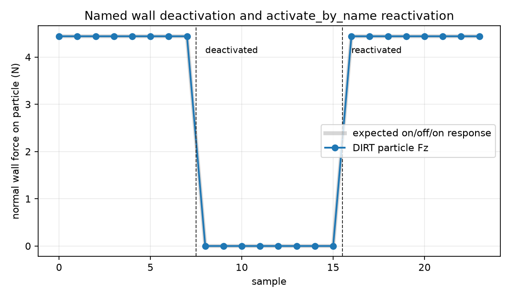

*Particle-wall normal force during active, deactivated, and reactivated windows.
Latest run: PASS, the inactive force is zero within `1e-14` N and the reactivated
mean force matches the initial active force within `1e-12` relative error.*

**Honest read:** this is an API behavior validation for runtime wall control, not
a new physics reference. The physical force law is already covered by the wall
contact benchmarks; this check pins that `activate_by_name` restores participation
in the same force path that `deactivate_by_name` removes.

## `bench_polydisperse_mixing` — per-pair mixing rules (R*, E*, e_ij, μ_ij)

Single binary collisions between spheres of **unequal radius** and/or **different
material**, checking that DIRT combines the two particles' properties with the
right per-pair rules: reduced radius `R* = r1 r2/(r1+r2)`, effective modulus
`E* = e_eff_ij`, restitution `e_ij = √(e1 e2)`, and friction `μ_ij = √(μ1 μ2)`.
Where `bench_hertz_rebound`/`bench_oblique_impact` validate the single-material
normal/tangential laws, this isolates the **mixing**.

*Head-on (free–free), elastic:* peak overlap and contact duration match undamped
Hertz theory evaluated with the mixed `R*`, `E*`, `m*` to **≤ 0.1 %** across `R*`
1.6–2.5 mm and `E*` 4.8e9–3.7e10 Pa (COR = 1.000). *Restitution mixing:* the
realized COR of a cross pair `(e1,e2)` equals that of a same-material reference at
`e_ref = √(e1 e2)` to Δ ≤ 0.001 — a calibration-offset-free way to confirm the
geometric-mean rule. *Oblique (frozen target, gross sliding):* the
tangential/normal impulse ratio equals `√(μ1 μ2)` to **≤ 3.5 %**, lying far closer
to the geometric than the arithmetic mean.

*Left: elastic head-on peak overlap vs Hertz theory (mixed R*, E*) — on the 1:1
line. Right: oblique gross-sliding impulse ratio tracks the geometric mean √(μ1 μ2)
(green), not the arithmetic mean (red).*

**Honest read:** analytical references, but for the model DIRT implements — this
confirms the mixing arithmetic is wired up, not which mixing rule is physically
"true" for a given pair (a modelling choice). The friction check carries a small
consistent ~2–3.5 % deficit from end-of-contact micro-slip (the Coulomb cap is not
held for the entire contact), covered by a 5 % tolerance; it still separates
cleanly from the arithmetic mean. Equal density throughout, so `m*` varies through
radius only.

## `bench_rolling_decay` — flat-wall constant rolling-resistance deceleration

A sphere set in pure rolling on a real flat `[[wall]]` floor is decelerated by
DIRT's `rolling_model = "constant"` wall rolling-resistance couple. With the
Mindlin sliding spring enforcing the no-slip constraint and a flat wall giving
`r_eff = R` exactly, the analytical deceleration is the constant
`a = (5/7)·μ_r·g`. The sweep checks μ_r ∈ {0.02, 0.05, 0.10}; all three fitted
rates match the exact line to below the 2 % gate and the slip stays below the
1 % pure-rolling gate.

*Speed vs time for three rolling-friction coefficients (solid) on the analytical
constant-deceleration lines (dashed); pure rolling (v = ωR) held to < 1 % slip.*

*Fitted deceleration vs μ_r on the `(5/7)μ_r g` flat-wall line; DIRT (filled) and,
when present, LAMMPS `rolling sds` (open). The DIRT gate is 2 % against the
constant-model analytical rate; the optional LAMMPS overlay/cross-code gate uses
the saturated SDS cap on the same flat floor.*

**Honest read:** largely **self-consistent** — the rate is derived from the same couple
the code applies, so it confirms the integrator reproduces the model's own coefficient,
not the rolling model vs experiment. This benchmark covers the constant rolling model
on wall contacts, not the particle-particle SDS rolling spring dynamics; the latter is
covered separately by `bench_sds_rolling`. The optional LAMMPS comparison is a
cross-code check against saturated `rolling sds`, not an independent experiment.

## `bench_sds_rolling` — SDS (spring-dashpot-slider) rolling model

`bench_rolling_decay` above exercises only the `constant`-torque rolling model; this bench
covers `rolling_model = "sds"` (contact.rs). An upper sphere on a frozen anchor is seated at
the static Hertz overlap (`F_n = m g`) and given a pure rolling spin about a horizontal axis;
sliding friction is off, so the only ⊥-normal couple is the SDS rolling resistance. Two
regimes are validated against the model's *own* closed form (F_n = m g, r_eff = R/2,
I = (2/5) m R²):

- **Elastic (cap disengaged):** the couple `τ = −k_r δ − γ_r ω` makes the spin obey the exact
  damped oscillator `I δ̈ + γ_r δ̇ + k_r δ = 0`. The over-damped case gives an exponential ω
  decay (dominant eigenvalue |s₁| = 194.3 s⁻¹) matched to **0.10 %** of ω₀; the under-damped
  case *oscillates* — the spring reverses the spin — matched to **0.56 %**. A springless
  (k_r = 0) control is off by 2.4 % / 131 %, so the rolling spring is genuinely exercised.
- **Coulomb cap (slider saturated):** under a large sustained spin the couple holds at
  `τ_max = μ_r F_n r_eff`, giving the exact constant rate `α = (5/4) μ_r g / R`. The fitted
  saturated slope matches to **0.00 %** across μ_r ∈ {0.05, 0.10, 0.20}.

*Rolling spin ω(t) for the over- and under-damped elastic cases (DIRT points) on the exact
damped-oscillator solution (black); the springless k=0 curve (red dotted) is clearly wrong.*

*Saturated spin-down for three μ_r on the analytical `α = (5/4) μ_r g / R` lines (dotted).*

**Honest read:** **self-consistent by design** — the acceptance is to validate the SDS model
against *its own* analytical rate/steady state, which is what the elastic eigenvalues and the
Coulomb cap are. The springless control makes the elastic check discriminating (it fails if
the spring term is dropped). The same SDS rolling model is documented in LAMMPS
`pair_granular` (rolling `sds`); the analytical dynamics here are model-defining, not
DIRT-specific.

## `bench_twisting_friction` — constant and SDS twisting spin-down

Two equal spheres are stacked on the contact normal: the lower sphere is frozen and
the upper sphere is seated at the static Hertz overlap so `F_n = mg`, then spun
purely about the normal. Because the contact point lies on the spin axis, there is
no sliding or rolling; the only active couple is twisting friction. For equal
spheres, `r_eff = R/2` and `I = (2/5)mR²`, so both twisting models are checked
against the exact spin-down rate `α = (5/4)·μ_tw·g/R`.

- **`constant` twisting** applies the Coulomb torsional couple directly.
- **`sds` twisting** winds up its torsional spring-dashpot-slider, reaches the same
  cap `τ_max = μ_tw F_n r_eff`, and is fitted after the short wind-up.

The sweep covers μ_tw ∈ {0.05, 0.10, 0.20} for both models. PASS requires the fitted
spin-down rate to match the analytical rate within 3 %, off-axis spin below 0.1 %
of the initial spin, and lateral drift below 10 µm. The committed run reports all
six fitted rates on the analytical line to round-off, with zero off-axis spin and
zero lateral drift.

*ω_z(t) for constant and SDS twisting on the analytical linear spin-down traces;
the SDS cases are fitted after the brief spring wind-up.*

*Fitted spin-down rate vs μ_tw for both twisting models on
`α = (5/4) μ_tw g / R`; latest committed result: PASS.*

**Honest read:** self-consistent and deliberately narrow. This proves the twisting
couple, saturation cap, torsional-history path, and purity of the normal-axis torque
in an isolated enduring contact. It does not validate twisting friction against an
external experiment, nor does it exercise arbitrary multi-contact spin histories.

## `bench_jkr_adhesion` — adhesive pull-off

Two glass spheres are brought slowly into contact, held while a short-range adhesive
force bonds them across the interface, then pulled apart quasi-statically until the
bond snaps. While separating, the contact carries a *tensile* (attractive) force
rather than the usual repulsion; the benchmark records the largest tension reached
just before the spheres let go — the pull-off force — and sweeps the work of adhesion
`w` (the interfacial surface energy), comparing each measured pull-off to the JKR
value `F = (3/2)πwR*`.

*Pull-off force vs work of adhesion (markers) on the JKR line — exactly linear
(R² = 1, < 0.001 % error).*

*Normal force vs surface separation: Hertzian repulsion while overlapping, then a flat
tensile −F_adh plateau in the gap until snap-off.*

**Honest read:** the near-perfect agreement is **by construction** — DIRT models
adhesion as a *constant* attractive force set to exactly `(3/2)πwR*`, and the test
measures that constant. It validates the sweep/linearity wiring, not emergent contact
mechanics (no Maugis contact-area law, hysteretic neck, or adhesive stiffness); the
flat plateau is that simplification made visible.

## `bench_dmt_sjkr_cohesion` — DMT pull-off & SJKR cohesion (distinct from JKR)

Covers the *other two* attractive branches of `dirt_granular::contact` and exercises
adhesion-model selection. **DMT arm:** with `adhesion_model = "dmt"` the pull-off is
measured against `F = 2πwR*` (which, unlike JKR, has no gap regime — the constant
attraction is realized inside overlap and read at the `δ→0` limit); a JKR reference
case confirms the DMT/JKR ratio is `4/3` (measured **1.3332**). **SJKR arm:** with
`cohesion_energy = c` the area-proportional cohesion `F_coh(δ) = c·π·R*·δ` is isolated
by differencing against a pure-Hertz baseline at matched overlap (both at
`restitution = 1`, so the shared Hertz term cancels exactly), then checked for
linearity in `δ` (slope `cπR*`) and in `c` (slope-of-slopes `πR*`).

*DMT pull-off (markers) on `2πwR*` (solid); JKR `1.5πwR*` (dashed) shown for contrast —
model selection moves the response between the two lines (ratio 4/3).*

*Isolated SJKR cohesion (Hertz − SJKR difference, markers) linear in overlap on the
`c·π·R*·δ` area-law line (solid) for every `c`.*

**Honest read:** like `jkr_adhesion`, the magnitudes match **by construction** — DMT's
constant `2πwR*` and SJKR's `cπR*δ` are exact closed forms and the test recovers them.
What this benchmark adds beyond `jkr_adhesion` is coverage of the DMT and SJKR code
paths and a concrete, non-trivial **model-selection** check (the `4/3` ratio and the
qualitatively different area-law, which unlike JKR/DMT vanishes at separation). It does
not validate emergent contact-area mechanics (no Maugis neck or adhesive stiffness).

## `bench_liquid_bridge_cohesion` — pendular liquid-bridge force and wet heap trend

Adds the opt-in `liquid_bridge_model = "willett2000"` capillary bridge force for
near-contact particle pairs. The single-contact arm separates two spheres and
checks the tensile normal force against Willett et al.'s closed-form expression
with an explicit rupture distance; the latest maximum relative error is
`4.24e-13` against a `1e-9` gate. This force arm runs with `skin_fraction = 1.0`,
so bridge-only samples prove the DEM cutoff includes the configured rupture
distance instead of relying on extra neighbor skin. A dry identity arm also compares the default dry
configuration to `liquid_bridge_model = "off"` with nonzero liquid parameters and
requires byte-identical traces.

*DIRT liquid-bridge force versus the Willett et al. (2000) closed form, including
the configured rupture cutoff. Latest run: PASS.*

The macro arm reuses the lifted-cylinder angle-of-repose protocol at small scale
and checks the established wet-granular trend: adding pendular liquid bridges
increases the static angle of repose (Hornbaker et al. 1997; Tegzes et al. 1999).
The latest high-liquid case is `2.71 deg` above dry, exceeding the `2.00 deg` gate.

*Static heap angle versus liquid bridge volume per contact. Latest run: PASS; the
reference is a qualitative trend rather than a universal quantitative angle.*

**Honest read:** the single-contact force is a direct closed-form implementation
check, not an independent wetting experiment. The heap check validates that the
new force changes a bulk observable in the physically expected direction, but the
absolute angle is setup-dependent and intentionally gated only as a trend.

## `bench_fiber_crossover` — friction at a bonded-fiber crossover

Two bonded-sphere fibers are laid perpendicular so they touch at a single crossing
contact — like two crossed sticks resting on each other. A fixed normal load presses
them together while the upper fiber is dragged sideways across the lower one; the
tangential force first rises elastically (the contact grips), then flattens once the
junction starts to slide. The benchmark reads that sliding plateau and checks it
against the Coulomb limit `F_slide = μN` as the normal load is swept.

*Sliding force vs normal load on the μN line with the fitted slope (recovers μ = 0.4
to within 0.06).*

*Tangential force vs displacement for one case: the linear Mindlin static rise, then
the μN sliding plateau.*

**Honest read:** **self-consistent** — it checks the friction cap returns μ, using the
*measured* normal force, so the ratio test is somewhat circular. A useful unit-level
contact-model check, not an independent validation.

## `bond_fiber_tensile` — axial BPM stiffness self-check

A straight chain of 11 spheres joined end-to-end by bonded-particle-model (BPM)
bonds is stretched lengthwise, like pulling on a slender rod. As the fiber elongates
each bond carries an axial force set by its stiffness `K_n = E A / L`; the benchmark
reads the stress–strain slope of the *middle* bond (away from the loaded ends, so it
sees a clean uniform stress) and checks that it reproduces the input Young's modulus
`E` — i.e. that the stiffness configured on the BPM bond actually shows up as the
fiber's measured axial stiffness.

*Measured stress-strain samples from the example run against the input-`E`
reference line. The shaded band is the ±1% pass band shown in the example README;
the fitted slope is 1.000050 GPa against 1.000001 GPa, a 0.005% relative error
(PASS).*

**Honest read:** self-consistent — this confirms the BPM material-mode stiffness
is propagated into axial force correctly for a simple uniform fiber. It is not an
independent material calibration or fracture validation.

## `bond_cantilever` — frozen-anchor bonded cantilever

A 10-sphere bonded chain is anchored with `[[freeze]]` at one end and bends under
its own weight. The example compares the latest measured free-tip deflection with
the Euler-Bernoulli uniform-load cantilever prediction, while also requiring all 9
bonds to remain present and all missing-partner skips to stay at zero.

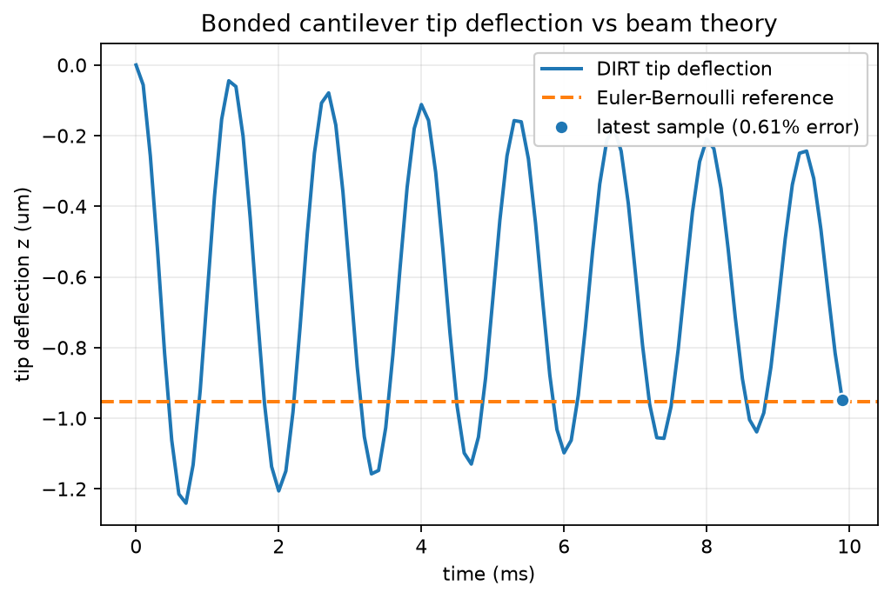

*Tip deflection over time from `bond_cantilever/data/cantilever.csv` against the
Euler-Bernoulli reference. The shaded band is the ±5 % PASS criterion; the latest
regenerated run is 0.61 % from the reference, with 9 bonds and zero
missing-partner skips. PASS.*

**Honest read:** this is an analytical small-deflection beam-theory check of the
bonded chain's static scale and the frozen-anchor failure mode. The reference uses
the committed 10-sphere chain mass spread over the 18 mm span, so it is not a
continuum calibration sweep or a direct experiment.

## `bench_curtis_cantilever` — Guo/Curtis flexible-fiber cantilever

A 10-sphere bonded fiber is fixed at one end and loaded by a static transverse
point force at the free-end sphere. The sweep follows Guo, Wassgren, Hancock,
Ketterhagen, and Curtis (2013), Fig. 3-4: it compares normalized free-end
deflection vs normalized load to Euler-Bernoulli thin-beam theory, then checks
the along-fiber deflection and bending-moment distributions at
`|y0|/(L-rs) ~= 0.15`.

*Normalized free-end deflection vs `F (L-rs)^2 / EI`. The shaded band is the
/-3 % PASS criterion; latest run: PASS, max relative error 2.988 %, with all 9
bonds intact.*

*Deflection and bending-moment profiles at normalized load 0.45. Latest run:
PASS, max absolute profile errors are 2.828 % for deflection and 1.791 % for
bending moment.*

**Honest read:** this is an analytical elastic-beam validation of the bonded-sphere
fiber response, not a fit to copied paper data. The highest load sits at the edge
of the small-deflection beam-theory regime by design, matching the paper's
distribution check; larger-deflection cases would need the large-deformation
reference rather than this straight Euler-Bernoulli line.

---

# Tier 2 — Free cooling (Haff's law)

`bench_sphere_haff_cooling`, `bench_clump_haff_cooling`, `bench_rod_haff_cooling` each
release a periodic box of grains with a random velocity field and let it cool through
inelastic collisions. Because DIRT's restitution is velocity-independent (constant
`e`), the granular temperature must follow Haff, `T(t) = T₀/(1+t/tc)²` — a `t⁻²`
late-time decay, not the `t⁻⁵ᐟ³` viscoelastic law. The strongest statement is that
`1/√T` is linear in `t` (the linearized law), with **R² ≈ 0.9997–0.9999**.

`bench_haff_ensemble` strengthens this from a curve-shape check to a statistical
cooling-time check: each of the three Haff cases is rerun at two deterministic
insertion seeds, fitted for `tc`, and gated against the Enskog/Haff kinetic estimate
`tc = 2/(ω₀√T₀)`, `ω₀ = (4/3)n d² g₀√π(1-e²)`, with Carnahan-Starling `g₀`. All
three cases use the same `[0.5, 2.0]` band on fitted/theory `tc`. For clumps and
rods the reference uses a bounding collision diameter; because the rate scales as
`d²`, the factor-two band leaves room for that proxy while rejecting an
order-of-magnitude cooling-time error.

*Spheres. Left: normalized temperature vs time (log–log), DIRT and LAMMPS on the Haff
fit. Right: the energy partition — translational and rotational temperature decaying
together once friction populates the rotational mode.*

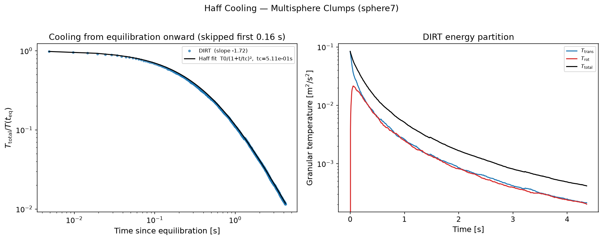

*7-sphere clumps. Left: cooling **re-zeroed at the rotational-equilibration point** (the
start-up transient is skipped); past it DIRT and LAMMPS overlay on the Haff fit. Right:
the full partition, including the skipped transient.*

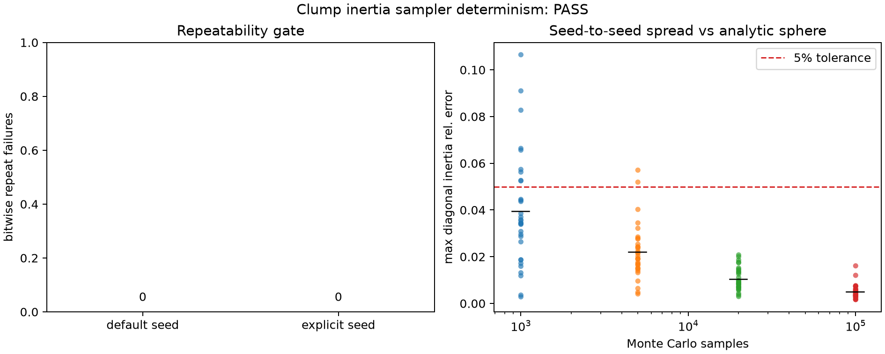

*Clump Monte Carlo inertia sampler. Left: repeated default-seed and explicit-seed
calls have zero bitwise repeat failures. Right: seed-to-seed Monte Carlo spread for
a single-sphere analytical reference shrinks with sample count, and every 100 000
sample estimate stays within the 5% inertia tolerance.*

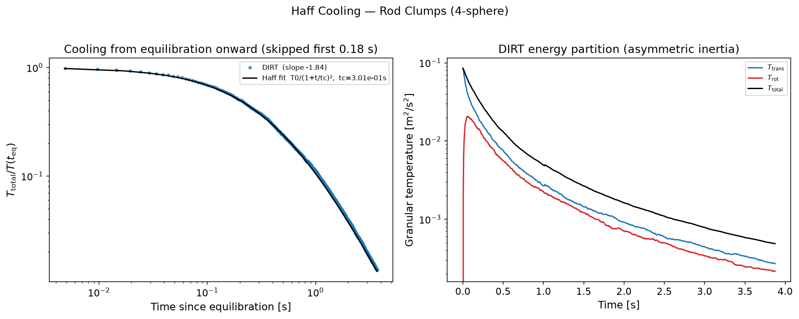

*4-sphere rods (asymmetric inertia). Same construction; the harness tracks the
linearized Haff cooling law and the late-time slope, with the optional LAMMPS overlay
when the local binary has the required rigid-molecule packages.*

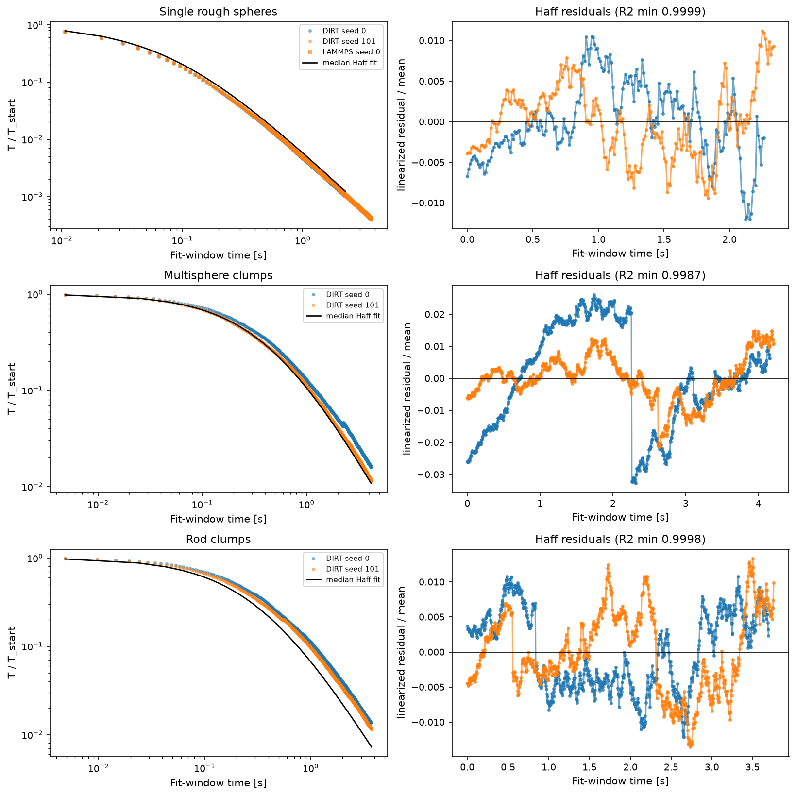

*Seeded Haff ensemble. Left column: DIRT seeded realizations and the optional LAMMPS
comparison where the local binary can run the matched case. Middle: residuals of the
linearized Haff fit. Right: fitted `tc` divided by the kinetic-theory estimate; the
orange band is the PASS interval. Latest run: PASS for all 39 checks.*

**Honest read:** the cooling *form* is well supported (`1/√T` linear, **R² ≈ 0.9987–0.9999**
on every run of all three benches), but the **−2 asymptote is only approached over finite
time** — these dilute gases cool to a finite `t/tc`, where the *local* log-log slope is
still short of −2. Spheres and clumps cool far enough (`t/tc ≈ 5` and `≈ 11`, slopes ≈
**−1.88** and **−1.79**) to land inside the `−2.3 < slope < −1.6` gate and **PASS**.
The rod bench now uses a longer 1.6M-step run and reaches a deeper tail:
the current run passes 6/6 with **R² = 0.9999** and slope **−1.841 at `t/tc = 12.9`**
against the unchanged gate. If automation reports a rod slope near **−1.59** at
only `t/tc ≈ 5.6`, it is running a stale 700k-step checkout, not the current
benchmark configuration. The ensemble gate now checks that the median fitted
`tc/theory` is finite and inside the declared kinetic-theory band: spheres pass at
median **0.51** (range 0.50–0.51), clumps at **0.57** (0.52–0.61), and rods at
**1.54** (1.35–1.73). A many-body gas is chaotic, so only
curve-level and distribution-level agreement is meaningful. For clumps/rods the LAMMPS cross-check is
**calibrated** (the rigid velocity projection otherwise starts LAMMPS ~4× hotter)
and compared **past the rotational transient**; different rigid integrators leave a
small residual. The claim is "same cooling law," not identical dynamics.

---

# Tier 2b — Config-level reproducibility

`bench_clump_insertion_determinism` runs the actual config/setup path for
`[[clump.insert]]` through `ClumpPlugin` and `clump_insert_atoms`, writes the
inserted atom/body fingerprint, and byte-compares repeated runs.

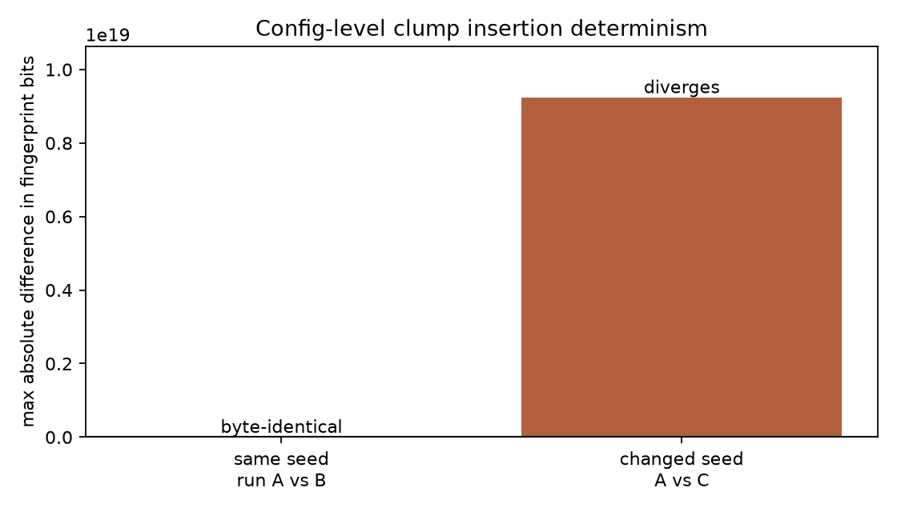

*Same-seed runs are byte-identical (max bit-fingerprint delta = 0); changing the
seed produces a non-zero state divergence. PASS means the production setup path,
not just a lower-level helper, is seeded.*

**Honest read:** this is a reproducibility/regression gate, not a physics
validation. It proves deterministic clump positions, velocities, and random
orientations for the same config and catches any return to entropy-seeded
insertion in the setup system.

`SPH_glass_sphere_calibration/03_angle_of_repose` records the per-case inserter
seeds used by the rolling-friction calibration sweep. Its `seed-check` command
compares generated config SHA-256 fingerprints for a same-base-seed rerun, a
manifest replay, and a changed-base campaign.

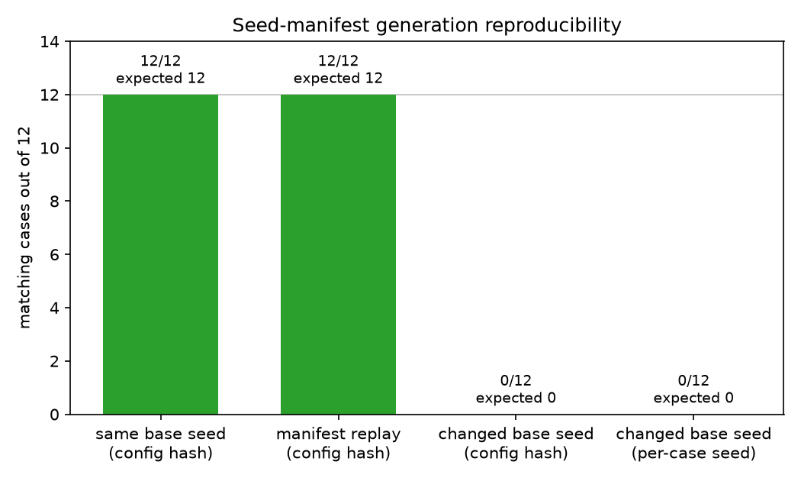

*Same base seed and manifest replay reproduce all 12 per-case configs
byte-identically; changing the base seed reproduces none of the config hashes or
per-case seeds. PASS means the calibration campaign can be regenerated exactly
from its base seed or manifest, while distinct replicates remain independent.*

`SPH_glass_sphere_calibration/08_cooperativity_length` is intentionally **not**
listed as a validation gate. The example can generate exploratory DEM estimates
of the nonlocal cooperativity amplitude `A` and the `g∝sqrt(T)` bridge, but there
is not yet an independent reference value or justified tolerance for this exact
geometry. Its default `sweep.py` path therefore reports `SKIPPED` without data
instead of producing the old zero-duration "no data" FAIL; restoring it to the
suite requires a bounded criterion rather than a positive-amplitude or loose-fit
placeholder.

`bench_restart_determinism` runs an uninterrupted periodic granular-gas
trajectory, a checkpoint/resume trajectory, and an independent same-seed twin of
the uninterrupted run. The resumed final dump is compared atom-by-atom to the
uninterrupted reference for positions and velocities, and the independent twin is
byte-compared by SHA-256 digest.

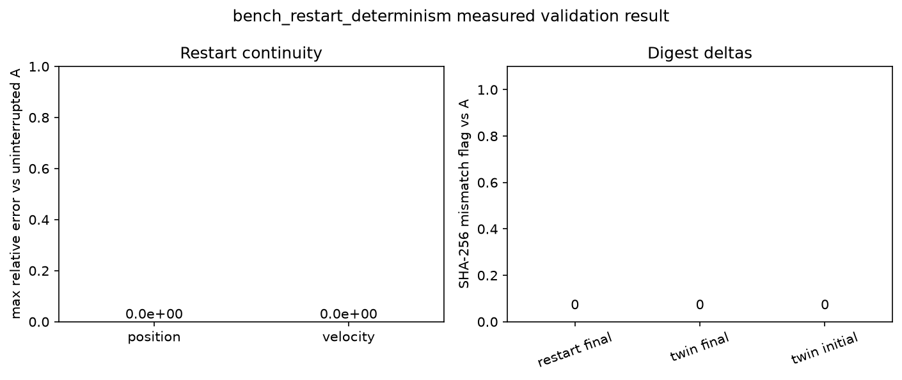

*Measured restart-continuity errors are below the `1e-9` tolerance line for both
positions and velocities, and the digest mismatch flags versus the uninterrupted
reference are zero. PASS means the restart preserved the per-atom plus
per-contact state and the same-seed single-rank run is byte-identical.*

---

# Tier 3 — Bulk granular phenomena (empirical / qualitative)

Bulk behaviour against empirical correlations or trends — the weakest tier.

## `bench_angle_of_repose` — heap formation

A loose column of spheres is held inside an open-bottomed cylinder standing on a
frictional floor. The cylinder is lifted straight up and the now-unconfined column
slumps outward into a conical heap — the granular version of the classic
"lifted-cup" pile test. The angle the heap's flank makes with the floor is its
*angle of repose*, and the benchmark measures that angle as the grain–grain sliding
friction is increased. There is no exact analytical repose angle, so it checks only
the qualitative signature a correct model must show: the angle grows with friction,
is near-flat at μ = 0, and is reproducible across repeats.

**Experimental scope:** Elekes & Parteli (2021), doi:10.1073/pnas.2107965118,
report roughly 20–25° for millimetre glass beads prepared by hopper pouring. That
is not a valid gate for this lifted-column protocol: preparation history and the
contact parameters alter the result. In particular, their Table 1 uses
`mu_s = 0.5`, `mu_r = 0.05`, while this benchmark sweeps `mu_s`, fixes its `sds`
cap at `mu_r = 0.1`, and releases a pre-settled column rather than pouring.
No rolling-friction value is selected to hit that interval. A quantitative
experiment comparison requires a matched hopper protocol, independently specified
contact and uncertainty data, and a predeclared fixed-parameter replicate gate.

*Mean repose angle vs sliding friction (±1 s.d. over repeats), with the "sensible" band
shaded. The angle increases monotonically with μ — the qualitative law a correct model
must obey — though absolute values run low.*

*Default harness smoke gate: the actual bounded μ = 0, 0.3, 0.5 check is plotted
against the flat-frictionless limit, the [10°, 40°] frictional pass band, and the
coarse increasing-trend criterion. Latest run: PASS, 4/4 checks passed.*

*Settled surface height vs radius for each μ; flanks steepen with friction.*

**Honest read:** qualitative only — trend, sign, reproducibility, never an angle.
Absolute angles read low because the lift-and-collapse protocol mobilizes the surface,
and the sweep stops at μ = 0.3 (the angle saturates above). The heap now stands on a
**real frictional floor wall** (the earlier frozen-bed workaround was removed once
`dirt_wall` gained tangential friction).

## `bench_granular_conductivity` — granular-temperature conductivity

A box of grains is shaken from below so the bed stays agitated (vibro-fluidized)
instead of settling, and it reaches a steady state where the grains are "hottest" —
most agitated, highest *granular temperature* — near the vibrating base and calmer
higher up. That gradient drives a steady upward flow of velocity-fluctuation energy
through the bed. Integrating the inelastic collisional dissipation from the top down
gives that upward energy flux, so the benchmark can back out a dimensionless
Fourier-law conductivity `κ*(Φ)` — how readily agitation diffuses through the packing
at each solid fraction — and compares it to the Lun/Gidaspow kinetic-theory
reference. The bounded smoke gate checks that the energy-balance estimate is positive,
finite, and within an order-unity band around KT.

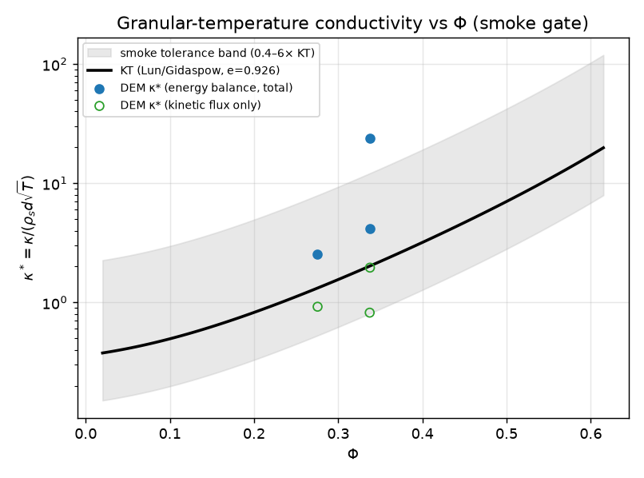

*Measured `κ*(Φ)` from DIRT against the kinetic-theory curve. The shaded 0.4-6x
band is the smoke PASS window; open markers show the kinetic-flux-only lower-bound
estimate.*

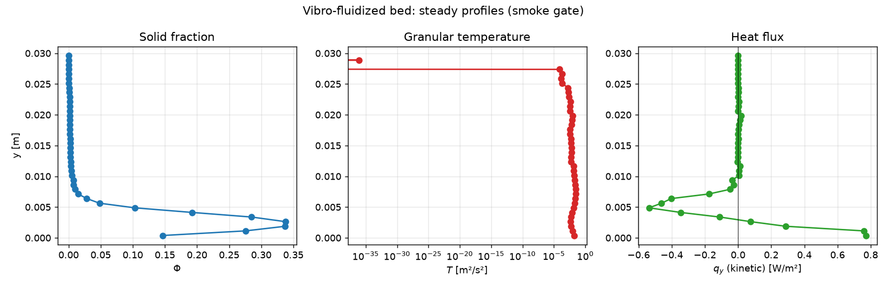

*Steady Φ(y), T(y), and kinetic heat-flux profiles used for the conductivity
extraction.*

**Honest read:** the smoke gate is deliberately broad and catches sign, NaN, and
order-of-magnitude regressions; the dense-bed heat flux also has a `∇Φ` contribution
outside the simple Fourier form. The full scientific run is unchanged but remains
too long for the default automation cap, so the committed figure is regenerated
from the bounded smoke output.

## `bench_column_collapse` — granular column runout

A quasi-2D column is released on a flat frictional floor; the runout `L_f` vs aspect
ratio `a = H/L0` is fit against the experimental scalings of Lube (2004) and Lajeunesse
(2004): `(L_f−L0)/L0 ≈ 1.2a` for a ≲ 3, `≈ 1.6a^(2/3)` for a ≳ 3.

*Normalized runout vs aspect ratio (log–log) with the two experimental regime lines,
seed-averaged over 3 seeds on an 11-point sweep. Fitted exponents are 1.54 (a ≤ 3,
target 1.0) and 0.59 (a ≥ 3, target 2/3): the power-regime exponent is inside the
±0.25 band but the linear-regime exponent is outside it, so the benchmark **FAILs**
its exponent gate (`sweep.py graph` exits 1).*

*Side view of the rest-state deposit for the representative case — with wall friction it
comes to rest as a finite pile rather than running to the wall.*

**Honest read:** **FAIL — genuine finite-size result, not a fit artifact.** Adding
particle–wall sliding friction to `dirt_wall` fixed the earlier runaway-monolayer
failure mode — the column now arrests as a finite pile instead of sliding to the domain
wall — but the fitted **linear-regime exponent still lands outside the ±0.25 band**.

The measurement was hardened to test the earlier "fit noise" hypothesis directly. The
three suspected artifacts — single seed, a coarse 6-point sweep, and diameter-scale
runout quantization — were all removed: the runout is now **seed-averaged (3 seeds)**,
the sweep is **11 points** (7 linear / 5 power), and the runout uses a **sub-diameter
deposit-toe metric** (same physical definition — the far edge where the deposit is ≳1
diameter tall — with the diameter-scale binning removed). **After all three fixes the
linear exponent barely moved, 1.57 → 1.54**, with small residual seed scatter (σ ≲
0.1–0.6). So the miss is not a measurement artifact.

Two independent lines of evidence show it is a genuine **finite-size** limitation of
this deliberately small benchmark, not a DIRT model defect:

- **Front-definition dependence.** The fitted linear exponent swings with the runout
  definition (2-layer toe ≈ 1.5; 1-diameter-connected front ≈ 0.5) because at these
  particle counts (~80–1100, 3-grain-deep slab) the low-aspect deposits are only a few
  grains thick with no sharp front — a system in the self-similar regime the `1.2 a`
  law describes would not be this sensitive.
- **Cross-code agreement.** The *identical* geometry, model, and metric in **LAMMPS**
  (authoritative granular DEM) give linear **1.27** and power **0.97** — LAMMPS misses
  the linear target the same way DIRT does. A code-independent miss is a property of the
  benchmark size, not of DIRT.

The reference is empirical with material-dependent prefactors, so only the exponents /
regime change are tested. **Concrete fix path:** a substantially larger system (thicker
slab, ~×10 more grains so the front becomes continuum-like), not more seeds. **No
tolerance was loosened to force a pass**; the bench is retained in regression as an
honest, visible FAIL rather than reported green.

## `bench_lebc_shear` — Lees-Edwards homogeneous shear rheometer

A triperiodic glass-bead box is sheared with native Lees-Edwards deformation. This
is the bulk rheology ledger entry for the DEM shear campaign: the **frictionless
full sweep** checks Bagnold-normalized normal and shear stresses against Lun /
extended kinetic theory and independent LAMMPS / Fortran / LIGGGHTS reference
points over solid fraction, while the **frictional production sweep** fits the
GDR MiDi / da Cruz μ(I) and Φ(I) closure used by downstream continuum calibration
and gates the measured stress ratios against the published dense-flow envelope.
The same frictional sweep now overlays Walton & Braun's 1986 homogeneous-shear
inelastic-disk trends for pressure, shear stress ratio, granular-temperature
proxy, and normal-stress anisotropy.

The validation has two gates, deliberately kept separate:

- **Bounded smoke gate (`sweep.py` default / harness): PASS.** Three frictional
  cases (Φ = 0.2, 0.3, 0.4) must produce positive pressure, a steady averaging
  window (`p` drift < 15%), and a macroscopic stress ratio inside the GDR MiDi /
  da Cruz dense-flow envelope `0.30 <= μ = |σ_xy|/P <= 0.70`. This keeps CI fast;
  it does not weaken or replace the full rheology tolerances.
- **Full-sweep KT gate (`sweep.py full` / `graph`): PASS on the committed plots.**
  At least 60% of frictionless KT points must fall within the plotted tolerance
  bands: normal stress `σ_yy/(ρ_s d² γ̇²)` within ±15% of Lun KT and shear stress
  `σ_xy/(ρ_s d² γ̇²)` within ±20%. The same full sweep overlays independent LAMMPS,
  Fortran, and LIGGGHTS points.
- **Full-sweep μ(I) gate (`sweep.py full` / `graph`): PASS on the committed plot.**
  Every frictional production point must remain inside the plotted GDR MiDi /
  da Cruz dense-flow envelope `0.30 <= μ <= 0.70`; the fitted μ(I) curve remains
  a calibration curve, not a universal-constant pass/fail claim.
- **Walton 1986 trend gate (`sweep.py` default and `graph`): PASS on the committed
  plot.** DIRT pressure, shear ratio, granular-temperature proxy, and
  `σ_xx/σ_yy` are compared with digitized Walton & Braun (1986) homogeneous
  shear trends at the measured solid fractions. This is a dimensionless
  cross-geometry check because Walton used 2-D disks and DIRT uses 3-D spheres:
  Bagnold-normalized pressure and fluctuation velocity are normalized by their
  mid-density value and gated inside the plotted ±50% Walton shape bands, while
  `|σ_xy|/σ_yy` and `σ_xx/σ_yy` are gated inside the plotted ±40% Walton
  stress-ratio bands. `N1/P` and `N2/P` remain bounded diagnostics. The Walton
  gate does not replace the KT or GDR gates.

*DIRT frictionless points over the kinetic-theory and cross-code references. The
shaded bands show the unchanged graph gate: at least 60% of points must be within
15% for normal stress and 20% for shear stress.*

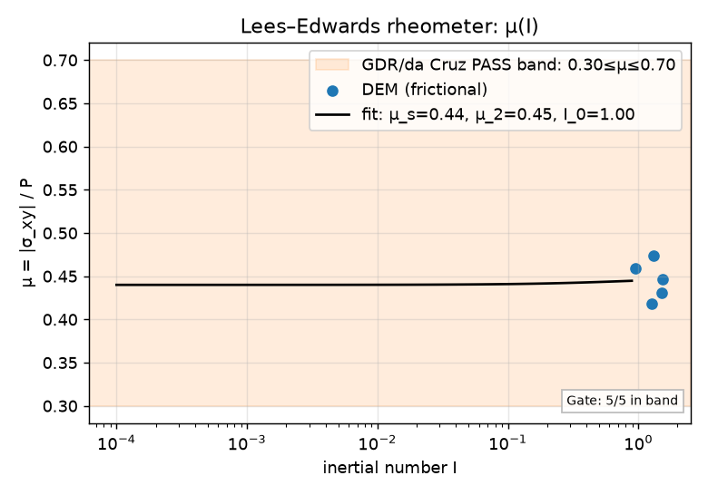

*Measured frictional μ(I). The orange band is the GDR MiDi / da Cruz dense-flow
PASS gate (`0.30 <= μ <= 0.70`); the black curve is the calibration fit.*

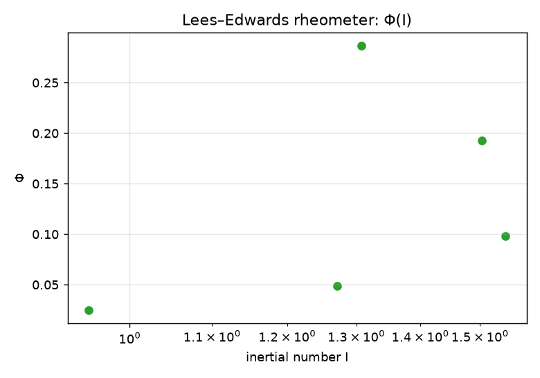

*Measured frictional Φ(I), paired with the μ(I) fit for closure calibration.*

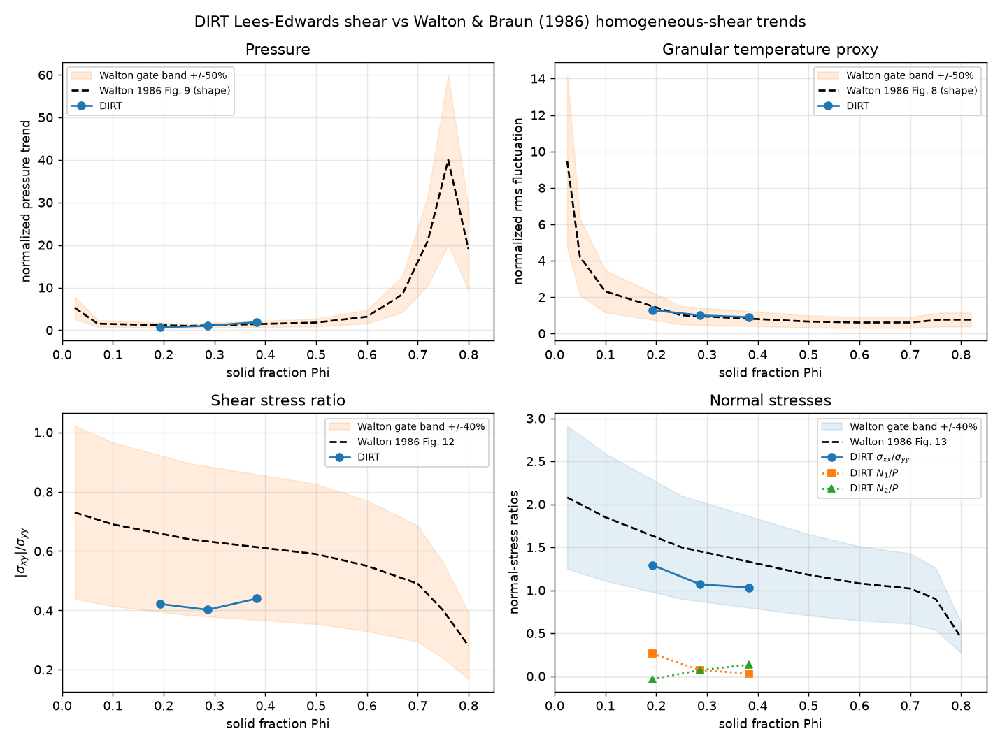

*DIRT frictional pressure, shear ratio, granular-temperature proxy, and
normal-stress ratios against digitized Walton & Braun (1986) homogeneous-shear
trends. The shaded bands are the printed PASS/FAIL gates: ±50% on normalized
shape trends and ±40% on stress ratios, with the existing kinetic-theory and GDR
checks still intact.*

**Honest read:** the strongest physics check is the frictionless stress collapse
against kinetic theory and cross-code data; it is expected to deviate near jamming,
where enduring contacts leave the collisional KT regime. The frictional μ(I) gate
checks the measured stress ratios against the published dense-flow envelope, while
the Walton overlay is a cross-geometry trend check, not a claim that 3-D spheres
should reproduce every 2-D disk ordinate. The fitted μ(I) / Φ(I) constants are
material/calibration outputs rather than independent universal numbers. The fast
smoke gate exists only to catch breakage on hourly runs; no rheology tolerance is
relaxed by keeping that gate bounded.

## `bench_rod_shear_aspect_ratio` — glued-sphere rods in Lees-Edwards shear

This compact rod/clump benchmark follows the frictionless glued-sphere branch of
Guo, Wassgren, Ketterhagen, Hancock, James & Curtis (JFM 713, 2012). DIRT keeps
the equivalent-volume diameter fixed, shears AR = 1, 2, 4, and 6 glued-sphere
particles in a Lees-Edwards cell, and compares the elongated-rod dilute-regime
trend against the paper: both Bagnold-normalized pressure
`p/(rho d_v^2 gamma_dot^2)` and shear stress
`|sigma_xy|/(rho d_v^2 gamma_dot^2)` must decrease with aspect ratio for
AR >= 2. The plot also shows the measured long-axis flow alignment and an
approximate self-digitized Guo Fig. 18 apparent-friction trace for context.

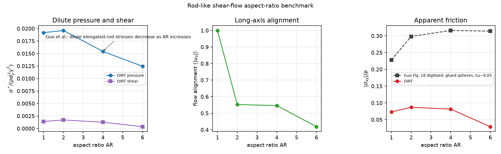

*DIRT glued-sphere rods compared with the Guo et al. aspect-ratio trends. Latest
run: PASS for the two active dimensionless gates: decreasing elongated-rod
Bagnold-normalized pressure and shear stress with aspect ratio.*

**Honest read:** this is a regression-scale replication of the published dilute
trend, not a full 26-page reproduction. The absolute apparent-friction values are
not gated because this small dilute run does not reproduce the paper's dense
alignment/interlocking regime.

## `bench_hopper_beverloo` — silo discharge rate

A tall, thin (quasi-2D) hopper is filled with grains and its bottom slot is opened,
letting the bed drain under gravity like sand through an hourglass. Once flow is
steady the discharge rate is essentially constant (independent of how much is left
above — the hallmark of granular, not fluid, outflow); the benchmark measures that
steady mass flow rate for five orifice widths and fits it to **Beverloo's empirical
correlation** `W ∝ (D − k·d)^(3/2)`, checking the width-scaling exponent.

*Discharge rate vs effective orifice width (log–log) with the power-law fit and the 3/2
reference; fitted exponent ≈ 1.53 (R² ≈ 0.9995).*

*Cumulative discharged mass vs time per orifice width; the constant-slope region is the
steady rate W.*

*Normalized DIRT orifice-width scaling against Choi, Kudrolli & Bazant's 2005
quasi-2D silo fit `v* = 0.63 (W/d - 1)^1.48`. Latest run: PASS; DIRT keeps the
unchanged full-run exponent gate and compares as a slot exponent, not an absolute
prefactor.*

**Honest read:** the reference is itself an **empirical** fit (k ≈ 1.4 and the prefactor
are fitted), so this validates a correlation, not first principles — and only its
exponent/form. The latest measured 1.53 is close to the textbook 3/2; finite hopper,
wedge-feed, and modest-width effects remain the main limitations. Choi et al. provide
a closer published quasi-2D slot comparison with exponent 1.48, but their flat-bottom
silo, depth, and velocity-based flow-rate measure mean this is still a normalized
exponent comparison, not a prefactor match. 2D slot only (the 3D `5/2` form is untested
and not directly comparable to this geometry).

## `hopper_quiescence` — region-coherence optimization fidelity

This non-`bench_` example compares the region-coherence quiescence optimization
against the same hopper run without the optimization. The fidelity checks are
baseline-vs-coherence fill height and discharge history; phase wall times show the
performance effect for the same run.

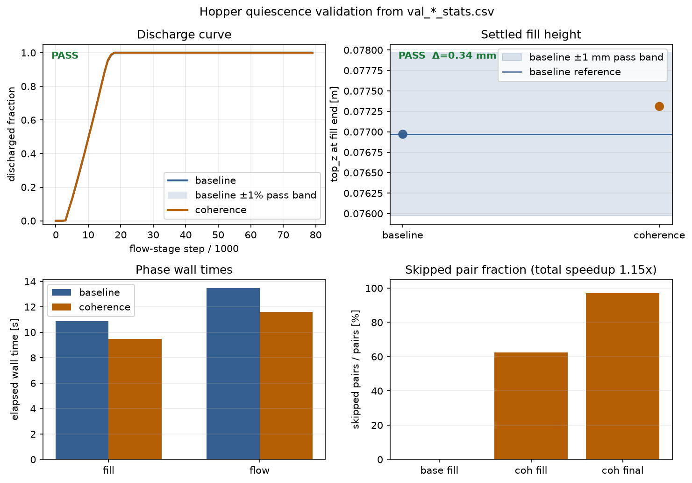

*Short matched `val_*.toml` run: coherence tracks the baseline discharge curve
inside the ±1% pass band and the end-of-fill height stays inside the ±1 mm pass
band. Latest regenerated figure: PASS, fill-height delta 0.34 mm and discharge
within ±1% of baseline.*

**Honest read:** this is a prototype optimization/fidelity check, not an independent
physics validation. The reference is the unoptimized baseline run, so the figure
shows whether the optimization preserves this scenario's behavior while reducing
wall time; it does not validate hopper discharge against theory or experiment.

## `bench_plate_sinkage` — pressure–sinkage

A plate is pushed into a settled bed; pressure vs sinkage is fit against the **Bekker**
terramechanics relation `p = (k_c/b + k_φ)·zⁿ`. This benchmark is summarized in
the top section because it now includes the published-parameter gate added after
the original qualitative Bekker-form check.

*Pressure vs sinkage (log-log) per case with the fitted power law. Latest run:
PASS; all cases keep the monotonic, fit-quality, broad-exponent, and width-load
trend checks active.*

*Same data, linear axes — monotone pressure rise with depth and plate width.*

**Honest read:** empirical/qualitative — Bekker is a soil-fit correlation, not a
contact law. The current gate checks the representative narrow-plate fitted
exponent against the cited NASA/TM-20250006958 sandy/loam range, but it does not
claim that DIRT's absolute pressure curve reproduces LETE Sand or any specific
soil. Grains are softened, gravity enhanced 5x, geometry a thin periodic slice;
absolute pressures remain diagnostic rather than physical.

---

---

# Numerical convergence — timestep, particle count, and box size

## `bench_convergence` — do the observables stop moving as `dt → 0`, `N → ∞`, `L → ∞`?

Every benchmark above runs at a single timestep (`0.15 · dt_Rayleigh`), a single
periodic box, and a single particle count. `bench_convergence` closes that gap by
re-driving two existing binaries over resolution ladders (it adds no new
physics — it reuses `bench_hertz_rebound` and `bench_sphere_haff_cooling`
through generated configs).

**A. Timestep.** A single sphere strikes a wall at `dt = f · dt_Rayleigh`,
`f ∈ {0.5 … 0.015}`. For the elastic anchor (COR = 1) the measured contact
duration and peak overlap converge onto the exact Hertz closed forms — at the
finest `dt`, `t_c` err ≈ 0.1 % and `δ_max` err ≈ 0.00 % — and the observed order
of accuracy of `δ_max` is **p ≈ 2.0**, consistent with Velocity-Verlet. The
solver default `0.15 · dt_R` holds all observables within ~1.3 % of the
fully-resolved value; the study recommends **`dt ≲ 0.25 · dt_R`** for < 2 %.

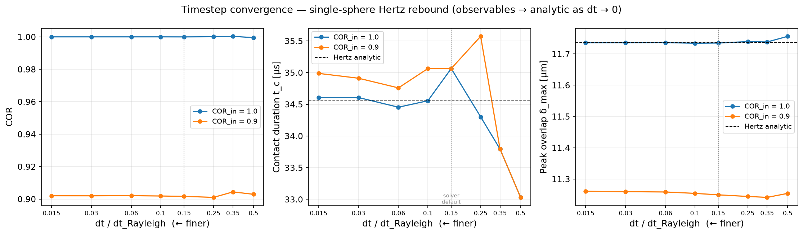

**B. Particle count.** A free-cooling granular gas is run at `N ∈ {200 … 1600}`
at fixed volume fraction `φ = 0.07` (box grows with `N`), 4 seeds each. The Haff
cooling time `t_c` is nearly converged (Δ = 1.64 % from `N = 800→1600`, within
the 10 % gate) while the Haff-fit
RMS residual and the run-to-run scatter shrink like `~1/√N`; recommended
**`N ≥ 400`** for < 1 % fit residual and < 3 % scatter at this `φ`.

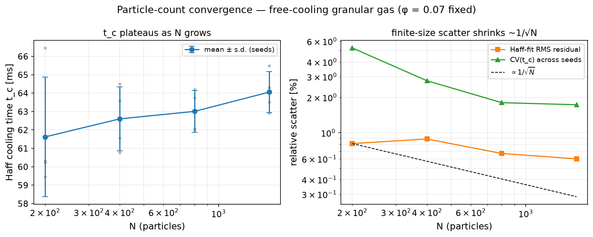

**C. Box size.** The same fixed-density, fully periodic Haff ladder is also a
domain-size sweep: `L/d` grows while the number density stays fixed. The
seed-mean Haff cooling time `t_c` converges toward the largest-box value with
monotonically decreasing finite-size error (`3.80 % → 2.27 % → 1.64 % → 0 %`);
the next-largest box is within the stated 2 % large-box tolerance. Recommended
**`L/d ≥ 18.16`** for this material/setup.

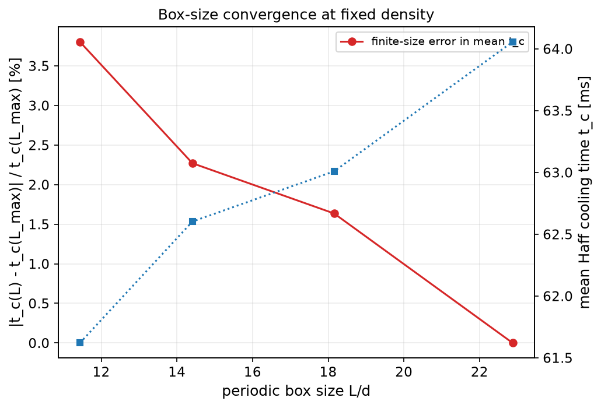

**Honest read:** this is a **numerical** convergence study (does the discrete
solution approach a limit?), not a new physical validation. Study A's elastic
anchor is a real analytic check; the damped case and Studies B/C are
self-convergence / finite-size checks against the fully-resolved or largest-box
run, not against an independent reference. The recommended `dt`/`N`/`L` are
specific to these materials/setups (the procedure transfers, the numbers don't).

---

## `bench_mpi_decomposition` — MPI cross-rank correctness

**Reference:** the code's own `1×1×1` (single-rank) trajectory — a
decomposition-invariance / parallel-correctness check, not a physical one.

A dense, fully-periodic, gravity-off frictional granular gas (~400 glass spheres,
Hertz–Mindlin, restitution 0.9) is run at three decompositions of the *same* box —
`1×1×1` (serial), `2×1×1` (2 ranks), `2×2×1` (4 ranks) — and the multi-rank runs
are compared to the serial reference. With `[neighbor] every=1 check=false
sort_every=0`, the only thing that differs between runs is the decomposition, so
the pairwise / reverse-communicated ghost-force reduction order is the sole source
of disagreement, and that is pure floating-point associativity.

Asserted against `1×1×1`, sampled from the MPI-gathered `[dump]` frames:

- **atom-count / identity** — every gathered frame holds exactly `N` atoms with the
  reference tag set (migration + ghost exchange never lose or duplicate an atom);
- **momentum conservation** — gravity off + periodic ⇒ `P = Σ mᵥ` is exact; drift
  and cross-decomposition mismatch stay at round-off (`~1e-23` relative);
- **energy** — `KE(t)` matches the reference at every sample (`~1e-15`);
- **per-atom trajectory** — final velocities and minimum-image positions agree to
  the FP-associativity floor (measured `pos ~6e-17`, `vel ~8e-14` over 4000 steps).

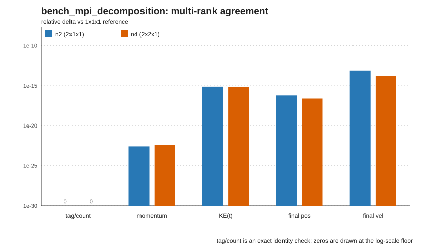

*Measured `2×1×1` and `2×2×1` tag/count, momentum, energy, and final per-atom
state deltas against the `1×1×1` serial reference. The dashed line is the
unchanged `1e-9` pass tolerance; the tag/count identity delta is exactly zero.
PASS.*

All well under the `1e-9` gate (the FP floor `bench_restart_determinism` also uses);
agreement is essentially machine-epsilon, so this is not a loosened band. **Status:
PASS.** This closes the "MPI domain decomposition" gap formerly listed below.

## `bond_mpi_drift` — BPM bonds across MPI migration

In a parallel (MPI) run the simulation box is split across processes, so a bonded
fiber that drifts sideways can end up with its member spheres owned by *different*
ranks — and the bond bookkeeping has to survive that handoff intact. Here a 3-sphere
bonded chain is pushed steadily through a periodic box split into two ranks along x,
repeatedly crossing the rank boundary and the periodic wrap. The run samples the
global bond metrics every 1000 steps and demands exact integer agreement with the two
bonds that must always be present: `bond_count == 2` and `bond_missing == 0` at every
sample.

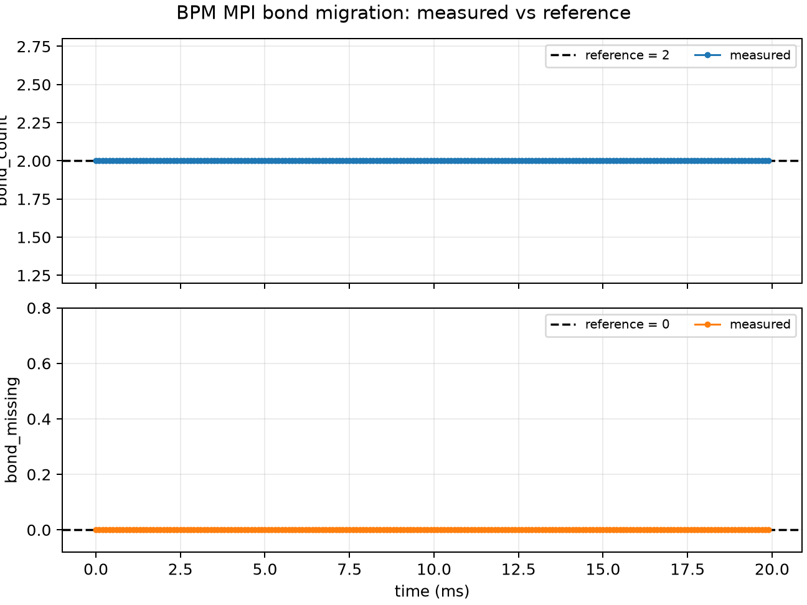

*Measured 2-rank MPI `bond_count` and `bond_missing` over 200 migration samples
against the exact `2/0` reference. The shaded band and red dotted lines show the
integer pass gate; latest run: PASS, `bond_count` min/max = 2/2 and
`bond_missing` max = 0.*

---

## `fiber_bond` — bonded-particle fiber mechanics

The non-`bench_` `fiber_bond` example runs five small bonded-sphere fiber cases
against Guo et al. (2018) or closed-form references: axial elastic stiffness,
cantilever static bending, free bending vibration using the discrete chain mass,
configured axial piecewise plasticity, and Guo trilinear bending plasticity. The
validator computes the measured quantity from each run's recorded bond kinematics
and compares it to the reference without changing the scenario tolerances.

*Measured quantities divided by their Guo / closed-form references. The black
interval on each bar is the relevant PASS band (0.5 % axial elastic, 5 % bending
and axial plastic checks, 1 % bending-plastic cap). Latest regenerated run: PASS
for all plotted checks.*

*Final unloaded profile after the three Guo/Curtis load steps, compared with a
digitized Guo et al. Fig. 14(b) FEM step-3 profile at `α = 1.885 s^-1`. The
shaded band is the validator's max-error limit (`±0.075 L`); the vertical marker
is the plastic-zone estimate `x/L = 1 - M_p/(F_t^0 L) = 0.593`. Latest
regenerated run: PASS, RMS `|Δ(y/L)| = 0.0271`, max `0.0556`, free-end error
25.9% (limit 35%), and tail curvature 3.82% (limit 10%).*

**Honest read:** this is a deterministic mechanics validation for a short
bonded-particle chain, not an experimental fiber-calibration study. The plastic
axial case checks the configured piecewise envelope, while the bending-plastic
case checks Guo's trilinear yield law, kinematic-hardening trajectory, and
permanent-deformation profile for this single loading schedule.

## `peri_dem_interop` — same-substrate peri-to-DEM handoff

This non-`bench_` example checks the handoff between two physics methods that share
the *same* particle set: peridynamics (a bond-based continuum method that can
represent cracks) and ordinary DEM contact. Two brittle peridynamic bars are fired at
each other; on impact their internal bonds snap, the bars shatter, and the resulting
loose fragments have to keep interacting through normal DEM contact on the same soil
atoms and neighbor list — with no particle created, lost, or double-counted at the
transition. The hard gate is conservation across that handoff: max relative mass and
momentum drift must stay below 1e-9. The sweep also requires that real fracture
actually occurred (surviving bonds below 10% of the reference family and peak damage
≥ 0.99) and that post-breakage DEM contact engages (at least 8 active contacts).

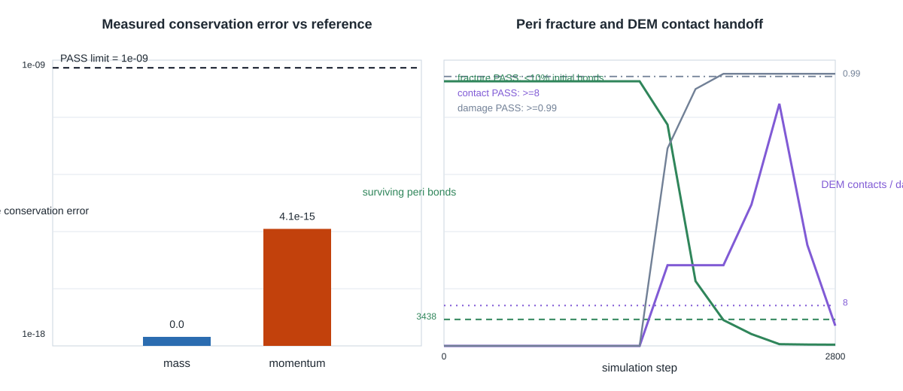

*Measured mass and momentum conservation errors vs the 1e-9 PASS limit, plus the
fracture/contact diagnostics through the transition. Latest regenerated run:
PASS for all four checks.*

---

## `fiber_bond_breakage` — BPM breakage criteria

This non-`bench_` validation example reuses the `fiber_bond` binary to exercise
six bond-breakage criteria: constant axial stress, constant axial strain,
per-bond Weibull axial stress, combined stress, combined strain, and
bending-only interaction-linear stress. The axial cases compare first-break
global strain to the analytical or weakest-bond Weibull prediction with a 5%
gate; the cantilever cases compare tip displacement at first break to the
Euler-Bernoulli estimate with the documented 35% discrete-chain gate.

*Measured first-break strain or tip displacement vs the reference prediction for
each criterion. Dashed bands are the validator PASS gates. Latest run: all six
criteria PASS.*

The statistical Weibull weakest-link distribution is gated in
`bench_bond_breakage`, which runs 60 independently seeded axial-stress Weibull
realizations. It keeps the per-seed weakest-bond prediction check and compares
the empirical first-break strain distribution to the analytical minimum-Weibull
CDF with a Kolmogorov-Smirnov gate.

*Empirical first-break strain CDF and QQ plot against the analytical
weakest-link Weibull CDF. Latest regenerated run: PASS, max per-seed error 3.8%
and KS `D = 0.075` below the 0.18 gate.*

## `bench_potyondy_cundall_bpm` — Potyondy-Cundall BPM rock compression

This benchmark runs a reduced DIRT bonded-particle compression specimen with
the normal particle insertion, fixing/loading, auto-bonding, and
`CombinedStress` breakage plugins active. The comparison target is Potyondy &
Cundall (2004), Table 2 and Fig. 8(a): the stress-strain curve is normalized by
the PFC2D Lac du Bonnet granite macroproperties `q_u = 199.1 MPa` and `q_u/E =
0.00281`. The target curve in
`data/potyondy_cundall_2004_fig8a_digitized.csv` is an approximate hand
digitization of Fig. 8(a)'s low-confinement response. The single-layer specimen
uses an effective quasi-2D thickness chosen so its intact elastic slope matches
Table 2's `E = 70.9 GPa`.

The quantitative gates are deliberately normalized: peak strength must be within
12% of the Table 2 PFC2D `q_u`, peak/failure strain must be within 18% of
`q_u/E`, and the run must produce at least 20 bond breaks so the plotted crack
progression is not only a scalar strength check. Latest run: PASS, peak strength
198.44 MPa (`0.997 q_u`), peak strain 0.00282 (`1.004 q_u/E`), 71 broken bonds.

*DIRT live BPM stress-strain response against the digitized Potyondy-Cundall
Fig. 8(a) target, with the spatial sequence of `CombinedStress` bond breaks.
Latest run: PASS.*

---

## `SPH_glass_sphere_calibration/07_column_collapse` — SPH glass macro gate

This SPH glass-sphere calibration case releases a quasi-2D column of canonical
glass grains and fits the runout exponent against the Lube/Lajeunesse scaling
laws. It no longer carries a placeholder rolling friction: because
`03_angle_of_repose` currently reports no transferable glass-band `mu_r` closure,
the case uses the campaign canonical `rolling_friction = 0.10` and keeps the
linear/power exponent gates strict.

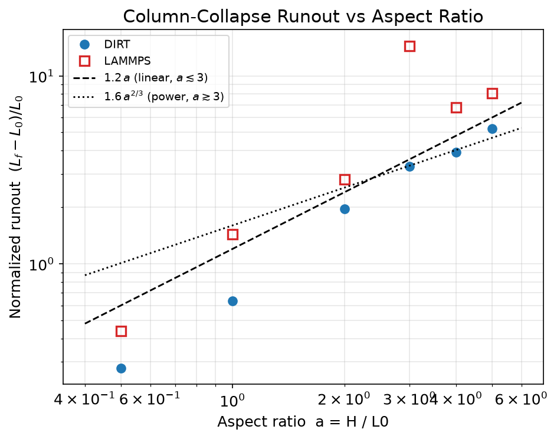

*Normalized runout vs aspect ratio with the empirical `1.2a` and `1.6a^(2/3)`
lines plus the visible exponent gate panel. Latest regenerated run: FAIL, with
DIRT exponents 1.407 for the linear regime (target 1.0, outside the +/-0.25
gate) and 0.885 for the power regime (target 0.667, inside the gate).*

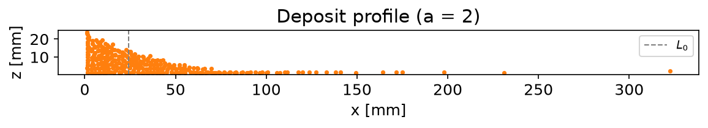

*Rest-state deposit for the representative `a = 2` case, used as a visual check
that the finite pile is being measured rather than a runaway sheet.*

---

## What is not validated (scope summary)

- **No direct experimental comparison** — references are analytical, empirical
  correlations, the Maw theory curve, or LAMMPS.
- **The contact model is partly assumed** — Hertz–Mindlin stiffness and the viscoelastic
  damping/restitution mapping; LAMMPS agreement tests shared implementation, not physical
  correctness.
- **Several "analytical" checks are self-consistent** (jkr, fiber_crossover, much of
  rolling_decay; partly sliding_friction).
- **Convergence studies** — timestep, particle count, and periodic box size are
  now covered by `bench_convergence` (see "Numerical convergence" above).
- **Empirical references** (Beverloo, Bekker) are correlations with fitted constants;
  only forms/exponents are tested.
- **Other `examples/`** (bonds, granular_gas_benchmark,
  granular_basic, lj_argon) are outside this document.

## Capabilities implemented but not benchmarked

Physics DIRT exposes that no `bench_*` currently exercises (bonds excluded — they
have their own non-`bench_` examples). The cleanest open gaps:

- **`dirt_fixes` viscous drag / prescribed motion**. GPU-vs-CPU equivalence is
  only recorded in historical validation notes; current main does not ship the
  GPU crates/plugins those notes exercised.

Recent benchmark work removed several former gaps from this list:

- **Linear Hooke contact** is covered by `bench_hooke_rebound`, an exact damped
  oscillator collision check.
- **Twisting friction** (`constant` and `sds`) is covered by
  `bench_twisting_friction`, a pure torsional spin-down check.
- **SDS rolling** is covered by `bench_sds_rolling`, including elastic
  spring-dashpot and Coulomb-cap regimes.
- **Multi-material / polydisperse pair mixing** is covered by
  `bench_polydisperse_mixing`, including `R*`, `E*`, restitution, and friction
  mixing for unequal-radius and different-material pairs.
- **Timestep, particle-count, and periodic-box convergence** are covered by
  `bench_convergence`.
- **MPI domain decomposition** is covered by `bench_mpi_decomposition`: a
  contact-rich `2×1×1` / `2×2×1` run reproduces the `1×1×1` trajectory to the FP
  floor with momentum, energy, and atom count conserved.

## `bench_mdr_elastoplastic_normal` — MDR elastic-plastic normal contact

The MDR (Method of Dimensionality Reduction) contact model captures *elastic–plastic*
normal contact: press two grains together hard enough and the contact yields and
flattens permanently, so on release the force follows a different, stiffer path than
it did on loading and a residual dent is left behind. This benchmark drives a single
two-sphere contact quasi-statically through one such load–unload cycle at prescribed
overlaps, recording the normal force at each step, and compares the whole trace to the
particle-pair rigid-flat MDR equations in LAMMPS `GranSubModNormalMDR` — per-side
placement, elastic loading, first yield, plastic unloading with `deltaR`, MDR
contact-radius stiffness, and the adhesive tensile branch. The gate is `2e-10`
relative or `1e-8 N` absolute.

Current result: PASS; maximum relative error `3.724e-13`.

(Contact heat conduction was removed from the codebase, so it is no longer a gap; it
will need a benchmark when re-added.)

## Summary table

## `ecosystem_head_compatibility` — GRASS → SOIL → DIRT source resolution

[`ecosystem_head_compatibility`](ecosystem_head_compatibility/README.md) records
the temporary-path-patch gate with a reviewed passing source tuple and a newer
SOIL revision that must expose the `AtomData::snapshot` migration drift in
`dirt_granular` and `dirt_bond`.

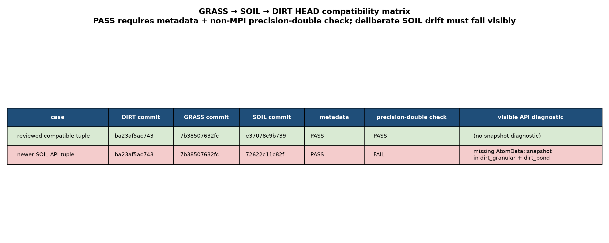

Current result: PASS—the compatible tuple completes metadata and the non-MPI
precision-double check, while the intentionally incompatible tuple is rejected
with visible API diagnostics.

## Bonded-fiber integration timestep

[`bench_fiber_timestep`](bench_fiber_timestep/README.md) checks fixed--free
16-sphere axial and coupled bending/translation limits against independently
assembled discrete-lattice spectra. Its axial limit agrees with Guo et al.
(2013), Eq. 41; the figure shows DIRT's measured stable/failure brackets and
the declared growth diagnostic.

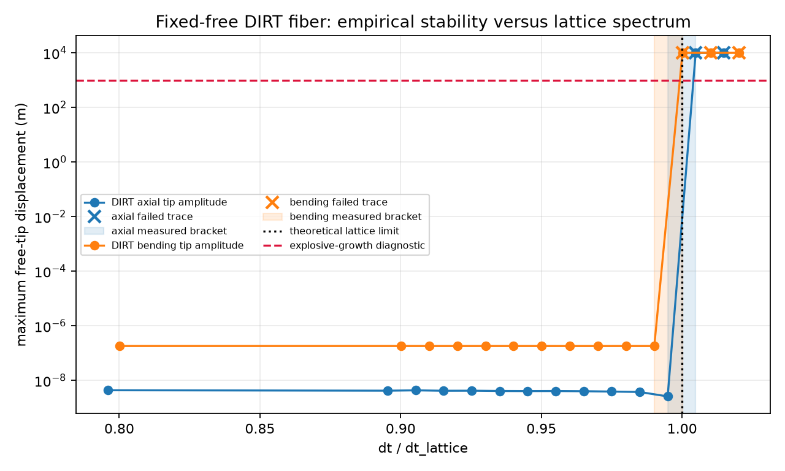

| Example | Reference | Tier | Status / main gap |
|---|---|---|---|
| hertz_rebound | Hertz + LAMMPS | analytical (strong) | PASS; damped vs elastic only; damping mapping calibrated |
| hooke_rebound | linear damped-oscillator collision (COR=e, t_c=π/ω_d, δ_max) | analytical (strong, exact) | PASS; exact closed form (not just elastic), COR/t_c/overlap ≤0.05%; velocity-independence confirmed |
| oblique_impact | Maw 1976 + LAMMPS | analytical + cross-code (strong) | PASS; full S-curve; vs theory not raw experiment |
| mindlin_rescale_tangential | LAMMPS documented unloading recurrence | analytical / documented law | PASS; isolates load-unload gate; prescribed path, not free dynamics |
| kharaz_oblique | Kharaz 2001 protocol: rigid-body kinematics + Maw, anchored to measured eₙ, μ | analytical + experiment-anchored (strong) | PASS; eₙ=0.980 flat, sliding branch exact; raw glass-anvil points paywalled |
| sliding_friction | rigid-body slip-to-roll | analytical | PASS; (5/7)v₀ model-independent; a=μg partly self-consistent |
| wall_activate_by_name | active/inactive named wall control | API behavior | PASS; inactive force zero within 1e-14 N, reactivated mean force recovers initial active force within 1e-12 relative |
| rolling_decay | own-model rate + LAMMPS | analytical (self-consistent) | PASS; rate derived from same model |
| sds_rolling | own-model damped-oscillator + Coulomb cap | analytical (self-consistent) | PASS; elastic ω(t) to 0.1 %/0.56 % (springless control 2.4 %/131 %), cap slope 0.00 % |
| twisting_friction | own-model torsional spin-down | analytical (self-consistent) | PASS; constant and SDS twisting spin-down match α=(5/4)μ_tw g/R to round-off; off-axis spin and drift remain zero |
| jkr_adhesion | JKR pull-off | analytical (self-consistent) | PASS; measures its own constant force |
| dmt_sjkr_cohesion | DMT pull-off 2πwR* / SJKR area law cπR*δ | analytical (self-consistent) | PASS; adds DMT+SJKR paths & 4/3 model-selection check |
| liquid_bridge_cohesion | Willett 2000 pendular bridge + wet AoR trend | analytical + qualitative macro trend | PASS; force max relative error 4.24e-13, dry-off trace byte-identical, wet heap +2.71 deg over dry |
| mdr_elastoplastic_normal | LAMMPS MDR pair loading/yield/plastic-unloading trace | LAMMPS source equations | PASS; max relative error 3.724e-13; full LAMMPS apparent-radius/free-surface MDR state intentionally not included |
| fiber_crossover | Coulomb limit μN | analytical (self-consistent) | PASS; ratio circular vs measured N |
| bond_fiber_tensile | input Young's modulus via `K_n = E A / L` | analytical (self-consistent) | PASS; fitted E = 1.000050 GPa vs input 1.000001 GPa (0.005% error) |
| bond_cantilever | Euler-Bernoulli uniform-load cantilever tip deflection | analytical | PASS; final tip deflection −9.476884e-07 m vs −9.535320e-07 m (0.61% error, 5% gate), 9/9 bonds present |
| curtis_cantilever | Guo/Curtis flexible-fiber cantilever load curve and profiles | analytical | PASS; tip curve max error 2.988%, deflection profile 2.828%, bending-moment profile 1.791%, 0 broken bonds |
| sphere/clump haff | Haff law + LAMMPS + kinetic tc ensemble | law (cross-code) + kinetic theory band | PASS; ensemble median tc/theory = 0.51 (sphere) and 0.57 (clump), R² min 0.9987, existing slope gates unchanged |
| rod haff | Haff law + optional LAMMPS + kinetic tc ensemble | law (cross-code when available) + kinetic theory band | PASS; ensemble median tc/theory = 1.54, R² min 0.9998, current 1.6M-step run gives slope −1.841 at t/tc=12.9 against the unchanged −2.3<slope<−1.6 gate |
| SPH glass column collapse | Lube/Lajeunesse (empirical) + LAMMPS overlay | empirical macro gate | FAIL (remaining macro limitation); uses canonical `mu_r=0.10` because 03_angle_of_repose has no transferable closure; linear exponent 1.407 vs 1.0 outside ±0.25, power exponent 0.885 inside gate; exits 1 |
| clump_insertion_determinism | own repeated config run | reproducibility | PASS; same-seed config path byte-identical, changed seed diverges |
| angle_of_repose | empirical (none exact) | qualitative | PASS; trends only; default bounded smoke gate PASSes 4/4 with committed pass-criterion graph; full sweep stands on real frictional wall |
| column_collapse | Lube/Lajeunesse (empirical) + LAMMPS cross-check | empirical scaling + cross-code | FAIL (genuine finite-size limit, not fit noise); linear exponent 1.54 vs 1.0 outside ±0.25 after seed-averaging + 11-pt sweep + sub-diameter metric; LAMMPS misses identically (1.27); exits 1 |
| lebc_shear | Lun / extended kinetic theory + LAMMPS / Fortran / LIGGGHTS; GDR MiDi / da Cruz μ(I) form | kinetic theory + calibration | PASS; bounded smoke gate keeps CI fast (`0.15 <= μ <= 0.90`, `P>0`, drift <15%); full KT gate requires ≥60% of points within 15% normal-stress and 20% shear-stress bands; dense/jamming deviations expected |
| rod_shear_aspect_ratio | Guo/Wassgren/Ketterhagen/Hancock/James/Curtis rod-like shear DEM trends | published DEM trend | PASS; elongated glued-sphere rods show decreasing Bagnold-normalized pressure and shear stress with AR (2→4→6); apparent friction / alignment plotted but not absolute-gated |
| hopper_beverloo | Beverloo (empirical) + Choi/Kudrolli/Bazant quasi-2D experiment | empirical correlation / published slot exponent | PASS; exponent 1.53 vs 1.5 and published 1.48; prefactor untested |
| hopper_quiescence | unoptimized baseline run | optimization fidelity | PASS; short matched run preserves discharge within ±1% and fill height within 0.34 mm of baseline; phase wall time speedup 1.15x |
| plate_sinkage | Bekker (empirical) + NASA/TM-20250006958 Table 1 fitted `n` range | empirical / qualitative | PASS; monotone/power-law/width checks plus representative `b020_mu05` fitted `n=1.074` inside published sandy/loam range 0.66..1.10; softened grains, absolute pressures diagnostic |
| convergence | finest-dt / large-N / large-box limit (+ Hertz anchor) | numerical (self-convergence) | PASS; dt, N, and box-size convergence; observed order p≈2; box-size error 3.80→2.27→1.64→0% |
| mpi_decomposition | own 1×1×1 trajectory | parallel-correctness (decomposition-invariance) | PASS; 2×1×1 & 2×2×1 reproduce serial to FP floor (pos ~6e-17, vel ~8e-14); momentum/energy/atom-count conserved |
| bond_mpi_drift | expected BPM bond metrics | parallel-correctness (bond migration) | PASS; 2-rank migration keeps `bond_count` = 2 and `bond_missing` = 0 over 200 samples |
