# DIRT Scientific Validation

This document is restricted to physical/scientific validation and cross-code
comparisons. Each included benchmark compares a DIRT simulation with an
analytical result, experimental or empirical reference, published simulation,
or another solver such as LAMMPS.

Numerical convergence, reproducibility, MPI correctness, API contracts, and
build compatibility are tracked separately in
[`VERIFICATION.md`](VERIFICATION.md).

The intent is to be useful *and* honest: each section states the result, then says
plainly where the test is weak — an idealization, an empirical fit, a check that is
really self-consistent (confirming a model returns its own input), or a regime that
isn't reached.

> **Retired SPH glass-repose request (not a validation result).** The former SPH
> angle-of-repose campaign was removed from DIRT, so it has no current executable,
> result ledger, or figure in this DEM validation index. The auditable repository
> scope boundary and the conditions for any separate future study are recorded in
> [`RETIRED_SPH_GLASS_REPOSE.md`](RETIRED_SPH_GLASS_REPOSE.md). This link does not
> establish an angle, rolling-friction value, or calibration pass.

**Evidence tiers** (decreasing strength): *Analytical* — a closed-form reference;
*Cross-code* — agreement with LAMMPS, which tests implementation consistency under a
**shared** contact model, not correctness against physical reality; *Empirical /
law / qualitative* — only a functional form, scaling exponent, or trend, sometimes
against a correlation with fitted constants.

References are mostly analytical, empirical correlations, the experimentally-
established Maw curve (as a theory curve), or LAMMPS. The closest tie to a physical
experiment is `bench_kharaz_oblique`, which replicates Kharaz et al.'s (2001)
elastic-rebound protocol and anchors to their **measured** eₙ = 0.98 and μ = 0.092;
its curve-level check is still against the rigid-body/Maw theory those experimental
points confirmed, because the paper's per-point scatter lives only in paywalled
figures.

**These benchmarks catch real bugs.** The oblique-impact validation alone drove two
contact-model fixes — a tangential damping-sign error that was injecting energy, and
a requirement that a frozen contact partner also have its rotation frozen — and the
rebound benchmark surfaced a mislabeled damping constant (`SQRT_5_3` holds √(5/6)).
So the suite is doing its job, not just decorating passing runs.

**Wall friction (recent core change).** `dirt_wall` now applies a **Mindlin
tangential (sliding) spring with a Coulomb cap** on plane walls (using the
material's `friction`), with per-contact tangential history — not just normal force.
This unblocked `bench_sliding_friction` (now a clean flat-wall test) and let the
`bench_column_collapse` deposit come to rest as a finite pile instead of a runaway
monolayer (though that bench still **FAILs** its exponent gate — a genuine finite-size
limitation confirmed cross-code against LAMMPS, see below), and let
`bench_angle_of_repose` stand its
heap on a real frictional floor wall. Two examples still use a **frozen partner**
for legitimate reasons: `oblique_impact` uses a sphere–sphere contact to exercise
the *particle–particle* tangential model directly, and single-contact spin tests
such as `bench_sds_rolling` and `bench_twisting_friction` use frozen anchors to
isolate the rotational degree of freedom under a known normal load. `rolling_decay`
no longer uses a frozen floor sphere: it now runs on a real flat wall, so
`r_eff = R` exactly.

## LAMMPS and independent-code comparisons first

These are the most useful starting points for reading the ledger:

- [`bench_hertz_rebound`](#bench_hertz_rebound--hertzian-normal-rebound): DIRT
  and LAMMPS agree with the independently integrated Tsuji contact ODE.
- [`bench_oblique_impact`](#bench_oblique_impact--tangential-contact-vs-maw-1976):
  DIRT, LAMMPS, and the Maw theory curve.
- [`bench_kharaz_oblique`](#bench_kharaz_oblique--replicate-kharaz-gorham--salman-2001):
  DIRT and LAMMPS in the Kharaz wall-impact protocol against Maw and published
  experimental scalars.
- [`bench_nohistory_tangential`](#bench_nohistory_tangential--history-free-tangential-law):
  DIRT against the documented LAMMPS force law.
- [`bench_column_collapse`](#bench_column_collapse--granular-column-runout): the
  retained comparison is withheld because the two solvers started from different
  particle counts; the audit now fails that condition explicitly.
- [`bench_lebc_shear`](#bench_lebc_shear--lees-edwards-homogeneous-shear-rheometer):
  frictionless DIRT results against kinetic theory, LAMMPS, Fortran, and LIGGGHTS.
- [`bench_mdr_elastoplastic_normal`](#bench_mdr_elastoplastic_normal--mdr-elastic-plastic-normal-contact):
  DIRT against the LAMMPS MDR source equations.

`bench_mindlin_rescale_tangential` currently checks equations documented by
LAMMPS, not a separately executed LAMMPS trajectory.

---

# Tier 1 — Single-contact and single-particle mechanics

The strongest tests: small, deterministic setups compared to exact results. Some are
nonetheless partly *self-consistent* — noted where so.

## `bench_cundall_damping` — Cundall non-viscous global damping

A single free sphere is launched upward under gravity and spun under a constant
opposing torque while the `[[cundall]]` damping fix applies the documented
component-wise force/torque scaling. The sign of the mechanical power flips at the
apex and at zero spin, so the benchmark exercises both Cundall branches and fits
the exact piecewise-constant rates across γ ∈ {0.2, 0.5, 0.8}. All four DIRT rates
must match the analytical values within 1 %, and the linear acceleration branch is
also cross-checked against LAMMPS `fix damping/cundall`.

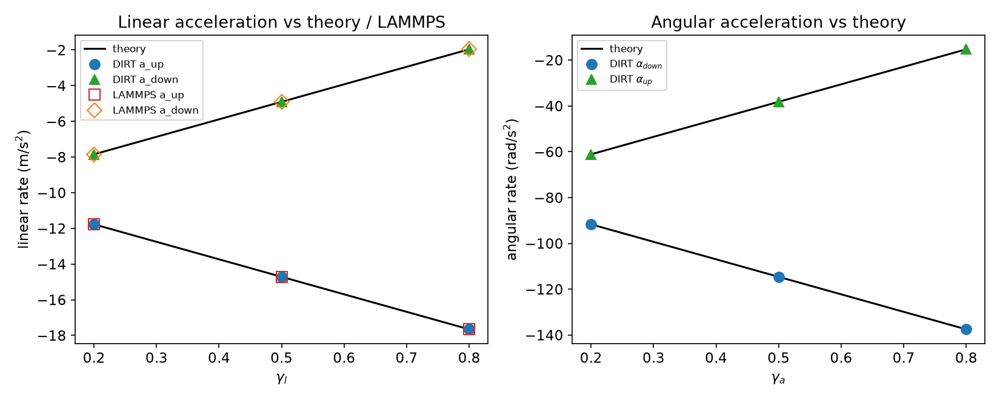

*Fitted DIRT linear/angular rates vs exact Cundall analytical rates; the shaded
band is the ±1 % PASS criterion used by the sweep, with LAMMPS overlaid for the
linear branch. Latest run: PASS, all rates within the 1 % gate.*

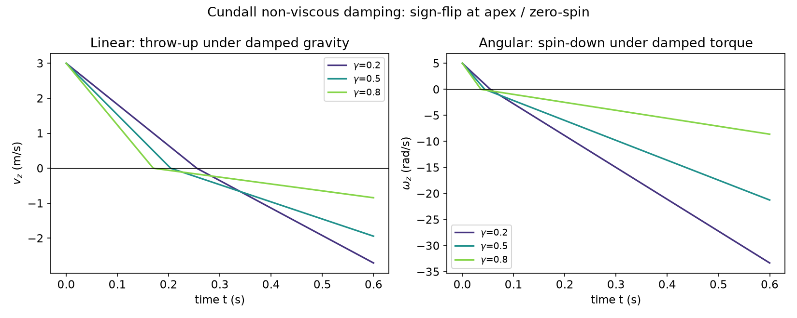

*Velocity and angular-velocity traces showing the apex and zero-spin sign flips
that separate the piecewise-linear analytical branches.*

**Honest read:** the reference is an exact single-particle analytical solution for
the documented Cundall damping rule, so this is a sharp implementation check for
the fix. It does not test contacts or quasi-static pack relaxation; those are
covered by the broader granular benchmarks.

## `bench_chung_ooi_impact` — Chung & Ooi elastic normal impact

Chung & Ooi (2011) is a widely-used suite of standard test cases for *verifying DEM
codes* against known answers; this benchmark reproduces its elastic normal-impact
Tests 1 and 2 — a head-on sphere–sphere impact and a sphere–wall impact, where one
grain flies into another (or into a rigid plane) and bounces off. Both cases are
undamped (`restitution = 1`), so the collision is purely elastic and the reference is
the independent closed-form Hertz solution. The sweep checks maximum contact force,
contact duration, and peak overlap across relative impact velocities from 0.5 to 10
m/s; all 31 checks pass with force and overlap errors at round-off scale and
contact-duration errors below 0.5%.

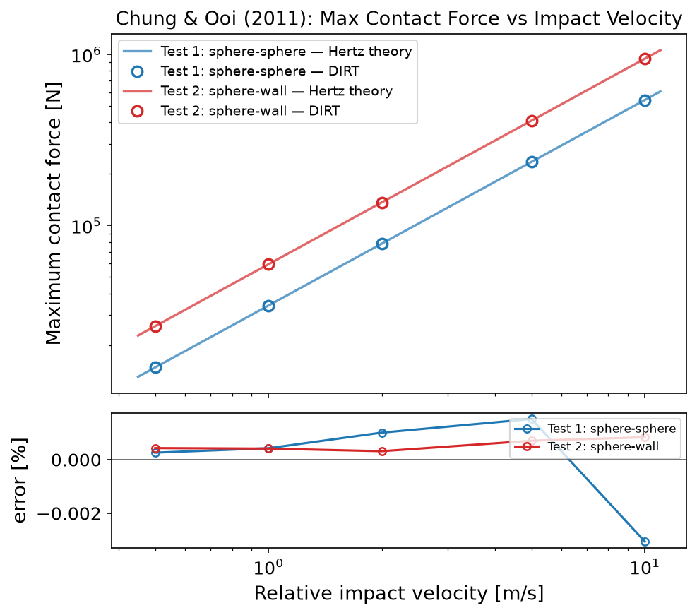

*Maximum contact force vs impact velocity for DIRT (points) and the Hertz
analytical reference (lines). The shaded band is the ±2% force PASS criterion;
both Chung & Ooi elastic normal-impact cases pass inside it.*

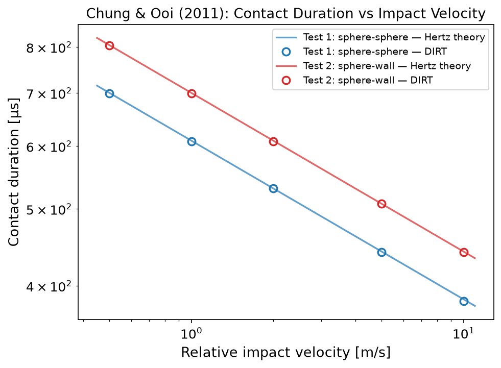

*Contact duration vs impact velocity for DIRT and Hertz. The shaded band is the
±2% contact-time PASS criterion; the remaining residual is integer timestep
resolution, and all cases pass inside it.*

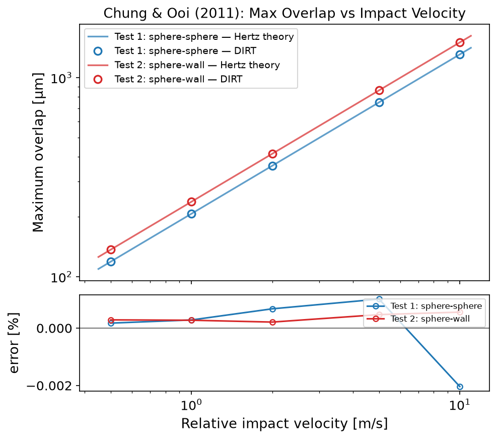

*Maximum overlap vs impact velocity for DIRT and Hertz. The shaded band is the
±2% overlap PASS criterion; both cases pass inside it.*

## `bench_hertz_rebound` — Hertzian normal rebound

A single glass sphere strikes a rigid wall; the benchmark sweeps impact velocity
(0.1–2 m/s) and Tsuji restitution input (0.5–1.0) and measures realized
restitution, contact duration, and peak overlap. The reference now integrates the
same one-degree-of-freedom Hertz–Tsuji contact equation independently, using the
Tsuji polynomial `beta = alpha(e)/sqrt(5)` and the same unclamped near-separation
force convention as the matched DIRT and LAMMPS cases. The previous plotted model
incorrectly used the logarithmic *linear-dashpot* inversion and clamped the force;
that was why it missed both codes.

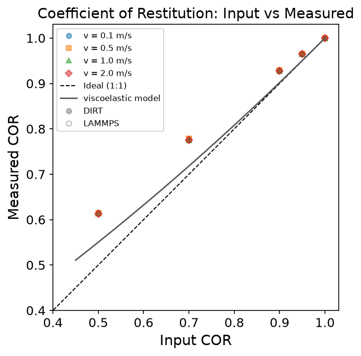

*Measured restitution vs the Tsuji input, DIRT (filled), LAMMPS (open), and the
independently integrated contact ODE. All three overlay. The dashed 1:1 line is
shown to make an important parameterization limit explicit: at low input values,
the Tsuji polynomial does not realize `measured COR = input COR`.*

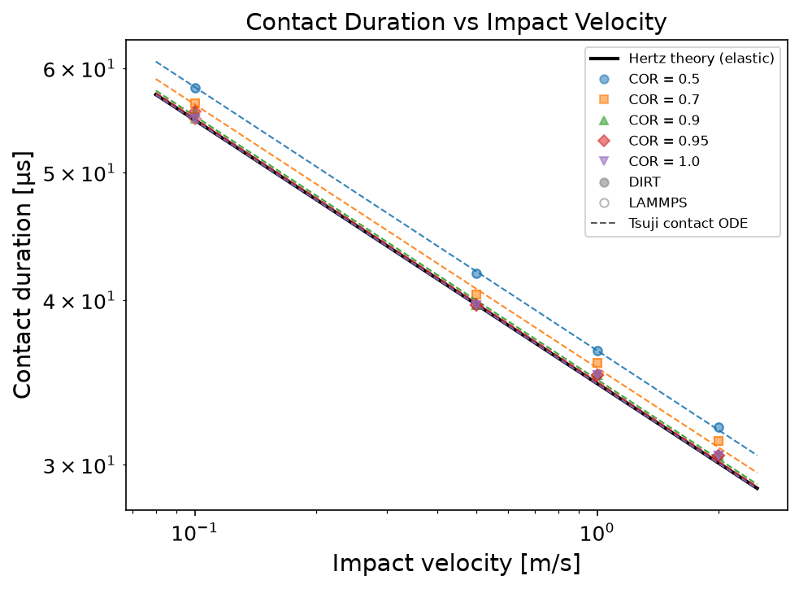

*Contact duration vs impact velocity. DIRT and LAMMPS overlay the Tsuji ODE curves;
the black elastic-Hertz curve is the COR = 1 limit. Maximum DIRT–ODE error is
1.51 %, dominated by timestep resolution.*

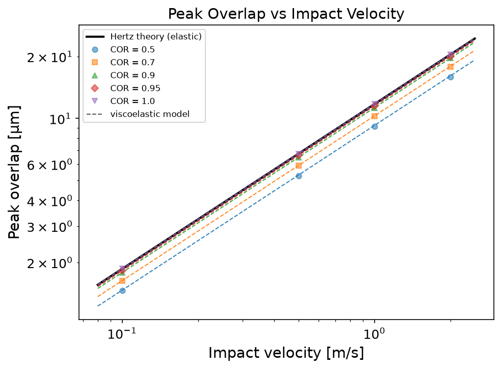

*Peak overlap vs velocity. Dissipative cases fall below the elastic curve and
follow the Tsuji ODE; maximum DIRT–ODE error is 0.79 %. The elastic anchor sits on
the Hertz line.*

**Honest read:** **PASS for the implemented Hertz–Tsuji equation and DIRT–LAMMPS
parity.** Across 20 cases, maximum DIRT–ODE relative errors are 0.57 % in COR,
1.51 % in contact duration, and 0.79 % in peak overlap; maximum DIRT–LAMMPS COR
difference is 0.0015. This validates the implementation, not the naming of the
input: a configured value of 0.5 realizes about 0.614. Anyone requiring a target
physical COR must calibrate or replace that Tsuji mapping rather than assume 1:1.

## `bench_tsuji_target_cor` — physical target-COR calibration

This companion benchmark leaves the legacy `restitution` field untouched: it is
still the raw Tsuji/LAMMPS input. For a requested physical normal COR, the driver
invokes DIRT's `hertz_tsuji_raw_for_target_cor` conversion before writing DIRT and
LAMMPS cases with that same mapped value; a separately implemented dimensionless
Hertz--Tsuji ODE checks the conversion rather than supplying it.
The mapping is `beta = alpha(e_raw)/sqrt(5)`; for example, physical target 0.70
maps to raw input 0.601269 (and beta 0.112809). The ODE residual gate is 0.0005.

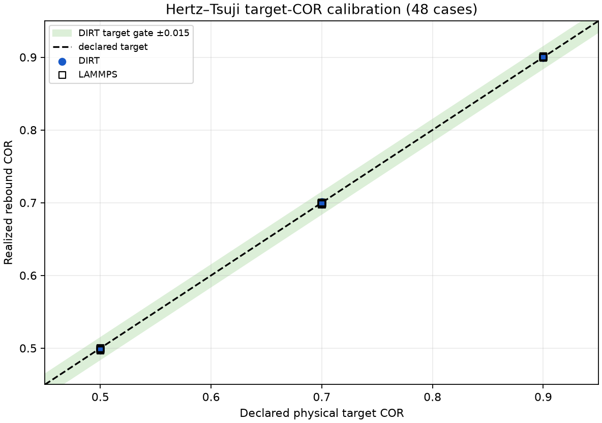

*DIRT (filled) and LAMMPS (open squares) realized COR against the declared physical
target. The green region is the DIRT ±0.015 gate. PASS: all 48 cases lie in band.*

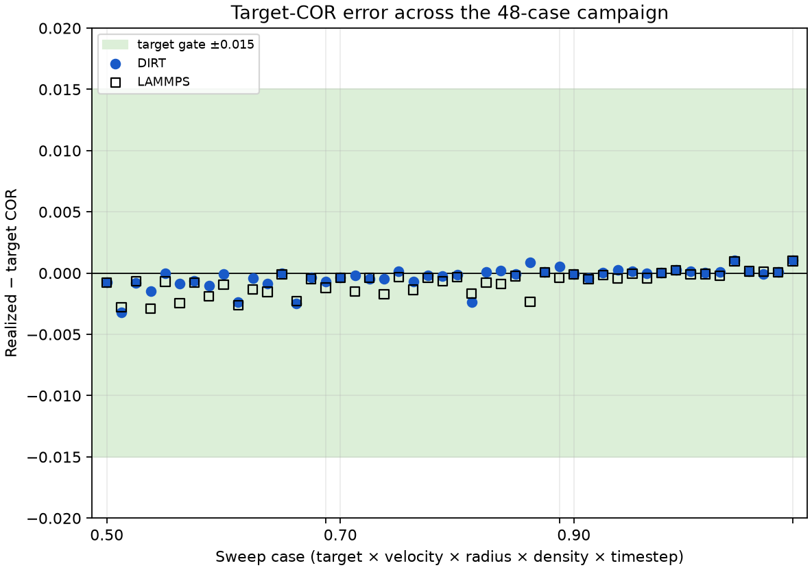

*Realized-minus-target COR through targets 0.50/0.70/0.90, velocities 0.25/1.0 m/s,
radii 2.5/5 mm, densities 1000/2500 kg/m³, and Rayleigh fractions 0.05/0.15. Dashed
lines are the ±0.015 gate. PASS: DIRT and LAMMPS stay within the plotted limits.*

**Honest read:** **PASS for the documented no-tensile-cutoff Hertz--Tsuji
convention.** The 48-case campaign passed target, ODE-inversion, and same-parameter
DIRT--LAMMPS parity gates. This is a contact-level calibration; mixed-material
contacts require calibration after DIRT's geometric per-pair raw-input mixing.

## `fiber_bond_breakage` — coupled axial plasticity and breakage

The `axial_plastic_stress_constant` scenario pulls a bonded-particle fiber
through the axial piecewise plastic envelope while `AxialStress` breakage is
active. The tensile threshold is in the post-yield hardening branch:
`sigma_break = 14 MPa` gives `eps_break = 0.018` from the analytical
elastic-plastic envelope, whereas an elastic-only calculation would break at
`eps = 0.014`. The validator reconstructs the coupled normal force from the
recorded plastic anchor and checks both the pre-break envelope and the
first-break strain.

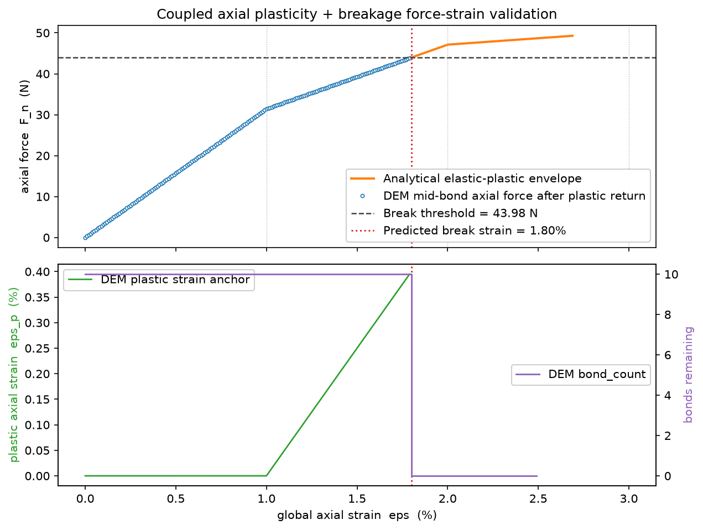

*Measured axial force after plastic return-map versus the analytical
elastic-plastic envelope, with the active breakage threshold and ±5% first-break
strain gate shown. Latest run: PASS.*

## `bench_hooke_rebound` — linear-spring normal rebound (exact damped closed form)

Exercises the **Hooke** normal contact (`contact_model = "hooke"`, per-material
`kn`/`kt`) — the linear spring-dashpot branch of `contact.rs` that every other
benchmark leaves untouched (they all use Hertz). Two identical spheres collide
head-on; the driver sweeps input restitution (0.3–1.0) and relative impact
velocity (0.5–4 m/s) and gates the measured COR, contact duration, and peak
overlap against the **exact** analytical collision. Unlike Hertz, the linear
contact is a constant-coefficient damped harmonic oscillator, so it *has* a
closed-form solution with no free constants:

- **COR = e** exactly, because DIRT derives the Hooke damping ratio as the exact
  linear inversion `β = −ln e/√(π²+ln²e)`, and `exp(−πβ/√(1−β²)) = e`.
- **Contact duration** `t_c = π/ω_d = √(π²+ln²e)·√(m_eff/kn)` (half the damped
  period), **velocity-independent** — the signature of a linear contact.
- **Peak overlap** `δ_max = (v/ω_d)·e^(−βω₀t*)·sin(ω_d t*)`, scaling linearly with
  the impact speed.

Across all 20 cases the simulation matches every one of these to **≤ 0.05 %**
(COR to within 0.0005, contact time and overlap to a few 0.01 %), and both COR and
`t_c` are flat across impact speed to < 0.05 %.

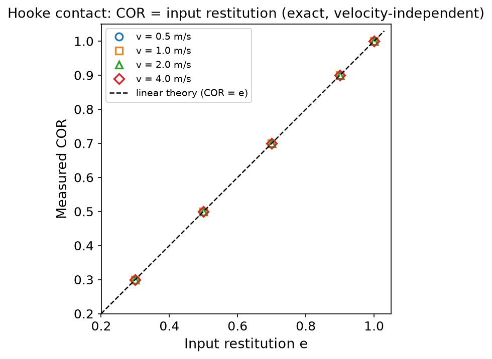

*Measured COR vs input restitution at four speeds. Points sit on the `COR = e` line
exactly and independently of velocity — the linear contact realizes its input
restitution with no calibration bias (contrast the Hertz/Tsuji rise above the line).*

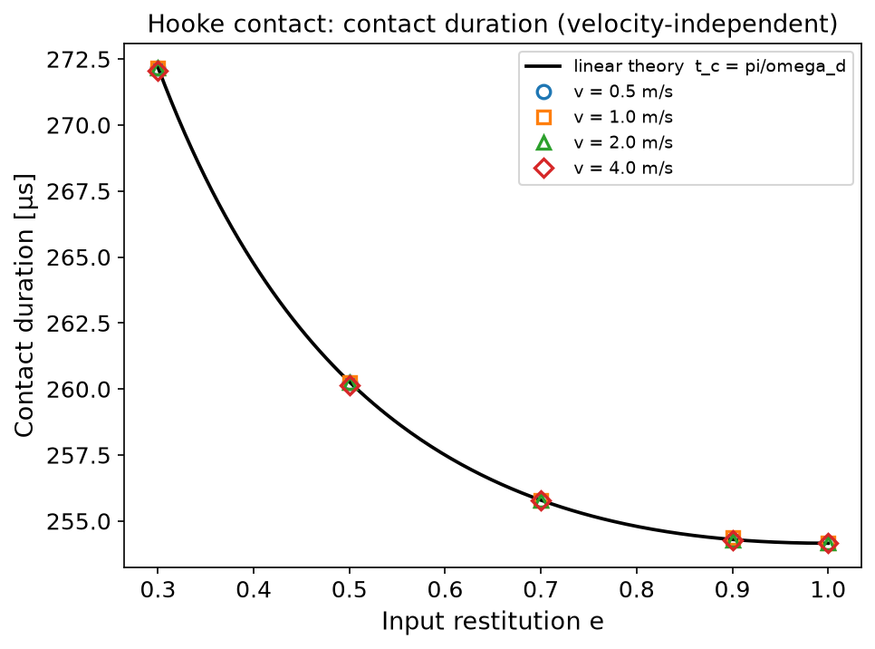

*Contact duration vs input restitution against `t_c = π/ω_d`. Points lie on the
analytical curve at every velocity (curves for the four speeds coincide), confirming
the velocity-independent half-period of the damped linear oscillator.*

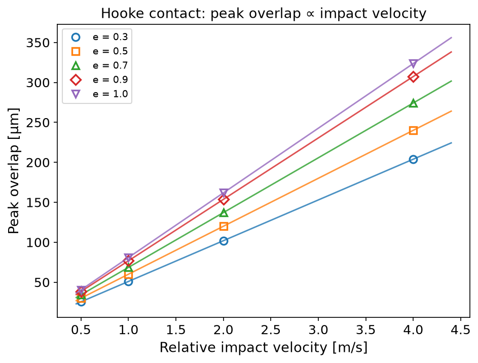

*Peak overlap vs impact velocity for each restitution. The linear `δ_max ∝ v`
scaling and the damping-dependent slope both match the closed form.*

**Honest read:** this is the strongest normal-contact check in the suite — an exact
damped closed form (not just the elastic limit, and not a calibrated mapping), so it
validates the linear stiffness, the restitution→damping derivation, and the
integrator simultaneously. It shares `bench_hertz_rebound`'s ~1–2 % contact-duration
floor from timestep quantization, but here the resolved error is far below it.

## `bench_hooke_wall_rebound` — linear-spring wall rebound

A single sphere strikes a real `dirt_wall` plane with
`contact_model = "hooke"`. This closes the wall-side Hooke normal-force check:
the reduced mass is the particle mass, `kn_ij` is the wall spring stiffness, and
`beta_ij` gives the exact linear spring-dashpot damping ratio. The sweep checks
measured COR, contact duration, peak overlap, and velocity-independence against
the same closed-form damped oscillator used for the particle-particle Hooke
benchmark, but with the rigid-wall effective mass.

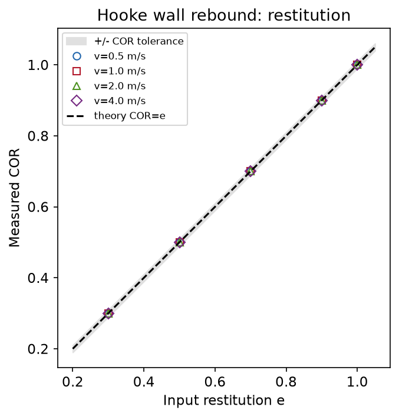

*Measured wall rebound COR vs the exact `COR = e` reference; the gray band is the
PASS criterion.*

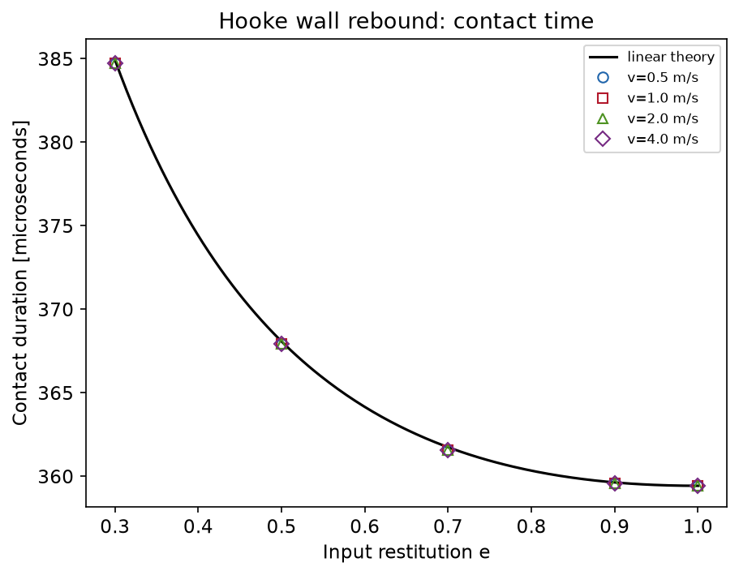

*Measured wall contact duration vs the exact damped half-period; the gray band is
the PASS criterion.*

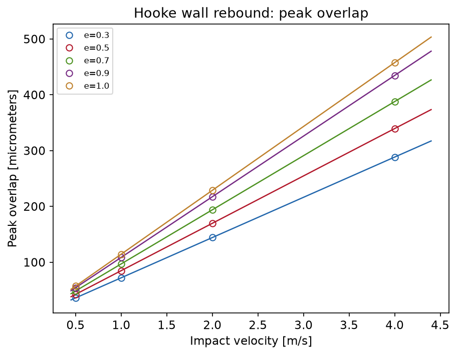

*Measured peak overlap vs the closed-form wall collision reference; shaded bands
show the PASS criterion.*

## `bench_oblique_impact` — tangential contact vs Maw (1976)

A spin-free projectile strikes a frozen sphere obliquely; sweeping the incidence
angle traces the tangential restitution β(ψ₁). This validates DIRT's Hertz–Mindlin
tangential spring + Coulomb cap against the **full Maw–Barber–Fawcett (1976)**
solution (the textbook S-curve, experimentally confirmed by Kharaz et al. 2001) and
against LAMMPS's `granular` model.

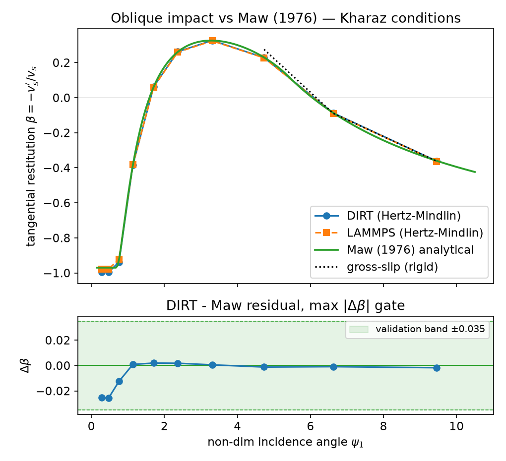

*β = −v_s′/v_s vs non-dimensional incidence angle ψ₁: DIRT, LAMMPS, and the
gross-slip line. DIRT reproduces the whole S-curve — the β ≈ −1 sticking plateau at
low ψ₁, a microslip rise through a +0.32 peak near ψ₁ ≈ 3.3, and convergence onto the
analytical gross-slip branch — and matches LAMMPS to max |Δβ| ≈ 0.007.*

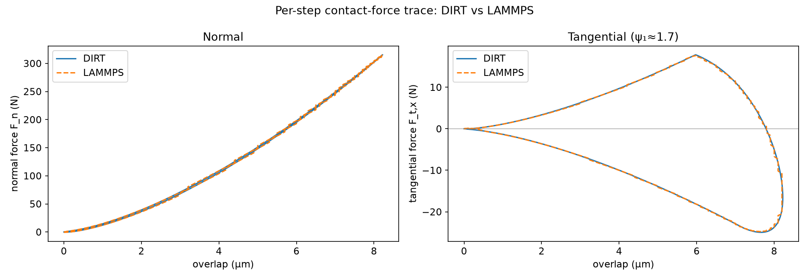

*Per-step normal and tangential force during one collision (ψ₁ ≈ 1.7): DIRT and
LAMMPS trace an identical normal curve and the same tangential loading/unloading
hysteresis loop. Normal restitution stays ≈ 0.985 independent of tangential velocity,
confirming the normal and tangential models are decoupled.*

**Honest read:** this is now a genuine analytical + cross-code validation across the
full regime, not just the gross-sliding limit — the strongest tangential test in the
suite. Still no direct comparison to raw experimental points (it matches the Maw
*theory* curve), and the projectile is aimed dead-centre so the impact normal is
exact.

## `bench_nohistory_tangential` — history-free tangential law

Two identical glass spheres are held at fixed normal overlap and driven through a
reversing tangential-velocity path. The `linear_nohistory` force is checked against
the documented LAMMPS `pair_granular` velocity-Coulomb law
`F_t = min(μ|F_n|, η_t|v_t|)` with zero stored tangential displacement, while the
default history model is run on the same path as a contrast case.

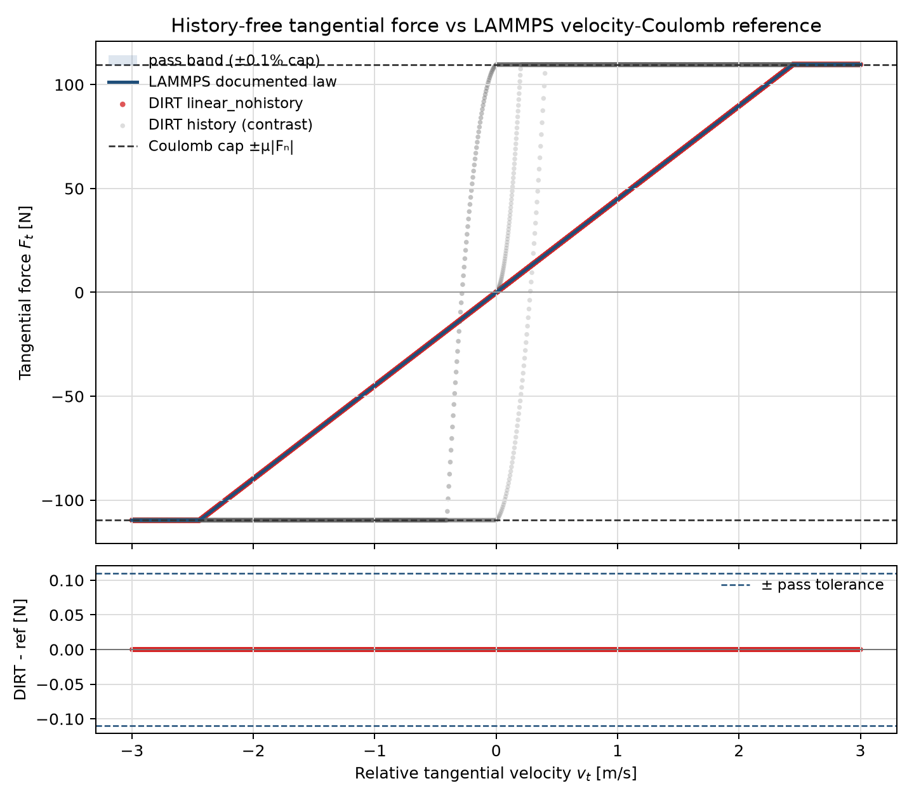

*DIRT `linear_nohistory` points lie on the LAMMPS documented law, with the Coulomb
cap and the `sweep.py` PASS tolerance shown directly. The history model retains an
elastic force at zero tangential velocity, demonstrating that the new mode is
genuinely history-free rather than a relabeled Mindlin path.*

**Honest read:** this is a deterministic single-contact law check, not an
integrated collision validation. It strongly pins the history-free force expression
and Coulomb cap, but the tangential damping coefficient is identified from the
sub-cap branch before checking the full documented `min()` shape.

## `bench_mindlin_rescale_tangential` — Mindlin unloading rescale

Two identical spheres are held at prescribed overlaps: first tangentially loaded
at fixed peak overlap, then normally unloaded with zero tangential velocity. The
benchmark checks `history`, `mindlin_rescale`, `mindlin_rescale/force`, and
`linear_nohistory` against the documented LAMMPS recurrences for the unloading
gate `history <- history * a/a_prev`.

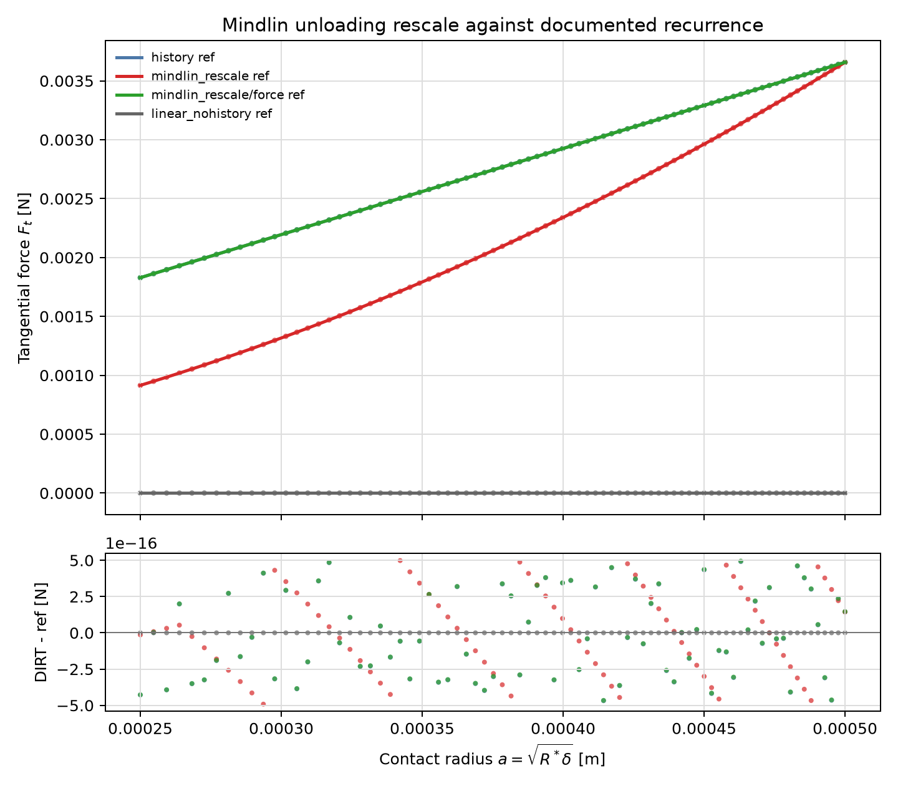

*DIRT unloading forces against the documented recurrence. The pass gate verifies
that `mindlin_rescale` drops quadratically relative to displacement-history
Mindlin during unload, `mindlin_rescale/force` scales its elastic-force history,
and `linear_nohistory` remains zero when `v_t = 0`.*

**Honest read:** this is an isolated force-law benchmark, not a free collision.
That is intentional: prescribed positions remove integrator noise and expose the
load-unload history update directly. It is equation-level parity with a documented
LAMMPS recurrence; an independently executed LAMMPS unloading trajectory has not
yet been added.

## `bench_kharaz_oblique` — replicate Kharaz, Gorham & Salman (2001)

Reproduces Kharaz et al.'s (2001) elastic-rebound *experimental protocol* — a 5 mm
alumina sphere on a **flat glass anvil** (a real `dirt_wall` z-plane) at fixed impact
speed Vᵢ = 3.85 m/s, sweeping the incidence angle — and plots the paper's
rebound/spin curves: rebound angle, tangential restitution eₜ = v_t′/v_t, and
non-dimensional rebound spin Rω′/Vᵢ vs incidence angle.

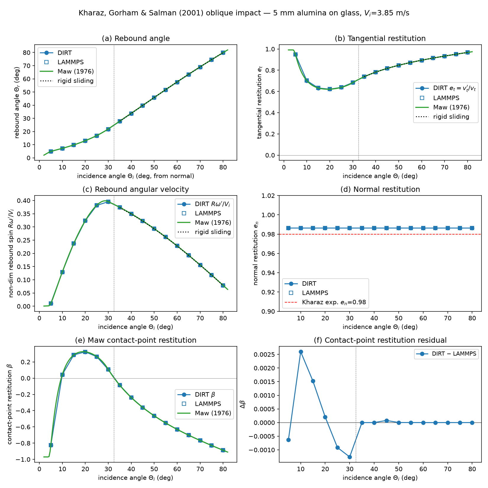

*Normal restitution is flat at eₙ = 0.986 across the whole 5°–80° sweep (within
0.006 of Kharaz's measured 0.98). In the sliding regime (Θᵢ ≳ 32.5°) the rebound angle,
tangential restitution and spin match the exact rigid-body impulse kinematics to
three decimals; below it DIRT traces the Maw micro-slip S-curve (eₜ minimum ≈ 0.62
near 20°, spin peak ≈ 0.39 near 30°) — the characteristic Kharaz shape.
Open squares are the matched LAMMPS wall-impact cases and overlay the DIRT points.*

**Honest read:** the flat wall (vs the frozen sphere used by `bench_oblique_impact`)
keeps the contact normal +z at all angles, so eₙ is exactly angle-independent — the
faithful Kharaz geometry. The quantitative check is against the exact rigid-body
sliding kinematics + the Maw theory Kharaz's data confirmed, anchored to Kharaz's
**measured** scalars eₙ = 0.98 and μ = 0.092. The 16-angle matched LAMMPS sweep
uses the same wall geometry, Tsuji damping, Mindlin history, and explicit damping
limit. Maximum DIRT–LAMMPS differences are 0.00074 in eₜ, 0.00045 in
`Rω'/Vᵢ`, 0.0105° in rebound angle, and 0.00260 in contact-point β. The
paper's per-point glass-anvil scatter lives only in its paywalled figures; if
digitised, it drops into `kharaz_experiment.csv` and is overlaid automatically.
So this is the suite's closest tie to a physical experiment, but still not a
raw-point comparison.

## `bench_sliding_friction` — slip-to-roll transition

A sphere is launched horizontally with no spin onto a **flat frictional wall** (a real
`dirt_wall` z-plane with Mindlin friction). Kinetic friction decelerates it and spins
it up until the contact stops sliding, after which it rolls without slipping.
Rigid-body mechanics predicts `a = μg`, transition `t* = 2v₀/(7μg)`, and a final
rolling speed `v_f = (5/7)v₀` that is **independent of μ**; all three are checked
across μ ∈ {0.2,0.3,0.5,0.7} and v₀ ∈ {0.5,1,1.5} (tolerances 8 % / 10 % / 3 %).

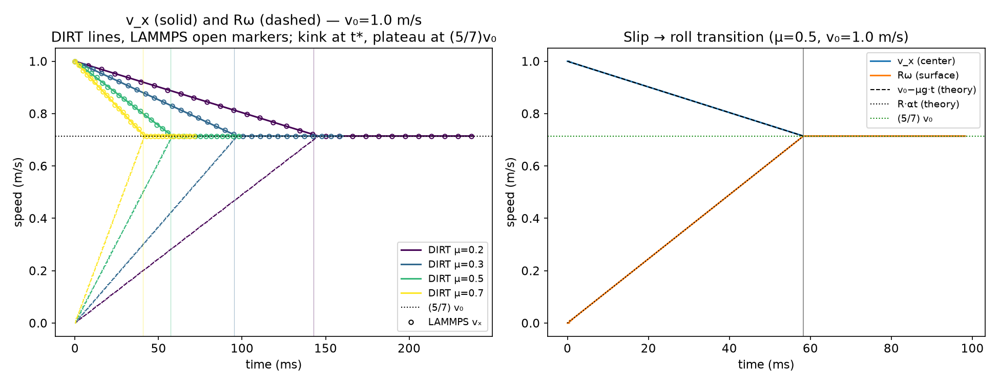

*Centre velocity vₓ (solid) and surface speed Rω (dashed) vs time. vₓ falls and Rω
rises until they meet at the (5/7)v₀ plateau (the slip→roll transition); the predicted
t* lines mark where each case stops sliding.*

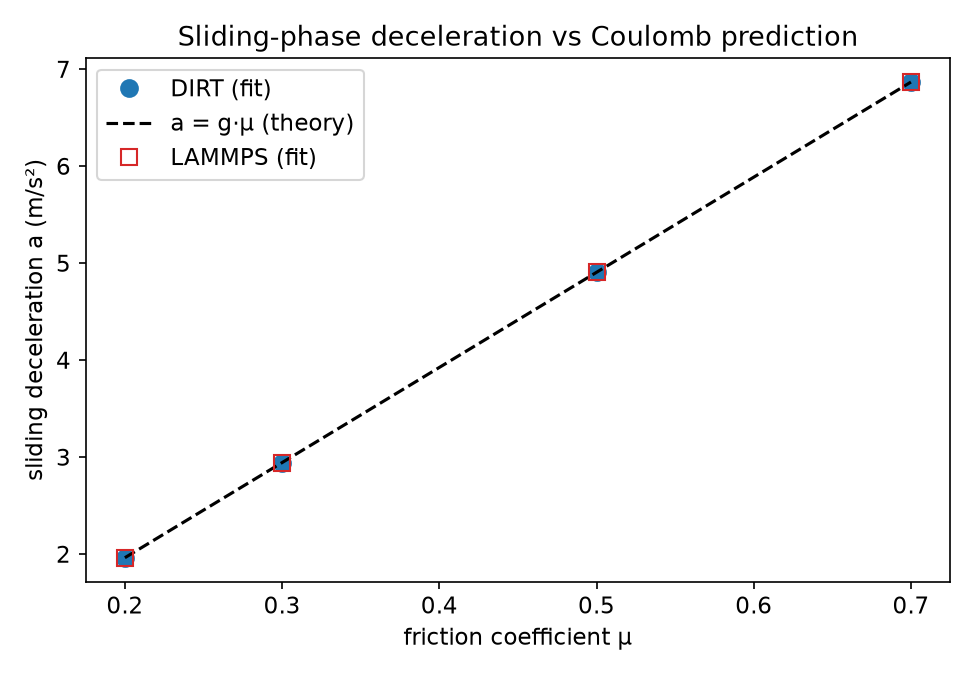

*Fitted sliding deceleration vs μ, on the `a = μg` line.*

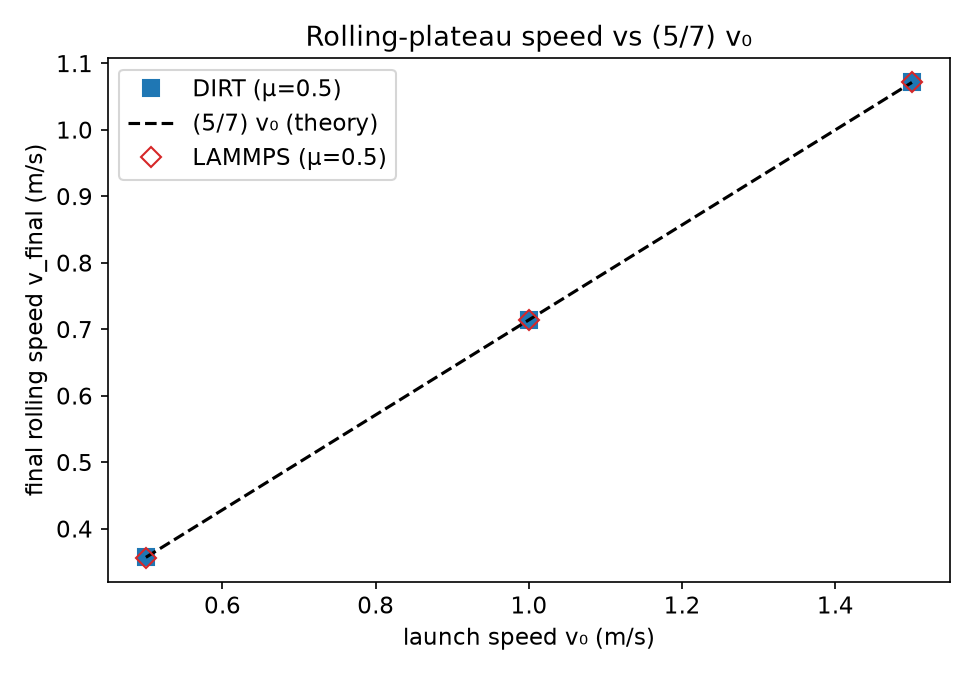

*Final rolling speed vs launch speed, on the `(5/7)v₀` line — and μ-independent, the
non-trivial prediction.*

**Honest read:** now a clean flat-wall test (the earlier giant-frozen-sphere floor
that blew up neighbor binning is gone). The `(5/7)v₀` plateau is model-independent, so
it genuinely tests the Hertz–Mindlin tangential law; `a = μg` is partly
self-consistent (the cap is μ|Fₙ| by construction). Gross sliding only; no LAMMPS.

## `bench_polydisperse_mixing` — per-pair mixing rules (R*, E*, e_ij, μ_ij)

Single binary collisions between spheres of **unequal radius** and/or **different
material**, checking that DIRT combines the two particles' properties with the
right per-pair rules: reduced radius `R* = r1 r2/(r1+r2)`, effective modulus
`E* = e_eff_ij`, restitution `e_ij = √(e1 e2)`, and friction `μ_ij = √(μ1 μ2)`.
Where `bench_hertz_rebound`/`bench_oblique_impact` validate the single-material
normal/tangential laws, this isolates the **mixing**.

*Head-on (free–free), elastic:* peak overlap and contact duration match undamped
Hertz theory evaluated with the mixed `R*`, `E*`, `m*` to **≤ 0.1 %** across `R*`
1.6–2.5 mm and `E*` 4.8e9–3.7e10 Pa (COR = 1.000). *Restitution mixing:* the
realized COR of a cross pair `(e1,e2)` equals that of a same-material reference at
`e_ref = √(e1 e2)` to Δ ≤ 0.001 — a calibration-offset-free way to confirm the
geometric-mean rule. *Oblique (frozen target, gross sliding):* the
tangential/normal impulse ratio equals `√(μ1 μ2)` to **≤ 3.5 %**, lying far closer
to the geometric than the arithmetic mean.

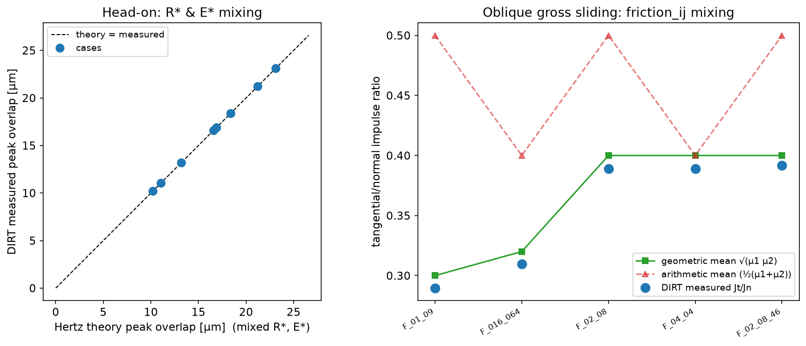

*Left: elastic head-on peak overlap vs Hertz theory (mixed R*, E*) — on the 1:1
line. Right: oblique gross-sliding impulse ratio tracks the configured geometric
mean √(μ1 μ2). The arithmetic mean is shown only as a negative control: if DIRT
were wired to the wrong common mixing rule, the points would move toward that
line. It is not presented as a competing physical reference.*

**Honest read:** analytical references, but for the model DIRT implements — this
confirms the mixing arithmetic is wired up, not which mixing rule is physically
"true" for a given pair (a modelling choice). The friction check carries a small
consistent ~2–3.5 % deficit from end-of-contact micro-slip (the Coulomb cap is not
held for the entire contact), covered by a 5 % tolerance; it still separates
cleanly from the arithmetic mean. Equal density throughout, so `m*` varies through
radius only.

## `bench_rolling_decay` — flat-wall constant rolling-resistance deceleration

A sphere set in pure rolling on a real flat `[[wall]]` floor is decelerated by
DIRT's `rolling_model = "constant"` wall rolling-resistance couple. With the
Mindlin sliding spring enforcing the no-slip constraint and a flat wall giving
`r_eff = R` exactly, the analytical deceleration is the constant
`a = (5/7)·μ_r·g`. The sweep checks μ_r ∈ {0.02, 0.05, 0.10}; all three fitted
rates match the exact line to below the 2 % gate and the slip stays below the
1 % pure-rolling gate.

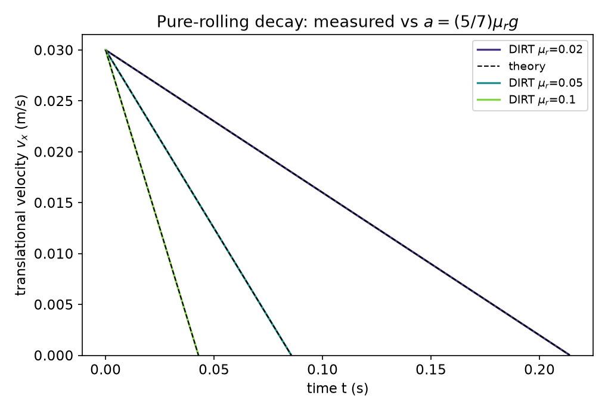

*Speed vs time for three rolling-friction coefficients (solid) on the analytical
constant-deceleration lines (dashed); pure rolling (v = ωR) held to < 1 % slip.*

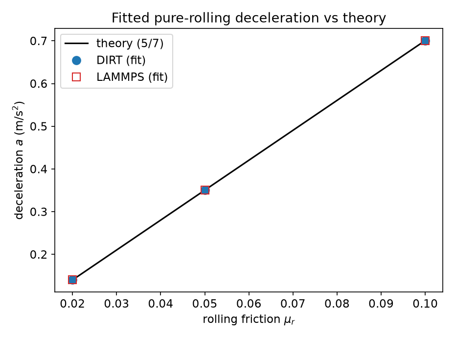

*Fitted deceleration vs μ_r on the `(5/7)μ_r g` flat-wall line; DIRT (filled) and,
when present, LAMMPS `rolling sds` (open). The DIRT gate is 2 % against the
constant-model analytical rate; the optional LAMMPS overlay/cross-code gate uses
the saturated SDS cap on the same flat floor.*

**Honest read:** largely **self-consistent** — the rate is derived from the same couple
the code applies, so it confirms the integrator reproduces the model's own coefficient,
not the rolling model vs experiment. This benchmark covers the constant rolling model
on wall contacts, not the particle-particle SDS rolling spring dynamics; the latter is
covered separately by `bench_sds_rolling`. The optional LAMMPS comparison is a
cross-code check against saturated `rolling sds`, not an independent experiment.

## `bench_sds_rolling` — SDS (spring-dashpot-slider) rolling model

`bench_rolling_decay` above exercises only the `constant`-torque rolling model; this bench
covers `rolling_model = "sds"` (contact.rs). An upper sphere on a frozen anchor is seated at
the static Hertz overlap (`F_n = m g`) and given a pure rolling spin about a horizontal axis;
sliding friction is off, so the only ⊥-normal couple is the SDS rolling resistance. Two
regimes are validated against the model's *own* closed form (F_n = m g, r_eff = R/2,
I = (2/5) m R²):

- **Elastic (cap disengaged):** the couple `τ = −k_r δ − γ_r ω` makes the spin obey the exact
  damped oscillator `I δ̈ + γ_r δ̇ + k_r δ = 0`. The over-damped case gives an exponential ω
  decay (dominant eigenvalue |s₁| = 194.3 s⁻¹) matched to **0.10 %** of ω₀; the under-damped
  case *oscillates* — the spring reverses the spin — matched to **0.56 %**. A springless
  (k_r = 0) control is off by 2.4 % / 131 %, so the rolling spring is genuinely exercised.
- **Coulomb cap (slider saturated):** under a large sustained spin the couple holds at
  `τ_max = μ_r F_n r_eff`, giving the exact constant rate `α = (5/4) μ_r g / R`. The fitted
  saturated slope matches to **0.00 %** across μ_r ∈ {0.05, 0.10, 0.20}.

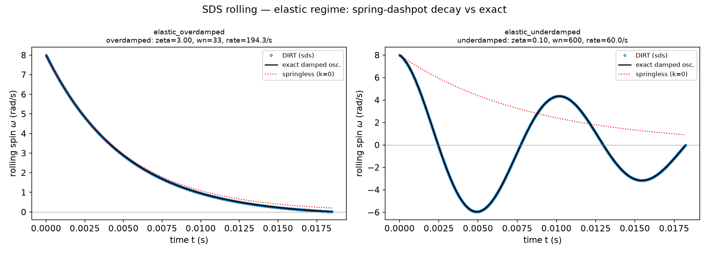

*Rolling spin ω(t) for the over- and under-damped elastic cases (DIRT points) on the exact
damped-oscillator solution (black); the springless k=0 curve (red dotted) is clearly wrong.*

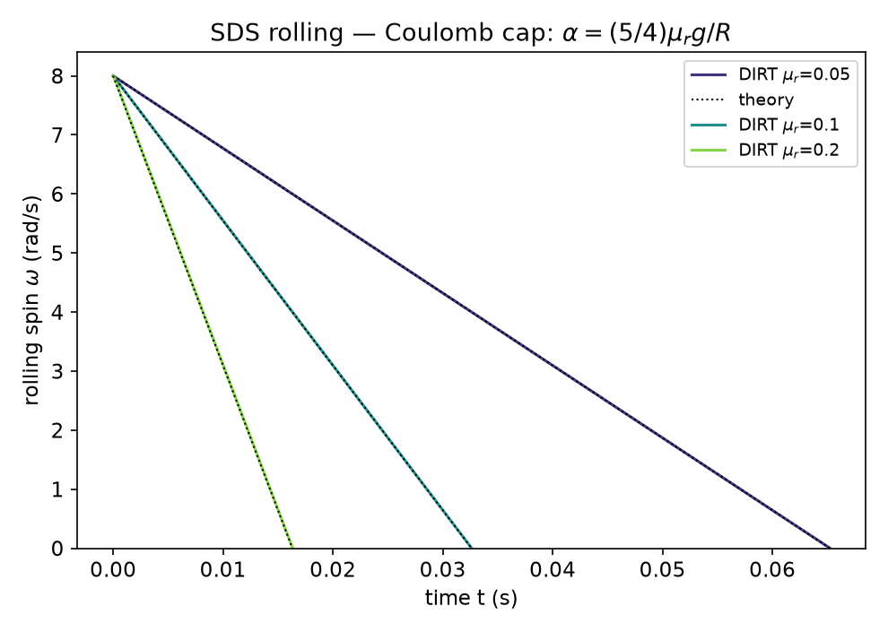

*Saturated spin-down for three μ_r on the analytical `α = (5/4) μ_r g / R` lines (dotted).*

**Honest read:** **self-consistent by design** — the acceptance is to validate the SDS model
against *its own* analytical rate/steady state, which is what the elastic eigenvalues and the
Coulomb cap are. The springless control makes the elastic check discriminating (it fails if
the spring term is dropped). The same SDS rolling model is documented in LAMMPS
`pair_granular` (rolling `sds`); the analytical dynamics here are model-defining, not
DIRT-specific.

## `bench_twisting_friction` — constant and SDS twisting spin-down

Two equal spheres are stacked on the contact normal: the lower sphere is frozen and
the upper sphere is seated at the static Hertz overlap so `F_n = mg`, then spun
purely about the normal. Because the contact point lies on the spin axis, there is
no sliding or rolling; the only active couple is twisting friction. For equal
spheres, `r_eff = R/2` and `I = (2/5)mR²`, so both twisting models are checked
against the exact spin-down rate `α = (5/4)·μ_tw·g/R`.

- **`constant` twisting** applies the Coulomb torsional couple directly.
- **`sds` twisting** winds up its torsional spring-dashpot-slider, reaches the same
  cap `τ_max = μ_tw F_n r_eff`, and is fitted after the short wind-up.

The sweep covers μ_tw ∈ {0.05, 0.10, 0.20} for both models. PASS requires the fitted
spin-down rate to match the analytical rate within 3 %, off-axis spin below 0.1 %
of the initial spin, and lateral drift below 10 µm. The committed run reports all
six fitted rates on the analytical line to round-off, with zero off-axis spin and
zero lateral drift.

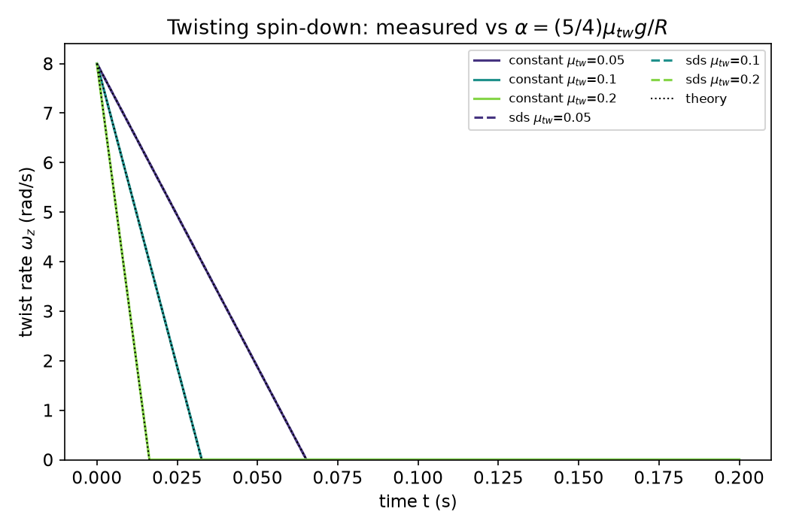

*ω_z(t) for constant and SDS twisting on the analytical linear spin-down traces;
the SDS cases are fitted after the brief spring wind-up.*

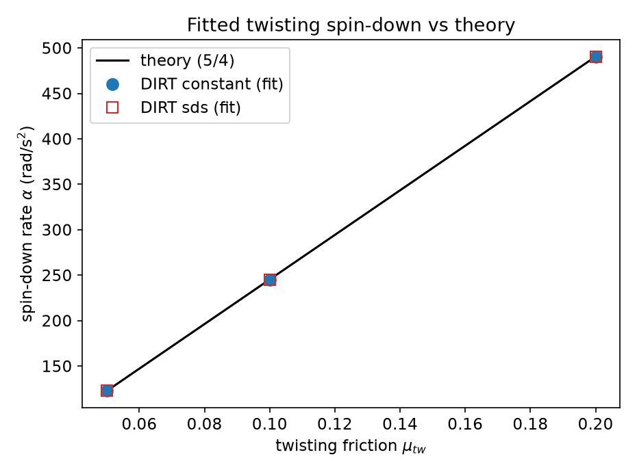

*Fitted spin-down rate vs μ_tw for both twisting models on
`α = (5/4) μ_tw g / R`; latest committed result: PASS.*

**Honest read:** self-consistent and deliberately narrow. This proves the twisting
couple, saturation cap, torsional-history path, and purity of the normal-axis torque
in an isolated enduring contact. It does not validate twisting friction against an
external experiment, nor does it exercise arbitrary multi-contact spin histories.

## `bench_jkr_adhesion` — adhesive pull-off

Two glass spheres are brought slowly into contact, held while a short-range adhesive
force bonds them across the interface, then pulled apart quasi-statically until the
bond snaps. While separating, the contact carries a *tensile* (attractive) force
rather than the usual repulsion; the benchmark records the largest tension reached
just before the spheres let go — the pull-off force — and sweeps the work of adhesion
`w` (the interfacial surface energy), comparing each measured pull-off to the JKR
value `F = (3/2)πwR*`.

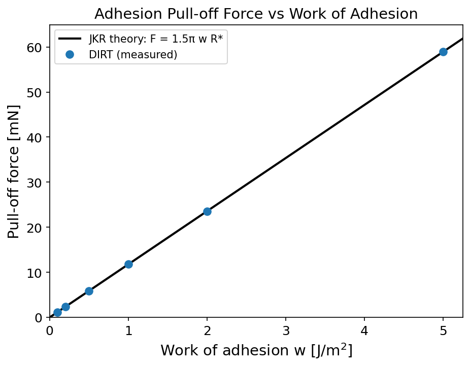

*Pull-off force vs work of adhesion (markers) on the JKR line — exactly linear
(R² = 1, < 0.001 % error).*

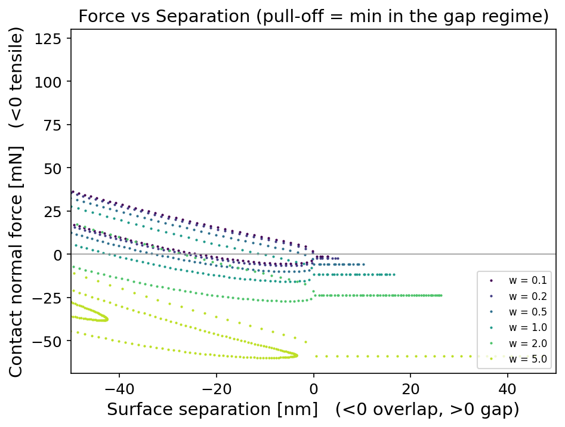

*Normal force vs surface separation: Hertzian repulsion while overlapping, then a flat
tensile −F_adh plateau in the gap until snap-off.*

**Honest read:** the near-perfect agreement is **by construction** — DIRT models
adhesion as a *constant* attractive force set to exactly `(3/2)πwR*`, and the test
measures that constant. It validates the sweep/linearity wiring, not emergent contact
mechanics (no Maugis contact-area law, hysteretic neck, or adhesive stiffness); the
flat plateau is that simplification made visible.

## `bench_dmt_sjkr_cohesion` — DMT pull-off & SJKR cohesion (distinct from JKR)

Covers the *other two* attractive branches of `dirt_granular::contact` and exercises
adhesion-model selection. **DMT arm:** with `adhesion_model = "dmt"` the pull-off is
measured against `F = 2πwR*` (which, unlike JKR, has no gap regime — the constant
attraction is realized inside overlap and read at the `δ→0` limit); a JKR reference
case confirms the DMT/JKR ratio is `4/3` (measured **1.3332**). **SJKR arm:** with
`cohesion_energy = c` the area-proportional cohesion `F_coh(δ) = c·π·R*·δ` is isolated
by differencing against a pure-Hertz baseline at matched overlap (both at
`restitution = 1`, so the shared Hertz term cancels exactly), then checked for
linearity in `δ` (slope `cπR*`) and in `c` (slope-of-slopes `πR*`).

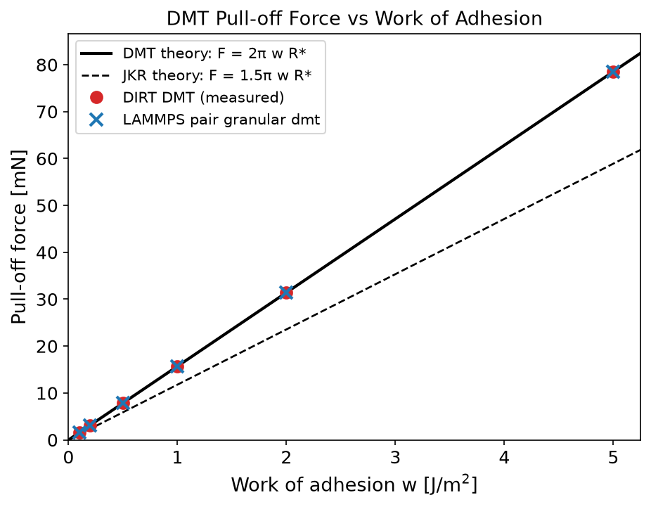

*DMT pull-off (markers) on `2πwR*` (solid); JKR `1.5πwR*` (dashed) shown for contrast —
model selection moves the response between the two lines (ratio 4/3).*

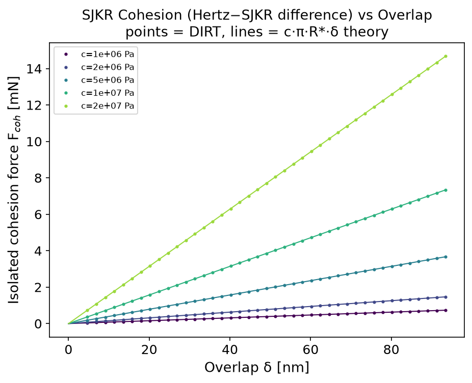

*Isolated SJKR cohesion (Hertz − SJKR difference, markers) linear in overlap on the
`c·π·R*·δ` area-law line (solid) for every `c`.*

**Honest read:** like `jkr_adhesion`, the magnitudes match **by construction** — DMT's
constant `2πwR*` and SJKR's `cπR*δ` are exact closed forms and the test recovers them.
What this benchmark adds beyond `jkr_adhesion` is coverage of the DMT and SJKR code
paths and a concrete, non-trivial **model-selection** check (the `4/3` ratio and the
qualitatively different area-law, which unlike JKR/DMT vanishes at separation). It does
not validate emergent contact-area mechanics (no Maugis neck or adhesive stiffness).

## `bench_liquid_bridge_cohesion` — pendular liquid-bridge force and wet heap trend

Adds the opt-in `liquid_bridge_model = "willett2000"` capillary bridge force for
near-contact particle pairs. The single-contact arm separates two spheres and
checks the tensile normal force against Willett et al.'s closed-form expression
with an explicit rupture distance; the latest maximum relative error is
`4.24e-13` against a `1e-9` gate. This force arm runs with `skin_fraction = 1.0`,
so bridge-only samples prove the DEM cutoff includes the configured rupture
distance instead of relying on extra neighbor skin. A dry identity arm also compares the default dry
configuration to `liquid_bridge_model = "off"` with nonzero liquid parameters and
requires byte-identical traces.

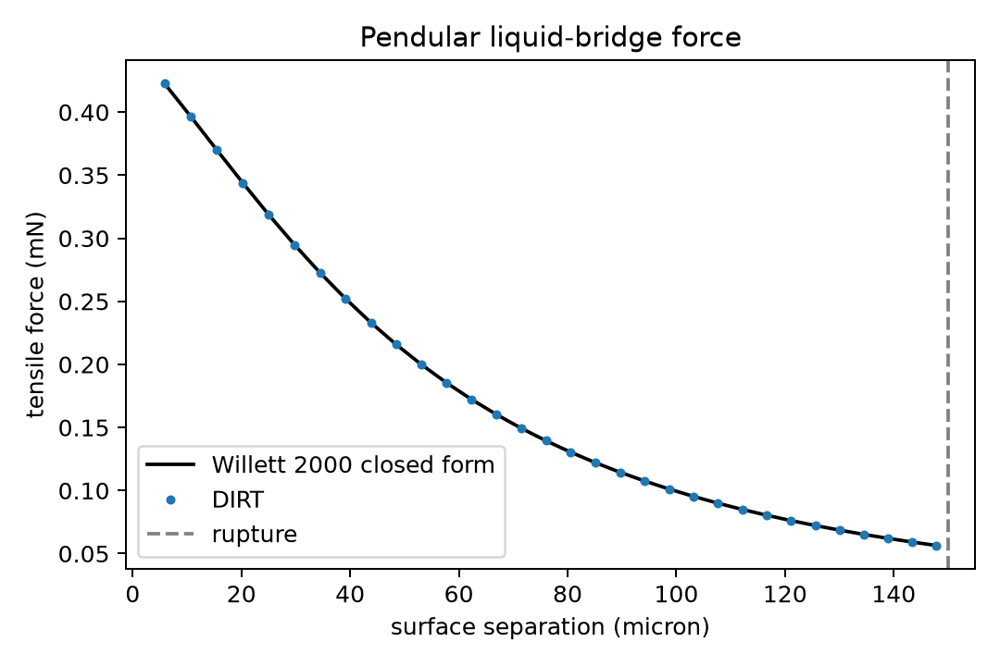

*DIRT liquid-bridge force versus the Willett et al. (2000) closed form, including
the configured rupture cutoff. Latest run: PASS.*

The macro arm reuses the lifted-cylinder angle-of-repose protocol at small scale
and checks the established wet-granular trend: adding pendular liquid bridges
increases the static angle of repose (Hornbaker et al. 1997; Tegzes et al. 1999).
The latest high-liquid case is `2.71 deg` above dry, exceeding the `2.00 deg` gate.

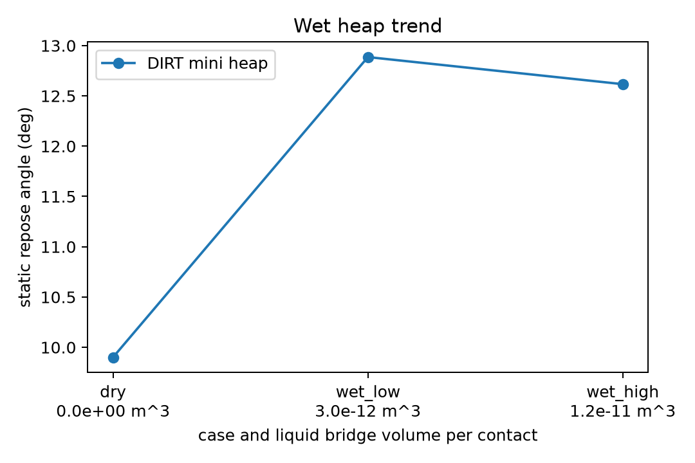

*Static heap angle versus liquid bridge volume per contact. Latest run: PASS; the
reference is a qualitative trend rather than a universal quantitative angle.*

**Honest read:** the single-contact force is a direct closed-form implementation
check, not an independent wetting experiment. The heap check validates that the
new force changes a bulk observable in the physically expected direction, but the
absolute angle is setup-dependent and intentionally gated only as a trend.

## `bench_fiber_crossover` — friction at a bonded-fiber crossover

Two bonded-sphere fibers are laid perpendicular so they touch at a single crossing
contact — like two crossed sticks resting on each other. A fixed normal load presses
them together while the upper fiber is dragged sideways across the lower one; the
tangential force first rises elastically (the contact grips), then flattens once the
junction starts to slide. The benchmark reads that sliding plateau and checks it
against the Coulomb limit `F_slide = μN` as the normal load is swept.

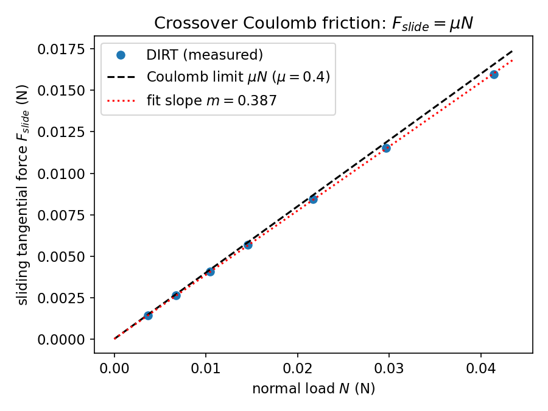

*Sliding force vs normal load on the μN line with the fitted slope (recovers μ = 0.4
to within 0.06).*

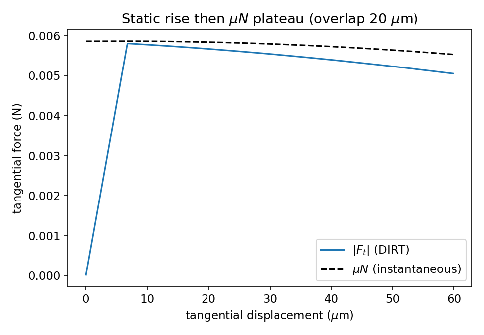

*Tangential force vs displacement for one case: the linear Mindlin static rise, then
the μN sliding plateau.*

**Honest read:** **self-consistent** — it checks the friction cap returns μ, using the
*measured* normal force, so the ratio test is somewhat circular. A useful unit-level
contact-model check, not an independent validation.

## `bond_fiber_tensile` — axial BPM stiffness self-check

A straight chain of 11 spheres joined end-to-end by bonded-particle-model (BPM)
bonds is stretched lengthwise, like pulling on a slender rod. As the fiber elongates
each bond carries an axial force set by its stiffness `K_n = E A / L`; the benchmark
reads the stress–strain slope of the *middle* bond (away from the loaded ends, so it
sees a clean uniform stress) and checks that it reproduces the input Young's modulus
`E` — i.e. that the stiffness configured on the BPM bond actually shows up as the
fiber's measured axial stiffness.

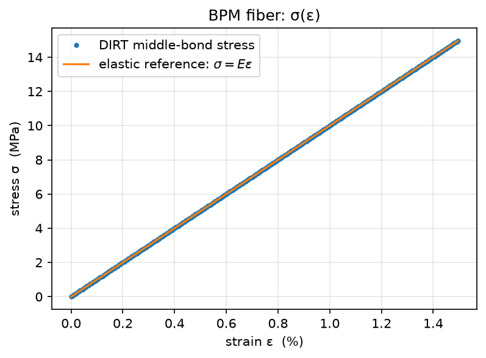

*Measured stress-strain samples from the example run against the input-`E`
reference line. The shaded band is the ±1% pass band shown in the example README;
the fitted slope is 1.000050 GPa against 1.000001 GPa, a 0.005% relative error
(PASS).*

**Honest read:** self-consistent — this confirms the BPM material-mode stiffness
is propagated into axial force correctly for a simple uniform fiber. It is not an
independent material calibration or fracture validation.

## `bench_curtis_cantilever` — Guo/Curtis flexible-fiber cantilever

A 10-sphere bonded fiber is fixed at one end and loaded by a static transverse
point force at the free-end sphere. The sweep follows Guo, Wassgren, Hancock,
Ketterhagen, and Curtis (2013), Fig. 3-4: it compares normalized free-end
deflection vs normalized load to Euler-Bernoulli thin-beam theory, then checks
the along-fiber deflection and bending-moment distributions at
`|y0|/(L-rs) ~= 0.15`.

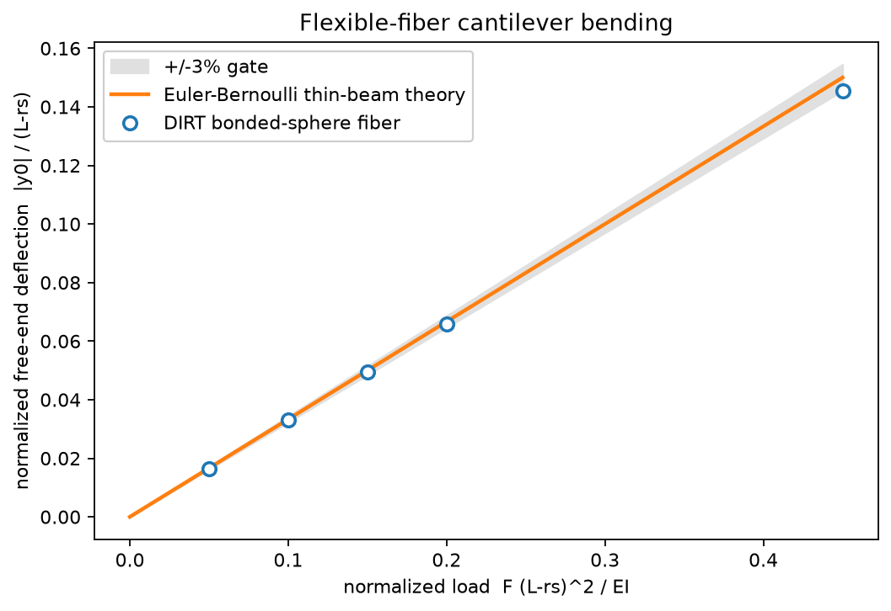

*Normalized free-end deflection vs `F (L-rs)^2 / EI`. The shaded band is the
/-3 % PASS criterion; latest run: PASS, max relative error 2.988 %, with all 9
bonds intact.*

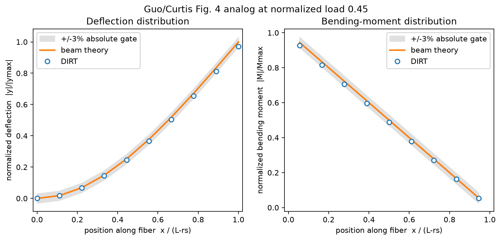

*Deflection and bending-moment profiles at normalized load 0.45. Latest run:
PASS, max absolute profile errors are 2.828 % for deflection and 1.791 % for
bending moment.*

**Honest read:** this is an analytical elastic-beam validation of the bonded-sphere
fiber response, not a fit to copied paper data. The highest load sits at the edge
of the small-deflection beam-theory regime by design, matching the paper's
distribution check; larger-deflection cases would need the large-deformation
reference rather than this straight Euler-Bernoulli line.

---

# Tier 2 — Free cooling (Haff's law)

`bench_sphere_haff_cooling` releases a periodic box of spheres with a random
velocity field and lets it cool through inelastic collisions. Because the
configured restitution is velocity-independent, the expected granular
temperature follows Haff, `T(t) = T₀/(1+t/tc)²`. The useful comparison here is
the direct DIRT–LAMMPS overlay and the linearity of `1/√T` in time.

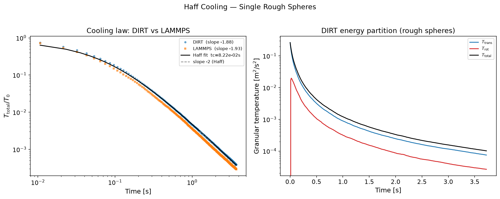

*Spheres only. Normalized temperature and energy partition for DIRT, with the
matched LAMMPS cooling curve overlaid.*

**Honest read:** this supports spherical-particle Haff cooling at curve level.
The clump and rod cooling figures have been removed from the validation ledger:
their start-up energy injection, re-zeroing after the transient, and calibrated
LAMMPS initialization obscure whether DIRT's multisphere dynamics are correct.
They should return only after the rotational-energy injection is understood. The
repeated seeded-ensemble dashboard is also omitted here; it remains a regression
artifact rather than primary scientific evidence.

---

# Tier 3 — Bulk granular phenomena (empirical / qualitative)

Bulk behaviour against empirical correlations or trends — the weakest tier.

## `bench_angle_of_repose` — heap formation

A loose column of spheres is held inside an open-bottomed cylinder standing on a
frictional floor. The cylinder is lifted straight up and the now-unconfined column
slumps outward into a conical heap — the granular version of the classic
"lifted-cup" pile test. The angle the heap's flank makes with the floor is its
*angle of repose*, and the benchmark measures that angle as the grain–grain sliding
friction is increased. There is no exact analytical repose angle, so it checks only
the qualitative signature a correct model must show: the angle grows with friction,
is near-flat at μ = 0, and is reproducible across repeats.

**Experimental scope:** Elekes & Parteli (2021), doi:10.1073/pnas.2107965118,
report roughly 20–25° for millimetre glass beads prepared by hopper pouring. That
is not a valid gate for this lifted-column protocol: preparation history and the
contact parameters alter the result. In particular, their Table 1 uses
`mu_s = 0.5`, `mu_r = 0.05`, while this benchmark sweeps `mu_s`, fixes its `sds`
cap at `mu_r = 0.1`, and releases a pre-settled column rather than pouring.
No rolling-friction value is selected to hit that interval. A quantitative
experiment comparison requires a matched hopper protocol, independently specified
contact and uncertainty data, and a predeclared fixed-parameter replicate gate.

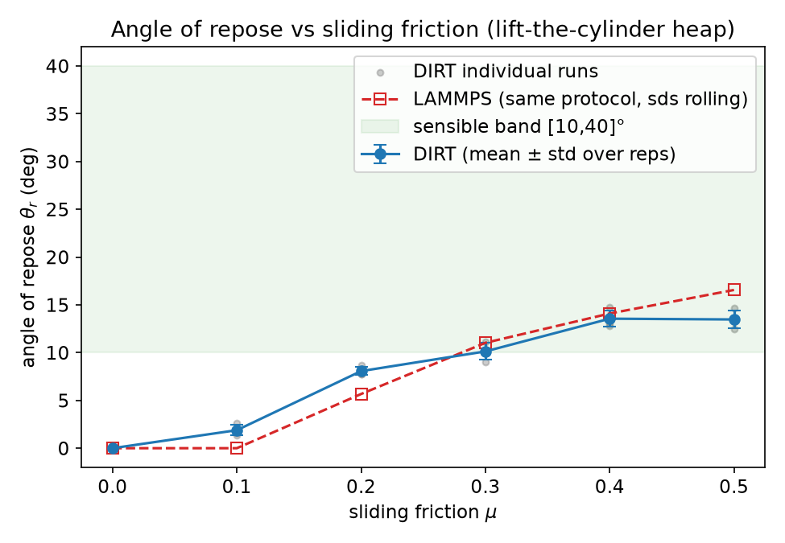

*Mean repose angle vs sliding friction (±1 s.d. over repeats), with the "sensible" band
shaded. The angle increases monotonically with μ — the qualitative law a correct model
must obey — though absolute values run low.*

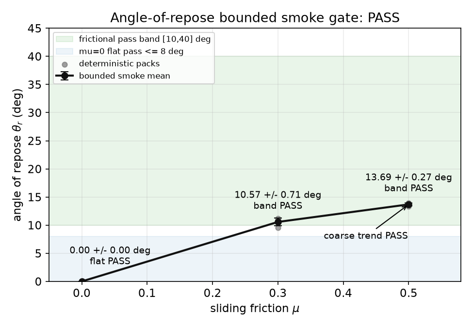

*Default harness smoke gate: the actual bounded μ = 0, 0.3, 0.5 check is plotted
against the flat-frictionless limit, the [10°, 40°] frictional pass band, and the
coarse increasing-trend criterion. Latest run: PASS, 4/4 checks passed.*

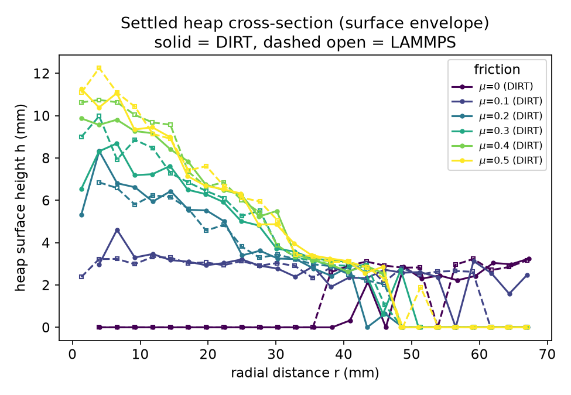

*Settled surface height vs radius for each μ; flanks steepen with friction.*

**Honest read:** qualitative only — trend, sign, reproducibility, never an angle.
Absolute angles read low because the lift-and-collapse protocol mobilizes the surface,
and the sweep stops at μ = 0.3 (the angle saturates above). The heap now stands on a
**real frictional floor wall** (the earlier frozen-bed workaround was removed once
`dirt_wall` gained tangential friction).

## `bench_column_collapse` — granular column runout

A quasi-2D column is released on a flat frictional floor; the intended comparison
is runout `L_f` versus the initial aspect ratio `a = H/L0` against Lube (2004) and
Lajeunesse (2004). The current sweep is **not valid scientific evidence** because
the DIRT and LAMMPS initial columns were not matched.

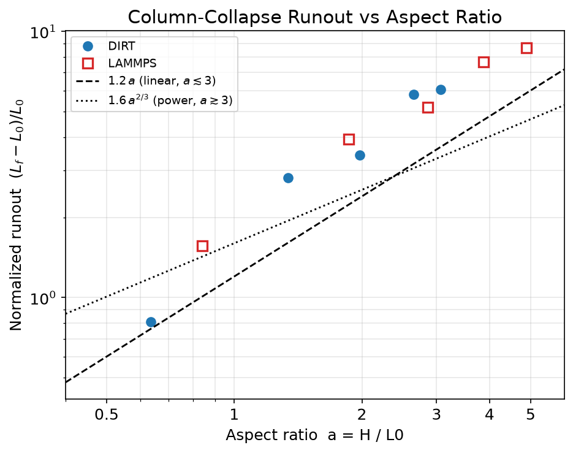

*Diagnostic only. Points are now placed at the aspect ratio computed from the
particle count actually present, not the requested case label. The separation
between the two solvers mostly reflects different initial columns rather than a
validated difference in collapse physics.*

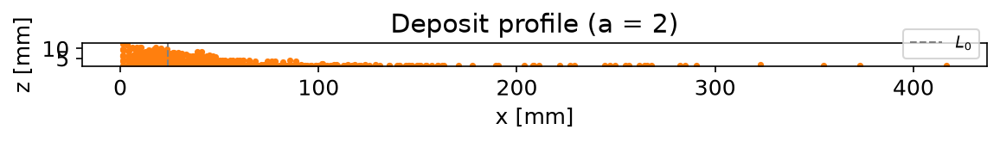

*Side view of the rest-state deposit for the representative case — with wall friction it
comes to rest as a finite pile rather than running to the wall.*

**Root cause:** DIRT's random non-overlap inserter exhausted its attempts well
before reaching the requested counts. Examples from the retained run logs are
`79/110` particles at requested `a=0.5` and `675/1100` at requested `a=5`. The
latter therefore had actual `a ≈ 3.07`, yet the old plot placed it at `a=5`.
LAMMPS used a taller insertion region and placed the full count. It also ran one
packing seed while DIRT was described as a three-seed mean. These are not
equivalent initial conditions, so neither the pointwise solver gap nor the old
fitted exponents support a finite-size or model conclusion.

The harness now computes `actual_aspect = H/L0`, plots that value, and fails any
case whose actual and requested aspect differ by more than 2%. A scientifically
useful rerun needs one complete set of initial particle coordinates supplied to
both codes, followed by a declared seed ensemble. Until then this benchmark is
**WITHHELD**, not a DIRT failure and not a cross-code validation.

## `bench_lebc_shear` — Lees-Edwards homogeneous shear rheometer

A triperiodic glass-bead box is sheared with native Lees-Edwards deformation. This
section retains only the strongest comparison: the **frictionless full sweep**
of Bagnold-normalized normal and shear stresses against Lun / extended kinetic
theory and independent LAMMPS, Fortran, and LIGGGHTS results. The frictional
μ(I), Φ(I), and Walton dashboards are calibration or cross-geometry trend plots;
they are not presented here as validation evidence.

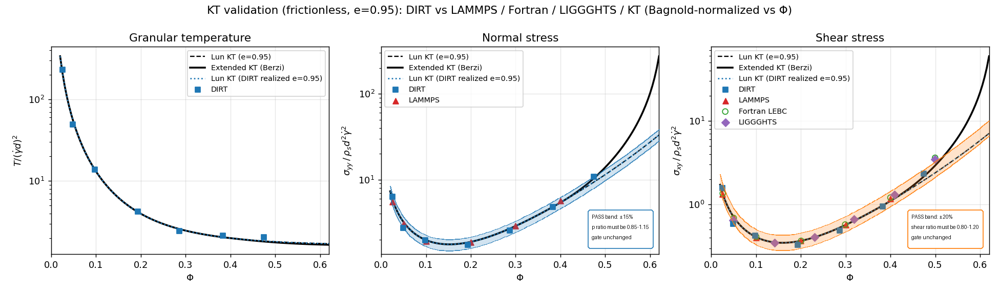

*DIRT frictionless points over the kinetic-theory and cross-code references.
The acceptance tolerances remain in the benchmark harness. The plotting code no
longer draws the colored PASS bands; this committed image still contains them
because the full frictionless KT dataset needed to regenerate it is not present
in this checkout.*

**Honest read:** the useful evidence is the frictionless stress comparison.
Deviations near jamming are expected when enduring contacts leave the collisional
kinetic-theory regime. The removed Walton comparison mixed 2-D disks with 3-D
spheres and did not match the stress ratios closely enough to carry validation
weight. The glued-sphere rod shear section is also withheld until the multisphere
energy issue identified in the cooling tests is resolved.

## `bench_hopper_beverloo` — silo discharge rate

A tall, thin (quasi-2D) hopper is filled with grains and its bottom slot is opened,
letting the bed drain under gravity like sand through an hourglass. Once flow is
steady the discharge rate is essentially constant (independent of how much is left
above — the hallmark of granular, not fluid, outflow); the benchmark measures that
steady mass flow rate for five orifice widths and fits it to **Beverloo's empirical
correlation** `W ∝ (D − k·d)^(3/2)`, checking the width-scaling exponent.

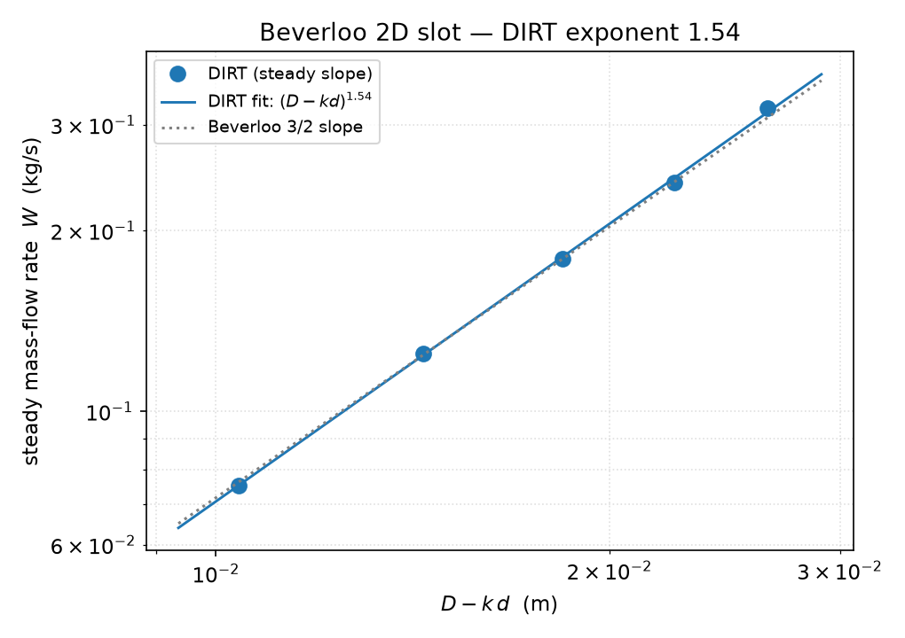

*Discharge rate vs effective orifice width (log–log) with the power-law fit and the 3/2
reference; fitted exponent ≈ 1.53 (R² ≈ 0.9995).*

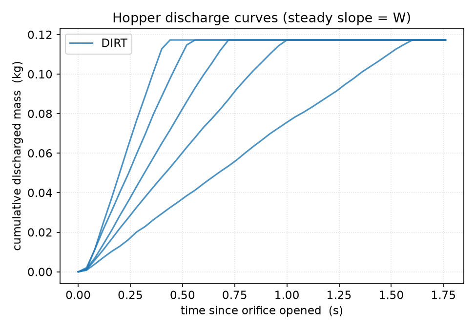

*Cumulative discharged mass vs time per orifice width; the constant-slope region is the
steady rate W.*

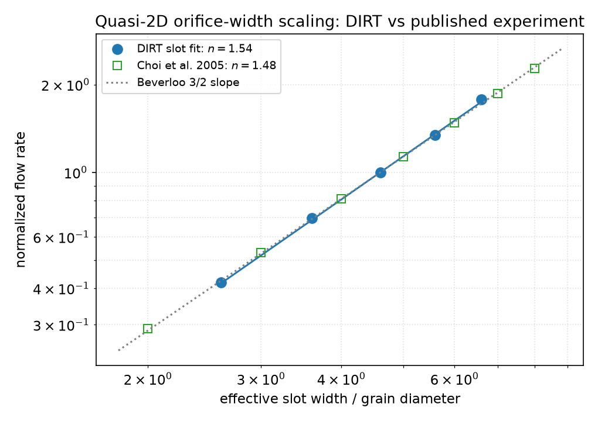

*Normalized DIRT orifice-width scaling against Choi, Kudrolli & Bazant's 2005
quasi-2D silo fit `v* = 0.63 (W/d - 1)^1.48`. Latest run: PASS; DIRT keeps the
unchanged full-run exponent gate and compares as a slot exponent, not an absolute
prefactor.*

**Honest read:** the reference is itself an **empirical** fit (k ≈ 1.4 and the prefactor
are fitted), so this validates a correlation, not first principles — and only its
exponent/form. The latest measured 1.53 is close to the textbook 3/2; finite hopper,
wedge-feed, and modest-width effects remain the main limitations. Choi et al. provide
a closer published quasi-2D slot comparison with exponent 1.48, but their flat-bottom
silo, depth, and velocity-based flow-rate measure mean this is still a normalized
exponent comparison, not a prefactor match. 2D slot only (the 3D `5/2` form is untested
and not directly comparable to this geometry).

## `bench_plate_sinkage` — pressure–sinkage

A plate is pushed into a settled bed; pressure vs sinkage is fit against the **Bekker**
terramechanics relation `p = (k_c/b + k_φ)·zⁿ`. Only the qualitative Bekker-form
checks are retained here: pressure should rise monotonically with sinkage and the
wider plate should carry more load. No agency-report or soil-specific parameter
comparison is claimed.

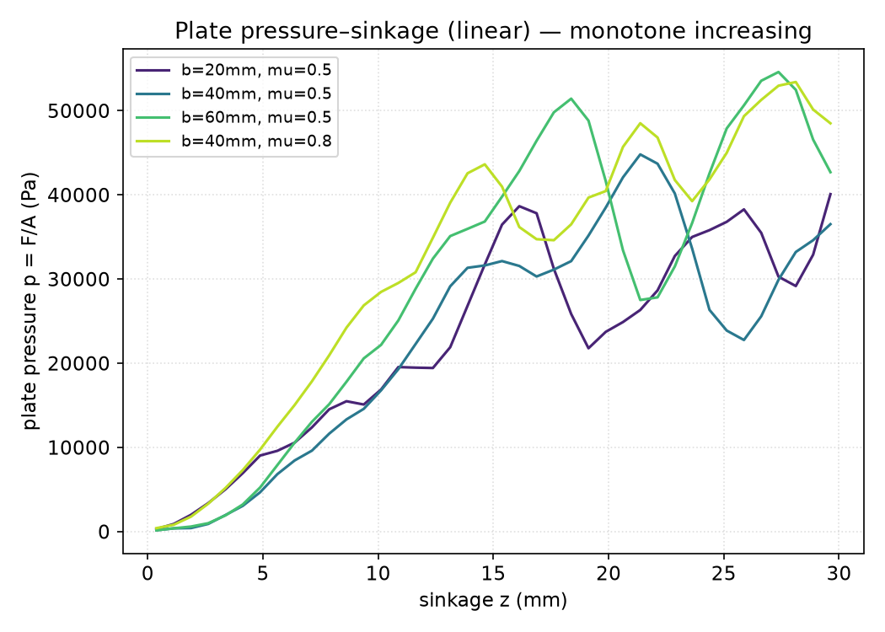

*Pressure-sinkage on linear axes. The shallow response is plausible, but the
deeper-sinkage curves visibly depart from a clean shared trend.*

**Honest read:** **diagnostic, not quantitative validation.** Bekker is a fitted
soil correlation, and these softened grains, enhanced gravity, and thin periodic
geometry do not represent a specified soil. The departure at larger sinkage must
be investigated before fitting or publishing an exponent. The cluttered all-case
log-log fit and the former published-parameter overlay are intentionally omitted.

---

## `fiber_bond` — bonded-particle fiber mechanics

The non-`bench_` `fiber_bond` example runs five small bonded-sphere fiber cases
against Guo et al. (2018) or closed-form references: axial elastic stiffness,
cantilever static bending, free bending vibration using the discrete chain mass,
configured axial piecewise plasticity, and Guo trilinear bending plasticity. The
validator computes the measured quantity from each run's recorded bond kinematics
and compares it to the reference without changing the scenario tolerances.

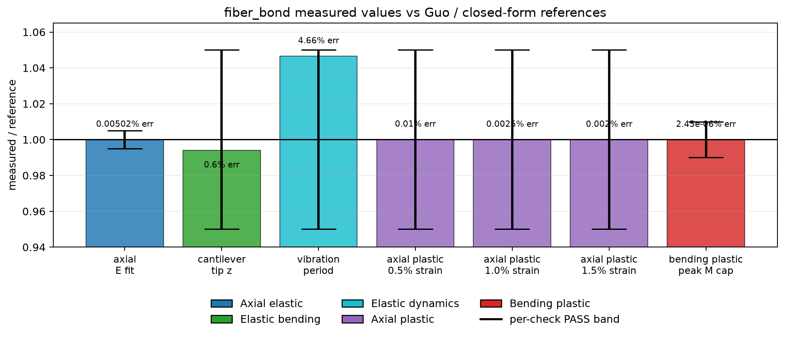

*Measured quantities divided by their Guo / closed-form references. The black
interval on each bar is the relevant PASS band (0.5 % axial elastic, 5 % bending
and axial plastic checks, 1 % bending-plastic cap). Latest regenerated run: PASS
for all plotted checks.*

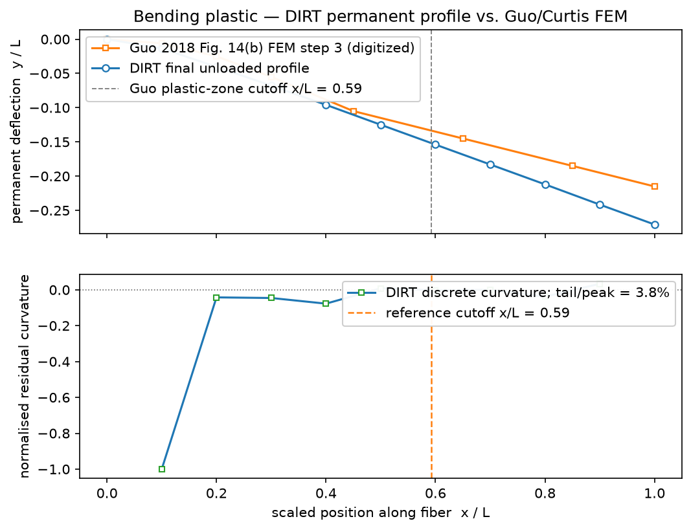

*Final unloaded profile after the three Guo/Curtis load steps, compared with a
digitized Guo et al. Fig. 14(b) FEM step-3 profile at `α = 1.885 s^-1`. The
shaded band is the validator's max-error limit (`±0.075 L`); the vertical marker
is the plastic-zone estimate `x/L = 1 - M_p/(F_t^0 L) = 0.593`. Latest
regenerated run: PASS, RMS `|Δ(y/L)| = 0.0271`, max `0.0556`, free-end error
25.9% (limit 35%), and tail curvature 3.82% (limit 10%).*

**Honest read:** this is a deterministic mechanics validation for a short
bonded-particle chain, not an experimental fiber-calibration study. The plastic
axial case checks the configured piecewise envelope, while the bending-plastic
case checks Guo's trilinear yield law, kinematic-hardening trajectory, and
permanent-deformation profile for this single loading schedule.

## `fiber_bond_breakage` — BPM breakage criteria

This non-`bench_` validation example reuses the `fiber_bond` binary to exercise
six bond-breakage criteria: constant axial stress, constant axial strain,
per-bond Weibull axial stress, combined stress, combined strain, and
bending-only interaction-linear stress. The axial cases compare first-break
global strain to the analytical or weakest-bond Weibull prediction with a 5%
gate; the cantilever cases compare tip displacement at first break to the
Euler-Bernoulli estimate with the documented 35% discrete-chain gate.

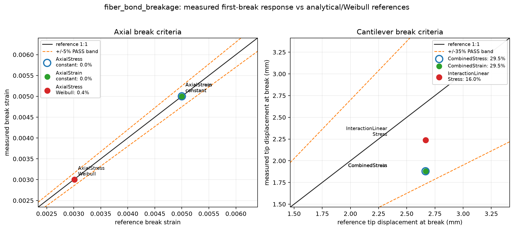

*Each point is one breakage rule. Left: predicted axial break strain on the
horizontal axis and measured strain on the vertical axis; the three axial rules
sit almost exactly on the black 1:1 line. Right: the same comparison for
cantilever tip displacement. Those three points miss the beam estimate by
16–30% and pass only because the discrete-chain tolerance is a broad ±35%.*

**Honest read:** the axial criteria are sharp analytical checks. The cantilever
criteria are only coarse consistency checks; a 35% band is too broad to treat
their PASS labels as strong validation.

The statistical Weibull weakest-link distribution is gated in
`bench_bond_breakage`, which runs 60 independently seeded axial-stress Weibull
realizations. It keeps the per-seed weakest-bond prediction check and compares
the empirical first-break strain distribution to the analytical minimum-Weibull
CDF with a Kolmogorov-Smirnov gate.

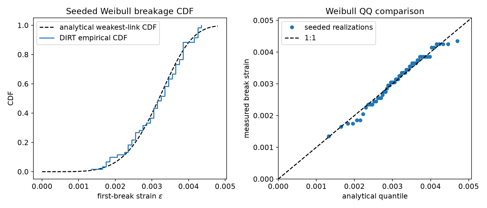

*Empirical first-break strain CDF and QQ plot against the analytical
weakest-link Weibull CDF. Latest regenerated run: PASS, max per-seed error 3.8%
and KS `D = 0.075` below the 0.18 gate.*

## `bench_cundall_strack_biaxial` — quasi-2-D wall-cell measurement diagnostic

This runnable 197-grain wall-cell diagnostic records dense DIRT wall reactions,
volumetric strain, and contact/fabric observables. The primary Cundall--Strack
paper supplies apparatus provenance only: its Fig. 10 snapshots have no strain
registration and are not targets. An earlier periodic 2-D LAMMPS trace has been
removed rather than presented beside the finite-wall 3-D response; it was not a
protocol-comparable reference. This is a measurement diagnostic, not a completed
replication; the README documents the missing external trajectory requirement.

## `bench_potyondy_cundall_bpm` — Potyondy-Cundall BPM rock compression

This benchmark runs a reduced DIRT bonded-particle compression specimen with
the normal particle insertion, fixing/loading, auto-bonding, and
`CombinedStress` breakage plugins active. The comparison target is Potyondy &
Cundall (2004), Table 2 and Fig. 8(a): the stress-strain curve is normalized by
the PFC2D Lac du Bonnet granite macroproperties `q_u = 199.1 MPa` and `q_u/E =
0.00281`. The target curve in
`data/potyondy_cundall_2004_fig8a_digitized.csv` is an approximate hand
digitization of Fig. 8(a)'s low-confinement response. The single-layer specimen
uses an effective quasi-2D thickness chosen so its intact elastic slope matches
Table 2's `E = 70.9 GPa`.

The quantitative gates are deliberately normalized: peak strength must be within
12% of the Table 2 PFC2D `q_u`, peak/failure strain must be within 18% of
`q_u/E`, and the run must produce at least 20 bond breaks so the plotted crack
progression is not only a scalar strength check. Latest run: PASS, peak strength
198.44 MPa (`0.997 q_u`), peak strain 0.00282 (`1.004 q_u/E`), 71 broken bonds.

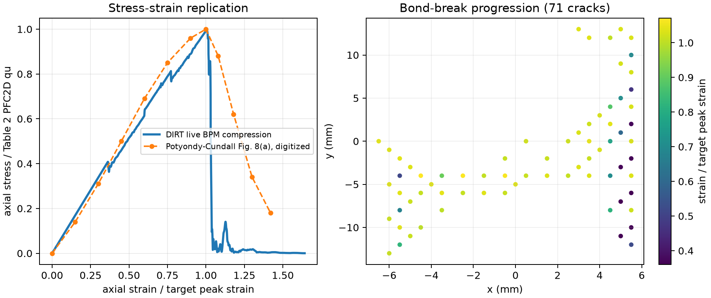

*DIRT live BPM stress-strain response against the digitized Potyondy-Cundall
Fig. 8(a) target, with the spatial sequence of `CombinedStress` bond breaks.
Latest run: PASS.*

## `bench_mdr_elastoplastic_normal` — MDR elastic-plastic normal contact

The MDR (Method of Dimensionality Reduction) contact model captures *elastic–plastic*
normal contact: press two grains together hard enough and the contact yields and
flattens permanently, so on release the force follows a different, stiffer path than
it did on loading and a residual dent is left behind. This benchmark drives a single
two-sphere contact quasi-statically through one such load–unload cycle at prescribed
overlaps, recording the normal force at each step, and compares the whole trace to the
particle-pair rigid-flat MDR equations in LAMMPS `GranSubModNormalMDR` — per-side
placement, elastic loading, first yield, plastic unloading with `deltaR`, MDR
contact-radius stiffness, and the adhesive tensile branch. The gate is `2e-10`
relative or `1e-8 N` absolute.

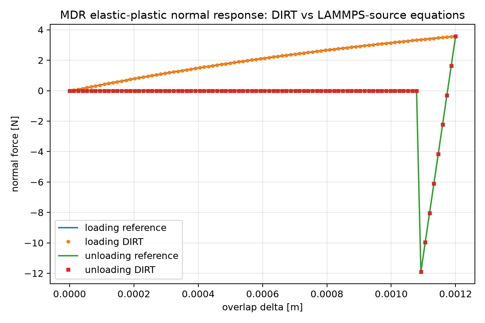

Current result: PASS; maximum relative error `3.724e-13`.

(Contact heat conduction was removed from the codebase, so it is no longer a gap; it
will need a benchmark when re-added.)

## Summary table

| Example | Reference | Tier | Status / main gap |
|---|---|---|---|
| hertz_rebound | Hertz–Tsuji contact ODE + LAMMPS | analytical + cross-code | PASS for implemented equation; max DIRT–ODE errors 0.57% COR / 1.51% duration / 0.79% overlap and max DIRT–LAMMPS ΔCOR 0.0015; Tsuji input is not realized COR at low values |
| tsuji_target_cor | independently inverted Hertz--Tsuji ODE + LAMMPS | analytical + cross-code | PASS; 48 COR/velocity/size/density/timestep cases, DIRT target and DIRT--LAMMPS gates ±0.015, ODE inversion residual ≤0.0005 |
| hooke_rebound | linear damped-oscillator collision (COR=e, t_c=π/ω_d, δ_max) | analytical (strong, exact) | PASS; exact closed form (not just elastic), COR/t_c/overlap ≤0.05%; velocity-independence confirmed |
| oblique_impact | Maw 1976 + LAMMPS | analytical + cross-code (strong) | PASS; full S-curve; vs theory not raw experiment |
| mindlin_rescale_tangential | LAMMPS documented unloading recurrence | documented law | PASS at equation level; no independently executed LAMMPS trajectory |
| kharaz_oblique | Kharaz 2001 protocol + Maw + LAMMPS, anchored to measured eₙ, μ | analytical + experiment-anchored + cross-code (strong) | PASS; 16 matched LAMMPS angles, max Δeₜ 0.00074 / Δspin 0.00045 / Δβ 0.00260; raw glass-anvil scatter not digitised |
| sliding_friction | rigid-body slip-to-roll | analytical | PASS; (5/7)v₀ model-independent; a=μg partly self-consistent |
| rolling_decay | own-model rate + LAMMPS | analytical (self-consistent) | PASS; rate derived from same model |
| sds_rolling | own-model damped-oscillator + Coulomb cap | analytical (self-consistent) | PASS; elastic ω(t) to 0.1 %/0.56 % (springless control 2.4 %/131 %), cap slope 0.00 % |
| twisting_friction | own-model torsional spin-down | analytical (self-consistent) | PASS; constant and SDS twisting spin-down match α=(5/4)μ_tw g/R to round-off; off-axis spin and drift remain zero |
| jkr_adhesion | JKR pull-off | analytical (self-consistent) | PASS; measures its own constant force |
| dmt_sjkr_cohesion | DMT pull-off 2πwR* / SJKR area law cπR*δ | analytical (self-consistent) | PASS; adds DMT+SJKR paths & 4/3 model-selection check |
| liquid_bridge_cohesion | Willett 2000 pendular bridge + wet AoR trend | analytical + qualitative macro trend | PASS; force max relative error 4.24e-13, dry-off trace byte-identical, wet heap +2.71 deg over dry |
| mdr_elastoplastic_normal | LAMMPS MDR pair loading/yield/plastic-unloading trace | LAMMPS source equations | PASS; max relative error 3.724e-13; full LAMMPS apparent-radius/free-surface MDR state intentionally not included |
| fiber_crossover | Coulomb limit μN | analytical (self-consistent) | PASS; ratio circular vs measured N |
| bond_fiber_tensile | input Young's modulus via `K_n = E A / L` | analytical (self-consistent) | PASS; fitted E = 1.000050 GPa vs input 1.000001 GPa (0.005% error) |
| curtis_cantilever | Guo/Curtis flexible-fiber cantilever load curve and profiles | analytical | PASS; tip curve max error 2.988%, deflection profile 2.828%, bending-moment profile 1.791%, 0 broken bonds |
| sphere haff | Haff law + LAMMPS | law + cross-code | PASS at curve level; clump/rod claims withheld pending multisphere energy audit |
| angle_of_repose | empirical (none exact) | qualitative | PASS; trends only; default bounded smoke gate PASSes 4/4 with committed pass-criterion graph; full sweep stands on real frictional wall |
| column_collapse | Lube/Lajeunesse (empirical) + intended LAMMPS cross-check | benchmark audit | WITHHELD; DIRT inserted only 60–72% of requested particles while LAMMPS used full counts, so old aspect labels, exponents, and cross-code conclusions are invalid |
| lebc_shear | Lun / extended kinetic theory + LAMMPS / Fortran / LIGGGHTS | kinetic theory + cross-code | PASS for frictionless stress comparison; μ(I), Φ(I), and Walton dashboards omitted |
| hopper_beverloo | Beverloo (empirical) + Choi/Kudrolli/Bazant quasi-2D experiment | empirical correlation / published slot exponent | PASS; exponent 1.53 vs 1.5 and published 1.48; prefactor untested |
| plate_sinkage | Bekker form only | empirical / qualitative | DIAGNOSTIC; shallow trend plausible, deep-sinkage departure unresolved; no soil-specific parameter claim |

## What is not validated

- **Multisphere dynamics.** Clump and rod cooling show a start-up energy injection;
  clump/rod Haff and rod-shear claims are withheld pending an energy audit.
- **Bond cantilever equilibrium.** The trace remains oscillatory, so sampling a
  near-reference instant is not accepted as a static validation.
- **Wet-fiber agglomerate breakage.** Four broad-tolerance points are insufficient;
  a larger, better-resolved sweep is required.
- **Granular-temperature conductivity.** The bounded smoke run checks only sign,
  finiteness, and order of magnitude; it is not scientific validation.
- **Plate sinkage at depth.** The deep-sinkage departure is unresolved and no
  soil-specific Bekker parameters are claimed.
- **Column collapse.** The retained sweep used incomplete DIRT insertions and
  unmatched LAMMPS initial beds. A shared complete coordinate set is required
  before any runout exponent or cross-code conclusion is reported.
- **Direct experiment coverage remains sparse.** Most references are analytical,
  empirical correlations, published simulation trends, or LAMMPS. Shared-code
  agreement does not establish physical correctness.
- **Several analytical checks are self-consistent**, especially JKR,
  `fiber_crossover`, much of `rolling_decay`, and part of `sliding_friction`.
- **Viscous drag and prescribed motion** in `dirt_fixes` have no current scientific
  benchmark. Other general examples such as `granular_basic` and `lj_argon` are
  outside this ledger.
