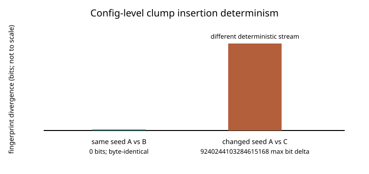
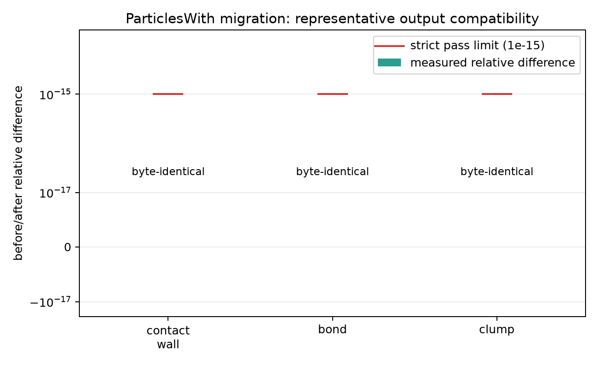
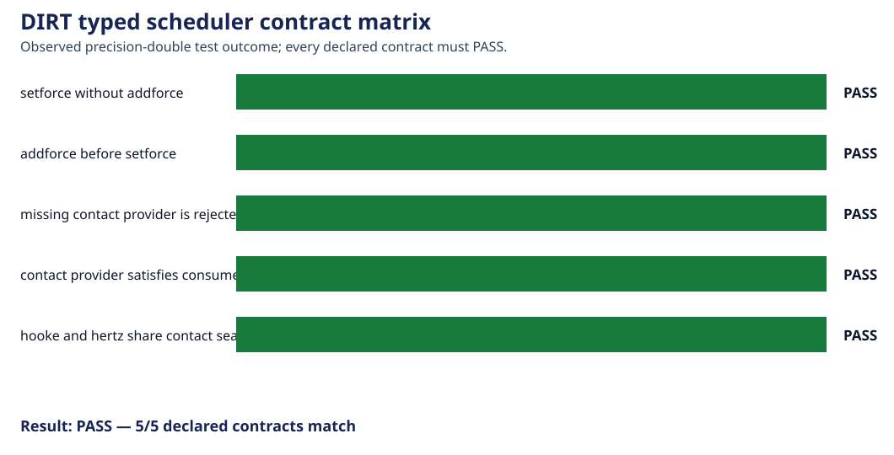

# DIRT Numerical and Software Verification

This document records evidence that DIRT is numerically stable, reproducible,
parallel-correct, and wired through its public APIs as intended. These checks are
important release gates, but they are not independent evidence that the DEM
physics reproduces an experiment, theory, or another solver.

Scientific validation and cross-code comparisons live in
[`VALIDATION.md`](VALIDATION.md).

## Numerical verification

### Timestep, particle-count, and box-size convergence

[`bench_convergence`](bench_convergence/) re-runs the Hertz rebound and sphere
Haff-cooling problems over resolution ladders. It checks convergence toward the
finest timestep, largest particle count, and largest periodic box. These are
self-convergence and finite-size checks; only the elastic Hertz anchor also has
an independent analytical reference.

### MPI decomposition invariance

[`bench_mpi_decomposition`](bench_mpi_decomposition/) compares identical
granular-gas runs at `1x1x1`, `2x1x1`, and `2x2x1` decompositions. It checks
particle identity/count, momentum, energy, positions, and velocities against the
single-rank trajectory. This establishes parallel correctness, not physical
accuracy.

### Bond migration across MPI ranks

[`bond_mpi_drift`](bond_mpi_drift/) moves a bonded chain repeatedly across a
rank boundary and periodic wrap. Its exact `bond_count == 2` and
`bond_missing == 0` gates verify distributed bond bookkeeping.

### Bonded-fiber integration timestep

[`bench_fiber_timestep`](bench_fiber_timestep/README.md) brackets stable and
unstable timesteps for fixed-free axial and coupled bending/translation modes
against independently assembled discrete-lattice spectra. This is a numerical
stability limit, not a material validation.

## Reproducibility and restart verification

### Clump insertion determinism

[`bench_clump_insertion_determinism`](bench_clump_insertion_determinism/)
byte-compares repeated production `[[clump.insert]]` runs. Same-seed runs must
match exactly and a changed seed must produce a different state.

### Restart determinism

[`bench_restart_determinism`](bench_restart_determinism/README.md) compares an
uninterrupted trajectory, a checkpoint/resume trajectory, and an independent
same-seed twin. It checks per-atom state continuity and byte-level digest
reproducibility.

### Clump inertia sampler

[`bench_clump_inertia_sampler`](bench_clump_inertia_sampler/README.md) verifies
bitwise repeatability for fixed seeds and Monte Carlo convergence toward the
single-sphere analytical inertia. It tests the sampler, not many-body clump
dynamics.

## API and integration contracts

### `ParticlesWith` migration compatibility

[`particleswith_migration_validation`](particleswith_migration_validation/README.md)
compares complete emitted CSVs from the legacy and typed-query implementations
for representative contact/wall, BPM-bond, and clump paths. All three are
byte-identical.

### Typed scheduler contracts

[`typed_schedule_validation`](typed_schedule_validation/README.md) checks five
declared schedule contracts, including force ordering, missing-provider failure,
provider acceptance, and the shared Hooke/Hertz contact seam.

### Typed material pair-table compatibility

[`material_pair_table_validation`](material_pair_table_validation/README.md)
compares all 21 generated mixed-material pair properties with the pre-redesign
golden table at a `1e-12` relative-error limit.

### Public simulation fixture contract

[`simulation_fixture_validation`](simulation_fixture_validation/README.md)
checks synchronized atom/DEM rows, particle counts, pair-table dimensions, CSR
connectivity, and the default timestep through the public test-fixture API.

### Runtime wall activation

[`bench_wall_activate_by_name`](bench_wall_activate_by_name/) verifies that a
named wall contributes force when active, contributes exactly zero when
deactivated, and recovers the original force after reactivation.

### Wall-geometry twisting parity

[`bench_wall_twisting_parity`](bench_wall_twisting_parity/) checks that plane,
cylinder, sphere, and spherical-region walls route the same local twisting law.
It is a geometry-dispatch parity test rather than new contact-physics evidence.

### Hopper optimization fidelity

[`hopper_quiescence`](hopper_quiescence/README.md) compares the region-coherence
optimization with the unoptimized baseline for the same short hopper run. It
checks behavior preservation and timing, not hopper physics against an external
reference.

