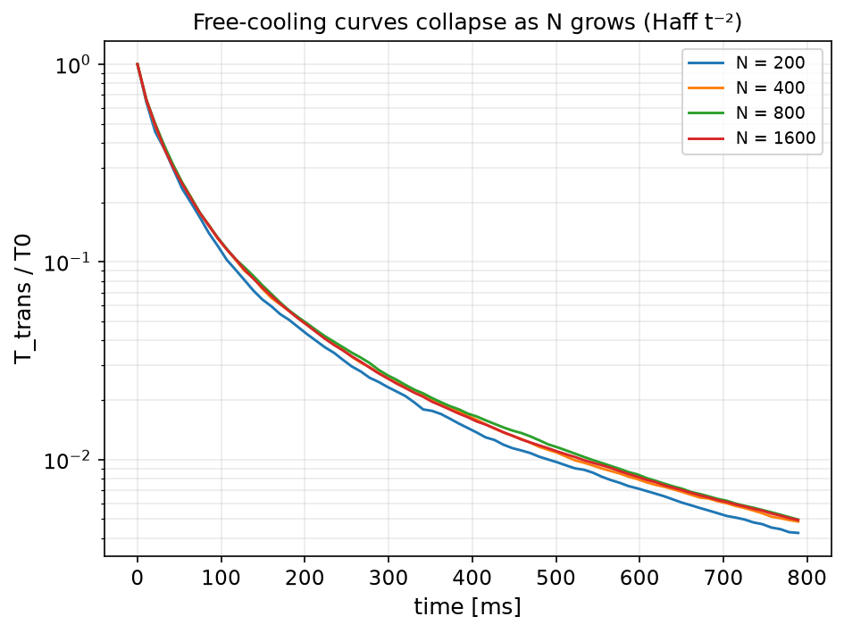

# bench_convergence — timestep & particle-count convergence study

Every other `bench_*` example runs at a **single** timestep (`0.15 × dt_Rayleigh`,
the solver default) and a **single** particle count, then asserts the answer is
close to a reference. None of them answers the two questions a solver user
actually has:

> How small must `dt` be, and how many particles `N` do I need, before the key
> observables stop moving?

This example answers both. It writes **no new Rust code** — it drives the existing
compiled benchmark binaries (`bench_hertz_rebound` and `bench_sphere_haff_cooling`)
through generated configs over a ladder of resolutions, and watches the
observables converge.

## Two sub-studies

### A. Timestep convergence (deterministic)

A single glass sphere strikes a rigid wall (the `bench_hertz_rebound` setup,
`v0 = 1 m/s`) at `dt = f · dt_Rayleigh` for `f ∈ {0.5 … 0.015}`. Three observables
are tracked:

| observable | behaviour as `dt → 0` |
|---|---|
| coefficient of restitution (COR) | flat (already dt-independent) |
| contact duration `t_c` | → analytic Hertz `t_c`; coarse `dt` under-resolves the contact and the integer-step quantization makes it drift |
| peak overlap `δ_max` | → analytic Hertz `δ_max`, smoothly (2nd-order) |

For the **elastic anchor** (`COR = 1.0`) the contact is purely Hertzian, so `t_c`
and `δ_max` have exact closed forms
(`t_c = 2.87 (m²/(R E*² v0))^{1/5}`, `δ_max = (15 m v0²/(16 √R E*))^{2/5}`;
Johnson, *Contact Mechanics*, 1985). We show measured → analytic as `dt → 0`, and
the observed order of accuracy for `δ_max` comes out `p ≈ 2.0`, consistent with
the Velocity-Verlet integrator.


### B. Particle-count convergence (finite-size / statistical)

A freely cooling granular gas (the `bench_sphere_haff_cooling` setup) is run at
`N ∈ {200 … 1600}` held at a **fixed volume fraction** `φ = 0.07` (the periodic
box grows with `N`, so number density is constant), over 4 independent random
seeds each. The intensive observable is Haff's cooling time `t_c` from the
linearized free-cooling law

```
1/√(T/T0) = 1 + t / t_c      (Haff 1983, T ∝ t⁻² late-time)
```

As `N` grows the **mean `t_c` plateaus** and the run-to-run scatter — together
with the RMS residual of the Haff fit — shrink like `~1/√N`.




## Running

```bash
source ~/projects/.build-env
python3 examples/bench_convergence/sweep.py            # generate + start + graph
# or step by step:
python3 examples/bench_convergence/sweep.py generate   # write per-case configs
python3 examples/bench_convergence/sweep.py start       # build + run all sims -> CSV
python3 examples/bench_convergence/sweep.py graph       # validate + plot + report.md
```

`graph` prints a PASS/FAIL for each check and exits non-zero if any fail, so the
example plugs straight into the regression harness
(`~/projects/automation/bin/run-bench.sh examples/bench_convergence`).

All sims are **reproducible**: the timestep study is deterministic and the
cooling study seeds its RNG explicitly, so the numbers (and the pass/fail verdict)
are identical run to run.

## Findings (this material / setup)

- **Recommended timestep:** `dt ≲ 0.25 · dt_Rayleigh` keeps COR, `t_c` and `δ_max`
  within 2 % of the fully-resolved value. The solver default `0.15 · dt_R` sits
  comfortably inside this — a data-backed justification for the default.
- **Recommended particle count:** `N ≥ 800` for a `< 1 %` Haff-fit residual and
  `< 3 %` run-to-run scatter on `t_c` at this `φ`. Smaller boxes still recover the
  correct cooling law but with more finite-size noise.

The generated report with the exact numbers is written to `report.md`.

## What this does and doesn't establish

- It is a **numerical convergence** study (does the discrete solution approach a
  limit as `dt → 0`, `N → ∞`?), not a new physical validation — the underlying
  contact physics is validated by the individual `bench_*` examples this driver
  reuses. See `examples/VALIDATION.md`.
- Study A's elastic anchor is a genuine analytic check; the damped case and
  Study B are self-convergence / finite-size checks against the fully-resolved
  run, not against an independent reference.
- The recommended `dt`/`N` are for **these materials and setups**; stiffer
  materials, larger overlaps, or denser packings shift the numbers, but the
  procedure (and this driver) transfers directly.
