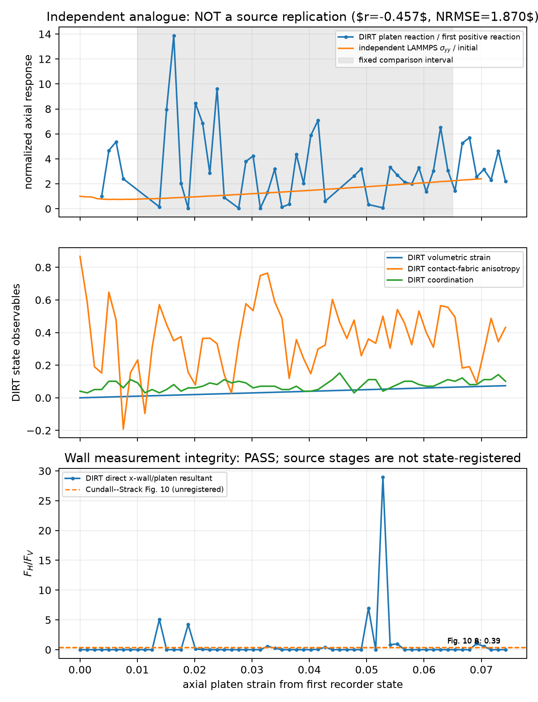

# Cundall--Strack-style quasi-2-D walled assembly

This deterministic DIRT case is a quasi-2-D, 197-grain dense-assembly
compression benchmark.  It is motivated by the wall-resultant apparatus in
Cundall & Strack (1979), but it does not claim to reconstruct that paper's
unpublished coordinates or controller history.  Its quantitative comparator is
the committed, independently executable LAMMPS 2-D counterpart under the
documented protocol; the original paper is provenance for particle count and
friction only.

```bash
$BENCH_PYTHON examples/bench_cundall_strack_biaxial/sweep.py
```



The top panel is the deliberately unfitted, fixed-interval cross-code result:
the present analogue does **not** agree (`r=-0.457`, normalized RMSE `1.870`).
The middle panel exposes DIRT's volumetric and contact/fabric observables; it
does not imply that the primary paper published corresponding curves. The
bottom panel is only the recorder-integrity check described below.

The committed figure includes the raw normalized DIRT-versus-LAMMPS axial
response panel used for the independent comparison, alongside wall-ratio and
contact measurements. Its divergence makes clear that recorder integrity is
not a replication PASS.

The executable check verifies forward compression, live contacts, a positive
platen reaction, finite output, and—independently from the precomputed
column—that `F_H/F_V` equals the recorded x-wall mean divided by the recorded
platen mean. It separately audits the committed primary-source transcription
of Fig. 10 A=`0.39` and B=`0.33`, and shows those values as explicitly
*unregistered* lines on the result figure. It does not compare a selected DIRT
time window with those numbers.

## Comparison and limitation

Fig. 10 provides two force-network configurations (`F_H/F_V = 0.39` and
`0.33`). The paper additionally says that A→B increased vertical force and
decreased horizontal force by 4.348%, and gives a 197-disc radius census; the
driver audits that transcription. It does not publish the digitized disc
coordinates or wall positions used by BALL, nor a source strain/time coordinate
that identifies which DIRT state should be A or B. A fixed late-loading window
therefore cannot be a defensible Fig. 10 target.
The source also used 2-D discs and beam-wall control; this case uses a
one-grain-deep 3-D sphere slice, Hertz contacts, and prescribed wall velocity.

The primary source does not publish a state-registered trajectory. Therefore
its two Fig. 10 snapshots are never used as a curve, interpolation target, or
tolerance.  The bundled LAMMPS trajectory is an independent solver comparison,
not a substitute for the primary experiment.  It has a different lateral
boundary, while DIRT is a one-grain-deep 3-D Hertzian slice.  Agreement can
test a declared analogue protocol; it cannot establish 2-D force-network
identity or a reproduction of the original photograph.

The executable also inventories the full acceptance evidence rather than
checking only snapshot ratios. The primary source has no registered state
coordinate, stress/deviatoric path, volumetric/dilatancy path, or
contact/fabric-evolution series for this assembly. A state map alone would
therefore still not satisfy the replication contract.

## Independent-solver check

`reference/lammps/in_biaxial.lmp` is a committed, independently implemented
LAMMPS 2-D 197-grain compression protocol. Its raw solver output is committed
beside the deck. After `sweep.py run`, `sweep.py external` compares normalized
axial response over strain 0.01--0.065 without fitting, selecting, or applying
a pass allowance. The present DIRT result disagrees (correlation -0.457,
normalized RMSE 1.870); the command exits non-zero and is evidence of
non-reproduction, not a successful external validation. The graph renders the
same raw comparison alongside the DIRT-only volumetric/fabric observables so a
reader cannot mistake a recorder pass for a bulk-response replication. This
does not meet the frozen acceptance criterion: a protocol-comparable external
trajectory with stress, dilatancy, and fabric/contact paths remains required.
