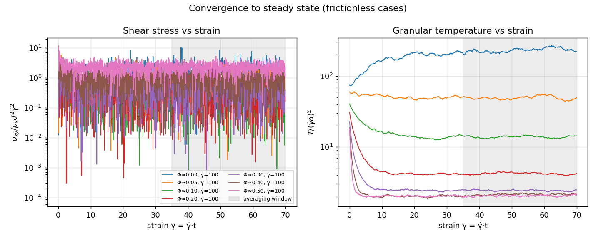

# bench_lebc_shear — Lees–Edwards homogeneous simple-shear rheometer

Tier-1 of the DEM calibration campaign. A triperiodic box of glass beads (gravity
off) is sheared at a constant rate γ̇ using DIRT's **native Lees–Edwards simple
shear** — a genuine triclinic box driven by the `[deform] xy` style, with the box
tilt and streaming-velocity remap handled in fractional (lamda) coordinates so the
flow is homogeneous and parallelizes across MPI ranks. In steady state the
recorder reports the full stress tensor, the granular temperature, and the solid
fraction; from these the sweep forms the inertial number `I`, the effective
friction `μ(I)`, and `Φ(I)` — the closure the dev_soil_sph solver consumes.

## What it does

- Drives Lees–Edwards shear: `[deform] xy = { style = "erate", rate = γ̇ }`
  (flow = x, gradient = y, vorticity = z), enabled only in the `shear` stage.
- Records, each thermo interval, to `data/lebc_shear_results.csv`:
  - the stress tensor `σ_ij` = contact virial (`VirialStress`/V, normal+tangential)
    **plus** the kinetic term `Σ m v'⊗v' / V` with the streaming velocity
    `v̄(y)=γ̇·y` removed;
  - `p = ⅓ tr σ`, the shear stress `σ_xy`, the normal-stress differences
    `N₁ = σ_xx − σ_yy`, `N₂ = σ_yy − σ_zz`;
  - the granular temperature `T = ⅓⟨|v−v̄(y)|²⟩` (shear profile subtracted);
  - the solid fraction `Φ`.

## Run

Single representative case:

```bash
cargo run --release --example bench_lebc_shear --no-default-features -- examples/bench_lebc_shear/config.toml
```

Bounded smoke gate (the harness default) / full sweep:

```bash
python3 examples/bench_lebc_shear/sweep.py            # BOUNDED smoke gate (PASS/FAIL) — the harness default
python3 examples/bench_lebc_shear/sweep.py smoke      # same as no-arg
python3 examples/bench_lebc_shear/sweep.py full       # full sweep: generate, start, graph
# or individually (full):
python3 examples/bench_lebc_shear/sweep.py generate
python3 examples/bench_lebc_shear/sweep.py start
python3 examples/bench_lebc_shear/sweep.py graph
```

### Bounded smoke gate (CI)

The full 14-case sweep shears each case to strain 70 (~3.5M steps per case at
γ̇=100), which overran the 1800 s automation cap every hourly run — so it
validated nothing. `sweep.py` with **no argument** now runs a **bounded gate**: 3
frictional (production) cases (Φ = 0.2, 0.3, 0.4) sheared to strain 10, asserting
that each reaches a **steady, physical shear-stress ratio** `μ = |σ_xy|/P`
(0.15 ≤ μ ≤ 0.90, pressure `P > 0`, window drift < 15%). It completes in ~9 min
and prints `ALL CHECKS PASSED`/`CHECKS FAILED`. The full production+KT sweep and
its kinetic-theory tolerances (in `graph()`) are **unchanged** and still run via
`sweep.py full`.

Each case is prepared by inserting a **loose** pack (random insertion saturates
near Φ≈0.38) and **compressing** it to the target box (→ target Φ) with a
velocity-style `[deform]` ramp before shearing — so the full Φ range, dilute to
near random-close-packing, is reachable. The sweep runs two families:

- **production** — frictional grains (`μ_p = 0.5`, `e = 0.7`): fits `μ(I)`, `Φ(I)`.
- **kt** — frictionless grains (`μ_p = 0`, `e = 0.7`): validated against kinetic
  theory, which is exact for smooth inelastic spheres in the collisional regime.

## Validation (PASS/FAIL, printed by `graph`)

1. **Kinetic theory: stress vs Φ** (frictionless sub-sweep, the headline check —
   `plots/kt_validation.png`). The measured stresses are made **dimensionless**, so
   they depend on Φ (and `e`) alone and every γ̇ collapses to one point per Φ:
   - normal stress `p* = p/(ρ_s T)` vs the Lun et al. (1984) EOS
     `p* = Φ[1 + 2(1+e)Φ g₀(Φ)]`, `g₀ = (2−Φ)/(2(1−Φ)³)` (Carnahan–Starling);
   - shear stress `η* = σ_xy/(ρ_s d √T γ̇)` vs the Lun/Gidaspow dimensionless
     shear viscosity (its dilute limit is the Chapman–Enskog value `5√π/96`).

   KT is drawn as a continuous curve from dilute Φ to RCP (Φ≈0.64); DEM points
   overlay it. Expect agreement at low/moderate Φ and **growing deviation toward
   jamming** — that deviation is the signature of the dense regime where DEM is
   irreplaceable. **PASS** when most points agree (p* within ~15%, η* within ~20%).
   This is the decisive cross-check on the virial+kinetic stress recorder and the
   triclinic (lamda) neighbor list: a broken stress pipeline fails it immediately.
2. **Steady state is verified, not assumed.** `plots/convergence.png` plots stress
   and T vs strain for each case with the averaging window (last 50% of strain)
   shaded — curves must plateau before it. `graph` also prints a `drift` (change of
   p across the window) and flags any case with drift > 15% as not steady. These
   runs heat up during compression and relax over many strain units, so shear
   duration is set by total strain (`TARGET_STRAIN`), and the low-γ̇ (low-I) cases
   are the long ones. The γ̇-collapse in (1) is also the Bagnold (σ ∝ γ̇²) check.
3. **μ(I) / Φ(I) gate and fit** (frictional sweep). Each measured frictional
   point must land inside the GDR MiDi / da Cruz dense-flow envelope
   `0.30 <= μ = |σ_xy|/P <= 0.70`; the plotted band and printed count are the
   PASS/FAIL gate. The same points are then fit to
   `μ(I) = μ_s + (μ₂−μ_s)/(I₀/I + 1)` and `Φ(I)` to extract the calibration
   constants written to `data/calibration.yaml` for
   `sph_constitutive::MaterialParams`. Those fitted constants are material
   outputs, not universal pass/fail targets.


*Frictionless LEBC shear: DIRT points over the Lun / extended kinetic-theory curves
and independent LAMMPS / Fortran / LIGGGHTS references. Shaded bands show the
unchanged PASS gate: at least 60% of KT points within 15% for normal stress and
20% for shear stress.*


*Frictional production sweep: measured μ = |σ_xy|/P over inertial number I. The
orange band is the GDR MiDi / da Cruz dense-flow PASS gate (`0.30 <= μ <= 0.70`);
the black curve is the fitted μ(I) calibration consumed downstream.*


*Frictional production sweep: measured solid fraction Φ over inertial number I, the
compaction side of the μ(I) / Φ(I) calibration.*



*Frictionless KT cases: stress and granular temperature versus strain with the
averaging window shaded. PASS requires the printed window drift to stay below 15%.*

## Outputs

| Path | Tracked? | Contents |
|---|---|---|
| `plots/mu_of_I.png`, `phi_of_I.png`, `kt_validation.png`, `convergence.png` | yes | final figures |
| `data/<case>/lebc_shear_results.csv` | no (gitignored) | per-case time series |
| `data/calibration.yaml` | no | fitted μ(I) closure → dev_soil_sph |
| `sweep/<case>/config.toml` | no | generated per-case configs |

## Notes

- **Gravity is off** and the box is fixed (fixed-Φ sweep) — the simplest valid
  route to μ(I)/Φ(I); convert Φ→P post hoc via the measured σ_yy. Pressure control
  (a servo on the gradient direction) is a later refinement.
- **Timestep** `dt ≈ 2e-7 s` is set from the Rayleigh criterion for `E = 7e7`,
  `d = 0.5 mm`; re-derive if `E` or `d` changes.
- **Clumps** (shaped grains) are supported under shear — the triclinic COM wrap and
  streaming remap are in `dirt_clump` — but this example validates spheres, where
  kinetic theory provides an analytic check.
- A LAMMPS cross-check leg (Liz's `lammps_shear_cell`, `fix deform xy erate … remap v`)
  can be overlaid the same way `bench_column_collapse` does; not wired here.

## References

- GDR MiDi, *Eur. Phys. J. E* **14** (2004); da Cruz et al., *PRE* **72** (2005) — μ(I) from DEM simple shear.
- Lun, Savage, Jeffrey & Chepurniy, *JFM* **140** (1984) — kinetic-theory transport coefficients.
- Companion specs: `SPH_temp/docs/dem-lebc-kt-spec.md`, `dem-campaign-dirt.md`.
