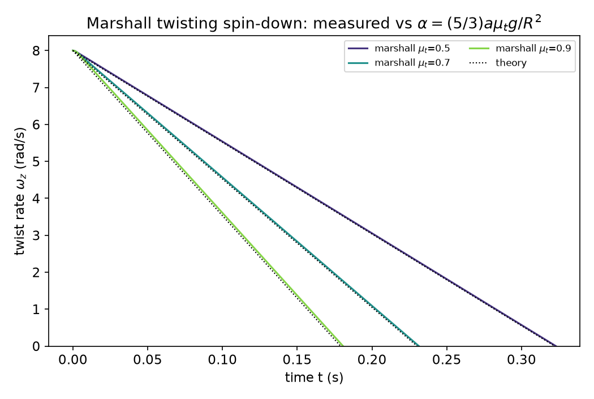
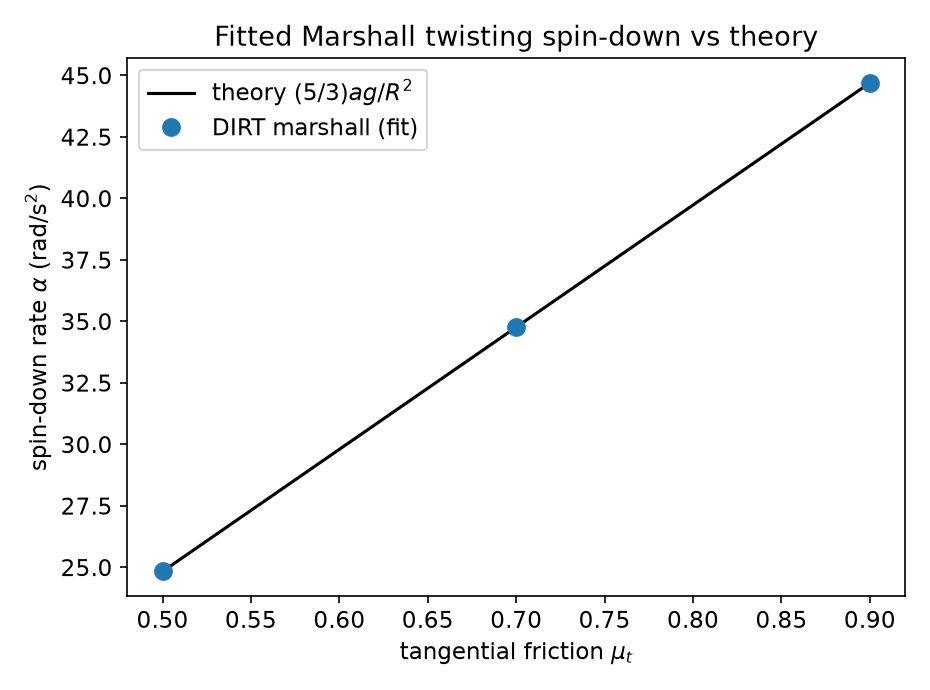

# bench_marshall_twisting — Marshall (derived-coefficient) twisting spin-down

Validates DIRT's **Marshall twisting model** (`twisting_model = "marshall"`) —
the twisting model whose stiffness, damping, and friction coefficients are
**derived from the active tangential (Mindlin) contact model** rather than
supplied as independent inputs — against the *exact* analytical spin-down of a
sphere twisting on an enduring contact.

This complements `bench_twisting_friction` (which validates the `constant` and
`sds` twist forms, whose coefficients are direct user inputs). Together they
cover DIRT's full twisting-model set and close gap #4 of the
[LAMMPS DEM parity](../../docs/src/comparisons/lammps-dem-parity.md) audit.

## The Marshall model

Per LAMMPS `pair_granular` `twisting marshall`
(`doc/src/pair_granular.rst`, "twisting_marshall"; Marshall 2009, eqs 32–33) the
twisting coefficients are expressed in terms of the tangential coefficients and
the Hertz contact radius `a = √(R* δ)`:

```
k_twist  = ½ · k_t · a²          (twisting stiffness, from tangential k_t)
γ_twist  = ½ · γ_t · a²          (twisting damping,   from tangential γ_t)
μ_twist  = (2/3) · a · μ_t       (twisting friction,  from tangential μ_t)
```

The couple is the spring–dashpot `τ = −k_twist ξ − γ_twist Ω` truncated to
`|τ| ≤ μ_twist F_n` (with the twisting displacement rescaled to the critical
value on saturation — identical bookkeeping to the SDS slider). Because
`μ_twist ∝ μ_t`, **the twisting cap is tied to the sliding-friction
coefficient** — the defining feature of the Marshall form.

## Setup (same seating as bench_twisting_friction)

Two identical spheres (R = 5 mm) are stacked along +z:

- **Lower sphere** — a frozen anchor (`[[freeze]]`: neither translates nor spins).
- **Upper sphere** — rests on the anchor under gravity, seated at the **static
  Hertz overlap** so `F_n = m g` from step 0, and given a **pure twisting spin**
  `ω = (0, 0, ω₀)` about the contact normal n̂ = +ẑ.

A pure twist about n̂ produces **zero** contact-point slip
(`v_rel = ω × (∓R n̂) = 0`), so no sliding or rolling occurs — and, crucially,
the tangential spring stays at zero *even though μ_t > 0*. The **only** contact
torque is the Marshall twisting couple.

## Theory (exact)

In the saturated (sliding) regime the couple is
`τ_tw = μ_twist F_n = (2/3) a μ_t F_n`. With `F_n = m g`, equal-sphere
`r_eff = R/2` (so `a = √(R δ / 2)`), and `I = (2/5) m R²`:

```
dω/dt = − τ_tw / I = − (2/3) a μ_t m g / ((2/5) m R²)
      = − (5/3) · a · μ_t · g / R²                     ← exact, constant
```

The mass cancels. The contact radius `a` is fixed by the static seating overlap
`δ`, so the analytical rate is a closed form in `a`, `μ_t`, `g`, `R`.

## What `sweep.py` checks (PASS/FAIL gated)

The **tangential friction μ_t** is the swept variable (μ_t ∈ {0.5, 0.7, 0.9}),
because it is what Marshall turns into the twisting cap. For each case:

1. **Spin-down rate** — linear-fit `ω_z(t)` over `0.15 ω₀ … 0.85 ω₀` (past the
   brief spring wind-up) and require the fitted deceleration to match
   `α = (5/3) a μ_t g / R²` within **4 %**. The linear scaling with μ_t directly
   exercises the `μ_twist = (2/3) a μ_t` derivation.
2. **Twist purity** — off-axis spin `|ω_perp|` < 0.1 % of ω₀ and lateral drift
   < 10 µm (the contact drives *only* the torsional DOF).

Exit code is 0 only if every case passes (the runner treats exit 0 = PASS). The
unit tests in `crates/dirt_granular/src/contact.rs`
(`marshall_twisting_*`) additionally assert that the Marshall torque **ignores**
the SDS `twisting_stiffness`/`twisting_damping` inputs (proving it is derived,
not read) and scales linearly with μ_t.

## Running

```bash
source ~/projects/.build-env
# one-shot: generate configs, build, run all cases, validate + plot
"$BENCH_PYTHON" examples/bench_marshall_twisting/sweep.py
# or the regression runner (records PASS/FAIL):
~/projects/automation/bin/run-bench.sh examples/bench_marshall_twisting
```

Single standalone case (μ_t = 0.5):

```bash
cargo run --release --example bench_marshall_twisting \
  --no-default-features --features precision-double -- \
  examples/bench_marshall_twisting/config.toml
```

## Latest result

```
  Hertz contact radius a = sqrt(r_eff*delta) = 7.594406e-05 m (delta = 2.307e-06 m)
  Marshall: mu_twist = (2/3) a mu_t  =>  alpha = (5/3) a mu_t g / R^2  (exact)
     mu_t     a_fit    a_pred  rel_err  max_perp     drift
    0.500    24.837    24.834    0.02%  0.00e+00  0.00e+00
    0.700    34.772    34.767    0.02%  0.00e+00  0.00e+00
    0.900    44.707    44.701    0.02%  0.00e+00  0.00e+00
RESULT: PASS
```

The fitted rate matches the analytical Marshall torque to 0.02 % (the 4 %
tolerance is comfortable headroom, not a fudge).




## Reference

- LAMMPS `pair_granular` documentation, "twisting_marshall" derived coefficients
  (`~/projects/reference/lammps/doc/src/pair_granular.rst`).
- W.R. Marshall, *"Discrete-element modeling of particulate aerosol flows"*,
  J. Comput. Phys. **228** (2009) 1541–1561, eqs 32–33.
