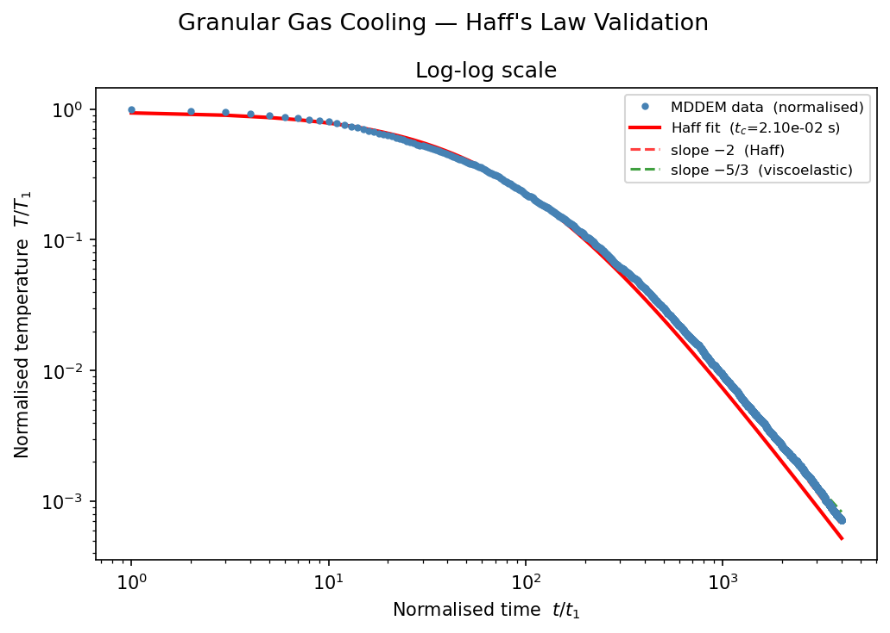

# Granular Gas Benchmark: Haff's Cooling Law

Granular gas benchmark validating energy dissipation against Haff's cooling law.

A granular gas in a periodic box with no external forcing cools inelastically. Haff's law predicts:

$$T(t) = \frac{T_0}{(1 + t/t_c)^2} \quad \Rightarrow \quad T \sim t^{-2} \text{ for } t \gg t_c$$

The cooling curve should span ~2 decades in temperature and ~2 decades in time, giving a clear log-log slope:

- **Haff's law** (inelastic hard sphere): T ~ t^(-2)
- **Viscoelastic Hertz** (Brilliantov): T ~ t^(-5/3)


## Files

- `main.rs` -- Compiled example entry point
- `config.toml` -- DIRT input
- `in.lammps` -- Equivalent LAMMPS input using `pair_style granular` with `hertz/material`
- `haff_analysis.py` -- Analysis script (reads `GranularTemp.txt`, produces `haff_comparison.png`)
- `validate.py` -- Automated physics validation (no NaN, cooling trend, no energy explosion)
- `validate_config.toml` / `validate_long_config.toml` -- Short/long configs for `validate.sh`

## Parameters

| Parameter | Value |
|-----------|-------|
| Particles | 500 |
| Radius | 0.001 m |
| Density | 2500 kg/m^3 |
| Young's modulus | 8.7 GPa |
| Poisson ratio | 0.3 |
| Initial velocity | 0.5 m/s |
| Restitution | 0.95 |
| Volume fraction | ~13.4% |
| Domain | 0.025^3 m (periodic) |
| Steps | 5,000,000 |
| Thermo interval | 500 |

## Run

```bash
# Single-process
cargo run --example granular_gas_benchmark -- examples/granular_gas_benchmark/config.toml

# With MPI
cargo build-examples
mpiexec -n 4 ./target/release/examples/granular_gas_benchmark examples/granular_gas_benchmark/config.toml

# LAMMPS (for comparison)
mpirun -n 4 lmp -in ./examples/granular_gas_benchmark/in.lammps

# Analyse results (run from this directory)
cd examples/granular_gas_benchmark
python haff_analysis.py
```


