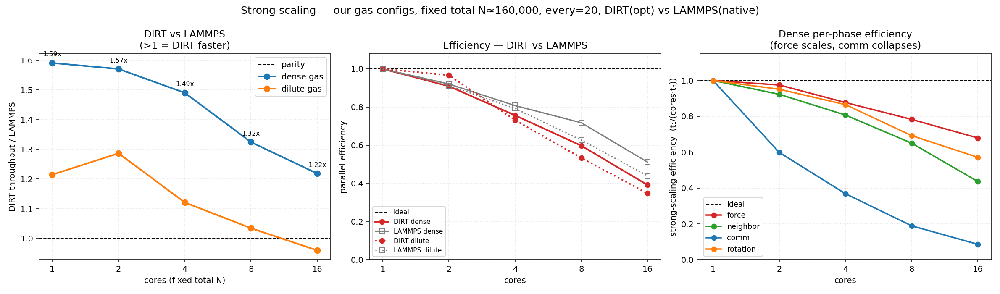
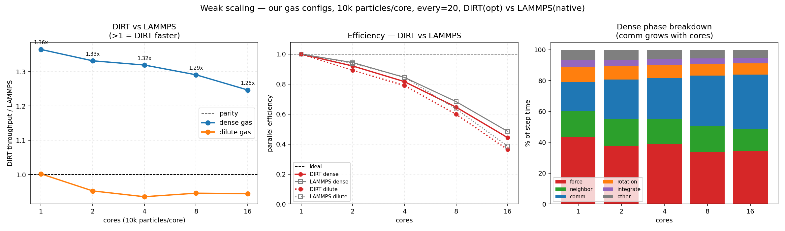

# perf_mpi_scaling — DEM throughput & MPI strong/weak scaling

> Note from me: I am guessing I did something wrong here, I find it hard to believe we are out performing LAMMPS in these situations, the only thing I kinda believe is that the scaling doesn't hold as well as LAMMPS.


A **performance** benchmark (not a validation one). It measures how fast DIRT
integrates a granular gas and how that rate scales with MPI ranks, and — when a
LAMMPS MPI binary is available — overlays LAMMPS on the *same* configs. No
correctness quantity is checked; the figure of merit is throughput.

> Unlike every `bench_*` example, a "FAIL" here means *poor scaling*, never a
> physics error. (The DIRT binary still records a conservation diagnostic per run
> — `n_global_start/end`, total KE — so a silently-broken decomposition is caught;
> every config in this example conserves at all rank counts.)

The headline driver is **`scaling_gas.py`**, which runs the two controlled
granular-gas regimes below in both scaling modes vs native LAMMPS and emits two
3-panel figures. (`sweep.py` is an older, more elaborate gas/bed driver kept for
reference; `scaling_gas.py` is the one these plots come from.)

## Two cost regimes (dense vs dilute gas)

Both are periodic cubes of frictional glass spheres with a random initial velocity
field, no gravity, no walls — identical Hertz–Mindlin contact, material, timestep,
and neighbor settings. Only the **volume fraction** differs, which flips the step
between the two cost regimes of DEM:

| regime | φ | neighbors/atom | bottleneck |
|---|---|---|---|
| **dense** | 0.50 | ~5.5 | the **Hertz–Mindlin force kernel** (contact-bound) — DIRT's strength |
| **dilute** | 0.05 | ~0.2 | **ghost comm + neighbor build** (overhead-bound) — LAMMPS's strength |

The reported quantity is **particle-steps per second**,

    particle_steps_per_s = N_global · steps_measured / wall_seconds,

a size-independent rate comparable across particle counts, rank counts, and codes.
`N_global` is obtained by an all-reduce, so it is correct under domain
decomposition. Only a **steady-state window** is timed (the recorder skips the
first 40 % — insertion, transient rebinning — barriers all ranks, then clocks the
remainder).

Beyond throughput, `scaling_gas.py` parses DIRT's per-system scheduler timings into
a **per-phase breakdown** (force / neighbor / comm / rotation / integrate), which
is what makes the *why* visible (see Findings).

## Material Properties

| property | value |
|---|---|
| radius | 1.1 mm (monodisperse) |
| density | 2500 kg/m³ (glass) |
| Young's modulus | 5×10⁷ Pa (softened) |
| Poisson ratio | 0.3 |
| restitution | 0.9 |
| friction | 0.3 |
| timestep | 6.386×10⁻⁶ s (**fixed, every case**) |
| neighbor skin / rebuild | 1.1 × diameter / every 20 steps (**fixed, both codes**) |

## Scaling modes

- **strong** — total particle count held fixed (≈157k, sized for the top of the
  core ladder), cores increased. Ideal: speedup = cores.
- **weak** — particle count *per core* held fixed (≈10k), domain and total N grow
  with cores. Ideal: flat throughput-per-core.

Default core ladder `1,2,4,8,16` (override with `PERF_RANKS`). Both codes are
pinned to the *same* processor grid per case.

## Fairness — build LAMMPS native

DIRT is built `-C target-cpu=native`, so for an honest comparison LAMMPS must be
built with equivalent native tuning — **a Homebrew/apt bottle is a generic build**
and will understate LAMMPS (on Apple Silicon the gap is small; on x86 with AVX512
it is large). Build it and point `scaling_gas.py` at it:

```bash
git clone --depth 1 https://github.com/lammps/lammps && cd lammps
mkdir build && cd build
cmake ../cmake -D BUILD_MPI=on -D PKG_GRANULAR=on -D CMAKE_BUILD_TYPE=Release \
      -D CMAKE_CXX_FLAGS="-O3 -mcpu=native"     # use -march=native on x86
make -j
export PERF_LAMMPS=$PWD/lmp                     # scaling_gas.py picks this up
```

## How to Run

```bash
# build DIRT, run both modes, graph both figures:
python3 examples/perf_mpi_scaling/scaling_gas.py

# one mode:
python3 examples/perf_mpi_scaling/scaling_gas.py strong
python3 examples/perf_mpi_scaling/scaling_gas.py weak

# replot from saved data/*.json — no sims:
python3 examples/perf_mpi_scaling/scaling_gas.py graph

# single representative case (serial smoke test):
cargo build --release --example perf_mpi_scaling --features mpi_backend
mpiexec -n 1 target/release/examples/perf_mpi_scaling examples/perf_mpi_scaling/config.toml
```

A real `mpiexec`/`mpirun` is required; LAMMPS is optional (DIRT-only if absent).

### Knobs (environment variables)

| var | default | purpose |
|---|---|---|
| `PERF_RANKS` | `1,2,4,8,16` | core ladder; keep ≤ physical cores |
| `PERF_NCORE` | `10000` | particles per core (weak) / per-core basis for the strong total |
| `PERF_STEPS` | `5000` | steps per run |
| `PERF_NEIGH_EVERY` | `20` | neighbor rebuild cadence (both codes) |
| `PERF_LAMMPS` | *(auto)* | path to a native LAMMPS binary (else `lmp_mpi`/`lmp` on PATH) |
| `PERF_MPI_EXTRA` | *(empty)* | extra `mpiexec` flags, e.g. `--map-by numa` on a fat node |

## Expected Plots

Each is a 3-panel figure: DIRT(optimized) vs native LAMMPS, dense + dilute.

**Strong scaling** (fixed total N ≈157k, cores 1→16):



(1) DIRT/LAMMPS throughput ratio vs cores, (2) parallel efficiency `speedup/cores`,
(3) **dense per-phase strong-scaling efficiency** `t₁/(cores·tₙ)` — the force line
riding the ideal while the comm line collapses toward 1/N.

**Weak scaling** (fixed ≈10k particles/core, total grows with cores):



(1) DIRT/LAMMPS ratio, (2) weak efficiency (throughput-per-core retention),
(3) **dense phase breakdown** — comm's share of the step climbing from ~19 % to
~40 % as cores grow.

## Findings (Apple M5 Pro, 18 cores; ≈10k particles/core)

DIRT(optimized) ÷ LAMMPS(native), `>1` = DIRT faster:

| cores | strong dense | strong dilute | weak dense | weak dilute |
|---:|:---:|:---:|:---:|:---:|
| 1 | 1.59× | 1.21× | 1.36× | 1.00× |
| 16 | 1.22× | 0.96× | 1.25× | 0.94× |

- **DIRT's edge is the force kernel; LAMMPS's edge is parallel-comm efficiency.**
  DIRT wins the dense (contact-bound) regime decisively at low core counts and the
  lead erodes as cores grow; LAMMPS wins the dilute (overhead-bound) regime,
  especially at scale.
- **Strong erodes faster than weak** (dense 1.59→1.22 vs 1.36→1.25): in strong
  scaling compute-per-core shrinks *and* comm grows; in weak only comm grows.
- **Comm is the universal scaling bottleneck** — at 16 cores it is ~40–46 % of the
  step in both regimes, while force/neighbor parallelize near-ideal. The per-phase
  panels show this directly.

## Assumptions / caveats

- **Single node.** The 16-core points are partly memory-bandwidth/oversubscription
  bound (16 ranks on 18 cores), which flatters the absolute efficiency floor down;
  the *per-phase trends and DIRT-vs-LAMMPS gaps are algorithmic and real*. True
  high-core behaviour needs a cluster.
- **Fairness rests on matched work + matched build.** Same Hertz contact, timestep,
  and neighbor cadence both sides; LAMMPS built native (see above).
- LAMMPS builds its own packing (N, density, contact model, decomposition, and step
  count matched — not the exact microstate). Sufficient for a throughput benchmark.
- Single realizations. For publication numbers, run each case a few times and
  report the median; pin ranks to physical cores.

## References

- LAMMPS `granular` pair style (Hertz–Mindlin), matched to the contact model
  cross-validated in `bench_oblique_impact` and `bench_hertz_rebound`.
- Standard DEM scaling methodology (strong/weak scaling; particle-steps/s as the
  throughput metric).
