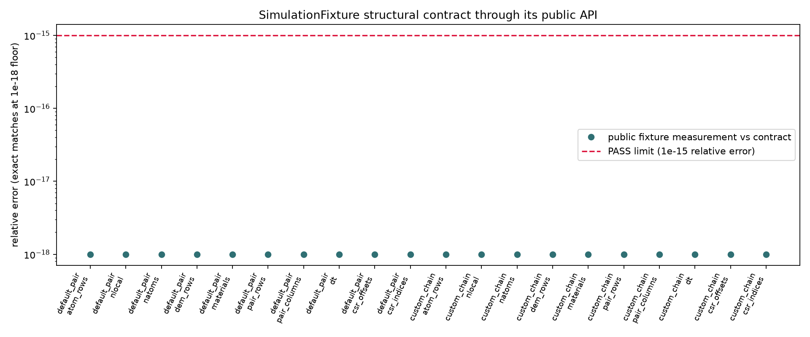

# SimulationFixture structural contract

This executable builds the public default contact fixture and an independently
declared three-particle chain through `dirt_test_utils::ParticleFixture`. Its
measurements are compared with the committed contract in
[`data/fixture_contract.csv`](data/fixture_contract.csv): Atom/DEM row parity,
`nlocal`/`natoms`, one material's built pair-table dimensions, the declared CSR
offset/index streams, and the conservative timestep.

Run `python3 examples/simulation_fixture_validation/sweep.py` to compile and
execute the public API, compare the output to the fixed contract, and regenerate
the figure. This is a structural utility check, not a DEM physics calibration;
the normal-contact and wall benchmarks remain the independent physics evidence.

*PASS: all 20 public structural measurements, including two CSR streams, match
the declared fixture contract exactly; the dashed line is the visible `1e-15`
relative-error criterion.*
